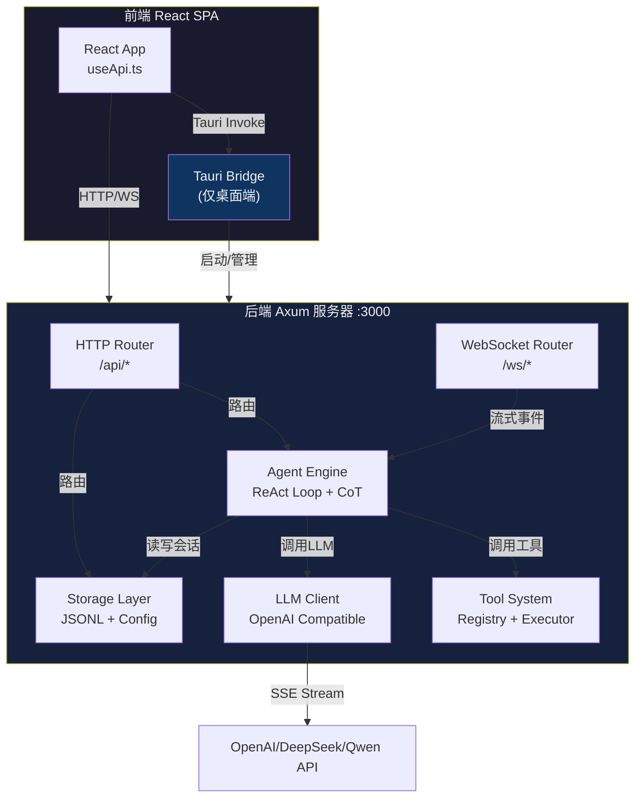
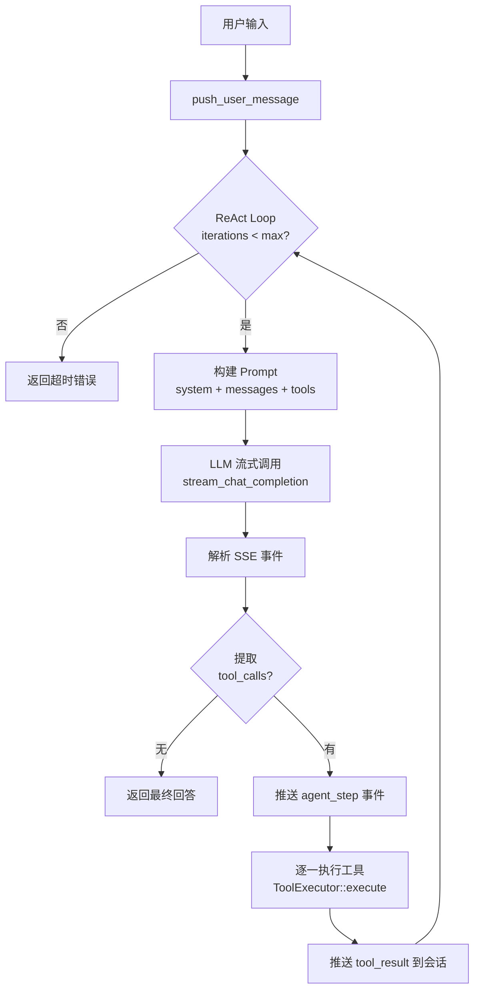
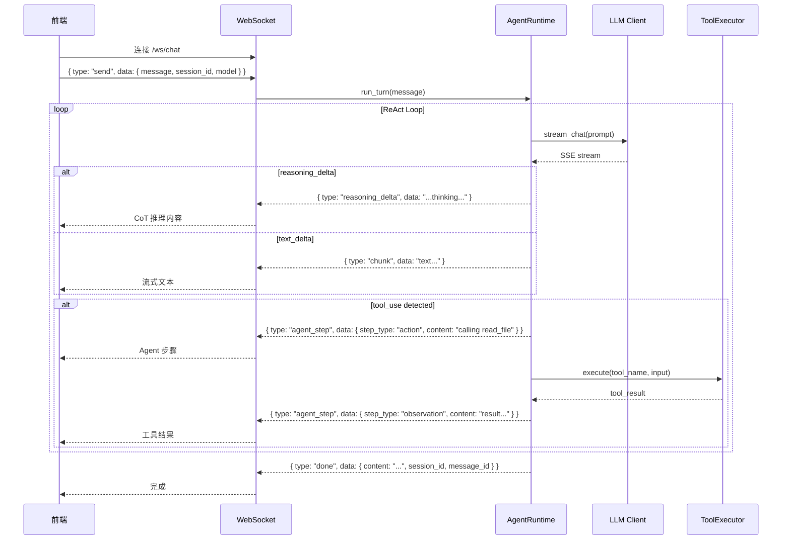

## 产品概览

为 NovaClaw AI Agent 项目开发完整的 Rust 后端，实现 AI Agent 核心的 **ReAct 循环 + Agent Loop + CoT (Chain of Thought) 推理**，以及**内置工具系统**，使前端能直接运行。

## 核心功能

### 1. Axum HTTP/WebSocket 服务器（全平台）

- HTTP API: 配置管理、会话 CRUD、模型管理、技能管理、定时任务、文件浏览、布局持久化
- WebSocket: 流式聊天 (chunk/agent_step/done/error 消息)、终端执行、实时日志推送

### 2. ReAct Agent 引擎

- 标准 ReAct 循环：Thought - Action - Observation - Final Answer
- 流式输出支持 (WebSocket 推送 text delta / agent step / done)
- 防死循环：max_iterations 限制
- Agent Loop 支持 CoT 推理内容提取与展示

### 3. 多供应商 LLM 支持

- OpenAI兼容协议 (支持 OpenAI、DeepSeek、Qwen、Claude via proxy 等)
- 可配置多 Provider，动态切换
- 流式 SSE 解析

### 4. 内置工具系统

- 注册表模式：工具名称到处理器映射
- 内置工具：文件读写、bash 执行、文本搜索
- 工具结果截断 (防上下文溢出)

### 5. 会话与存储

- JSONL 文件持久化 (仅文件系统，零外部数据库)
- 会话 CRUD (创建、列表、删除)
- 消息管理 (追加、分页查询)

### 6. Tauri 桌面端初始化

- Tauri v2 项目初始化
- 本地配置读写 (JSON 文件)
- 文件选择、自动启动等命令
- 启动时自动运行后端

## 前端 API 映射 (从 useApi.ts 解析)

**HTTP REST API:**

- `GET/PUT /api/config` - 全局配置读写
- `GET/POST /api/providers` - 供应商管理
- `GET /api/models` & `GET /api/models/:id` - 模型列表与详情
- `GET/POST /api/sessions` - 会话列表与创建
- `GET/DELETE /api/sessions/:id` - 会话详情与删除
- `GET /api/sessions/:id/messages` - 消息历史
- `POST /api/chat` - HTTP 聊天 (非流式)
- `POST /api/chat/test` - 连接测试
- `GET/POST /api/skills` & `DELETE /api/skills/:id` - 技能管理
- `GET/POST /api/cron-jobs` & `GET/PUT/DELETE /api/cron-jobs/:id` - 定时任务
- `GET /api/layout` & `PUT /api/layout` - 布局持久化
- `GET /api/files` - 文件浏览

**WebSocket:**

- `ws://127.0.0.1:3000/ws/chat` - 流式聊天
- `ws://127.0.0.1:3000/ws/terminal` - 终端执行
- `ws://127.0.0.1:3000/ws/logs` - 实时日志推送

**Tauri Commands (仅桌面端):**

- `get_app_config` / `save_app_config` - 本地配置读写
- `set_auto_start` / `clear_local_cache` / `select_folder`

## 技术栈

- **语言**: Rust (edition 2021)
- **Web框架**: Axum 0.7 + tower-http (CORS + 静态文件服务)
- **异步运行时**: tokio (full features)
- **序列化**: serde + serde_json
- **HTTP客户端**: reqwest (LLM API 调用)
- **WebSocket**: axum 内置 ws + tokio-tungstenite
- **错误处理**: thiserror
- **日志**: tracing + tracing-subscriber
- **文件存储**: JSONL 格式 (纯文件系统，零外部数据库依赖)
- **Tauri**: tauri v2

## 实现方案

### 整体架构

采用**分层架构**，核心引擎 (Agent Loop + CoT + Session) 与 Web 服务层解耦：

```
backend/ (Axum 服务)                    src-tauri/ (Tauri 桌面壳)
    |                                         |
    ├── routes/ (HTTP/WS 路由)               ├── src/main.rs (Tauri 入口)
    ├── agent/ (ReAct 引擎)                  ├── src/lib.rs (Tauri Commands)
    ├── tools/ (工具系统)                    └── Cargo.toml
    ├── llm/ (LLM 客户端)                   
    └── storage/ (持久化)                   
```

### 核心设计决策

1. **单一二进制**：backend/ 是一个独立的 Axum 服务器，可运行在 Linux/Windows/Mac。前端通过 Vite 代理访问。

2. **ReAct Loop 设计 (参考 claw-code)**：

- `AgentRuntime::run_turn()` 一行调用启动完整 ReAct
- 循环检测 tool_calls - 执行工具 - 继续直到无工具调用
- max_iterations 防死循环 (默认 20 次)
- 流式推送：每步 text delta + agent_step 事件 + 最终完成事件

3. **多供应商 CoT (参考 hermes-agent 的 4-level 提取)**：

- Level 1: `reasoning_content` (DeepSeek/Qwen)
- Level 2: `reasoning` 字段 (部分供应商)
- Level 3: 内联   `thinking` 标签 (兜底后备)
- CoT 内容通过 WebSocket 的 `reasoning_delta` 事件推送给前端

4. **工具系统 (参考 claw-code 的 GlobalToolRegistry)**：

- `ToolRegistry` 注册表：name - schema + handler 映射
- 统一 `ToolExecutor` trait
- 工具结果自动截断 (默认 8000 字符)
- 内置工具：read_file, write_file, bash, glob, grep

5. **会话存储 (参考 claw-code 的 JSONL)**：

- 每会话一个 JSONL 文件，增量追加
- 支持历史消息加载和分页

6. **配置管理**：

- 全局配置：JSON 文件，`~/.novaclaw/config.json`
- HTTP API 读写
- Tauri Commands 读写 (带桌面端路径选择)

### 架构设计图



### ReAct 循环流程图



### WebSocket 事件流设计



## 目录结构

### backend/ - Axum 后端服务器

```
backend/
├── Cargo.toml
└── src/
    ├── main.rs              # [NEW] 服务器入口，启动 Axum + 路由挂载
    ├── lib.rs                # [NEW] 库入口，导出所有公共模块
    ├── config.rs             # [NEW] 全局配置 (dirs, paths, init)
    ├── error.rs              # [NEW] 统一错误类型 (thiserror 枚举)
    ├── routes/
    │   ├── mod.rs            # [NEW] 路由注册聚合
    │   ├── config.rs         # [NEW] GET/PUT /api/config
    │   ├── chat.rs           # [NEW] POST /api/chat + WS /ws/chat
    │   ├── sessions.rs       # [NEW] 会话 CRUD
    │   ├── models.rs         # [NEW] 模型列表/详情
    │   ├── providers.rs      # [NEW] 供应商管理
    │   ├── skills.rs         # [NEW] 技能 CRUD
    │   ├── cron.rs           # [NEW] 定时任务 CRUD
    │   ├── files.rs          # [NEW] 文件浏览
    │   └── terminal.rs       # [NEW] WS /ws/terminal
    ├── agent/
    │   ├── mod.rs            # [NEW] Agent 模块入口
    │   ├── runtime.rs        # [NEW] ReAct Loop 核心引擎
    │   ├── session.rs        # [NEW] 会话数据结构
    │   └── prompt.rs         # [NEW] System Prompt 构建
    ├── tools/
    │   ├── mod.rs            # [NEW] 工具模块入口
    │   ├── registry.rs       # [NEW] ToolRegistry 注册表
    │   ├── executor.rs       # [NEW] ToolExecutor Trait + 执行器
    │   ├── builtin.rs        # [NEW] 内置工具 (read, write, bash, search)
    │   └── types.rs          # [NEW] 工具类型定义
    ├── llm/
    │   ├── mod.rs            # [NEW] LLM 模块入口
    │   ├── client.rs         # [NEW] SSE 流式客户端 (reqwest)
    │   ├── types.rs          # [NEW] LLM 类型 (ChatMessage, ChatCompletion, StreamEvent)
    │   └── providers.rs      # [NEW] 多供应商配置
    └── storage/
        ├── mod.rs            # [NEW] 存储模块入口
        ├── jsonl.rs          # [NEW] JSONL 会话持久化
        └── config.rs         # [NEW] 配置文件的读写
```

### src-tauri/ - Tauri 桌面端

```
src-tauri/
├── Cargo.toml                # [NEW] Tauri 项目依赖
├── tauri.conf.json           # [NEW] Tauri 配置
├── build.rs                  # [NEW] Tauri 构建脚本
├── capabilities/
│   └── default.json          # [NEW] Tauri 权限配置
└── src/
    ├── main.rs               # [NEW] Tauri 入口，启动后端服务器
    └── lib.rs                # [NEW] Tauri Commands (配置/文件/系统)
```

## 实现说明

### 执行要点

1. **与前端 API 完全对齐**：所有路由路径和响应格式严格匹配 useApi.ts 中的调用约定
2. **配置文件位置**：Linux/Mac 使用 `$HOME/.novaclaw/`，Windows 使用 `%APPDATA%/NovaClaw/`
3. **StreamEvent 枚举 (WebSocket 消息)**：

- `{"type":"chunk","data":"text..."}` - 流式文本增量
- `{"type":"reasoning_delta","data":"thinking..."}` - CoT 推理增量
- `{"type":"agent_step","data":{"step_type":"thought|action|observation","content":"...","turn":1,"max_turns":10}}` - 每步状态
- `{"type":"done","data":{"session_id":"...","message_id":"...","content":"..."}}` - 完成
- `{"type":"error","data":{"message":"..."}}` - 错误

### 影响范围

- **不修改** 现有前端代码 (`src/` 目录)
- **新建** `backend/` 整个目录
- **初始化** `src-tauri/` Tauri 项目
- **不修改** 项目根目录的现有配置文件

## Agent 扩展使用

### SubAgent

- **code-explorer**
- 用途: 在前端源代码探索阶段使用，快速读取所有类型定义、hooks、组件源码
- 预期结果: 完整理解前端 API 调用约定和数据结构，确保后端 API 完全对齐

### MCP

- **vibedev-specs**
- 用途: 在创建后端前使用工作流工具，确保功能目标、需求收集、设计和任务规划得到完整记录
- 预期结果: 生成结构化的 spec 文档，帮助保持开发过程的有序性和可追溯性