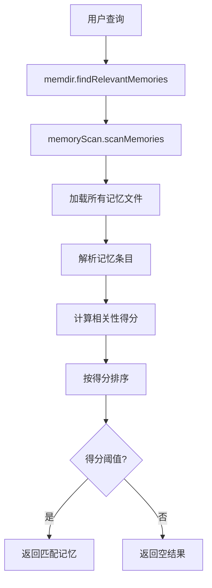
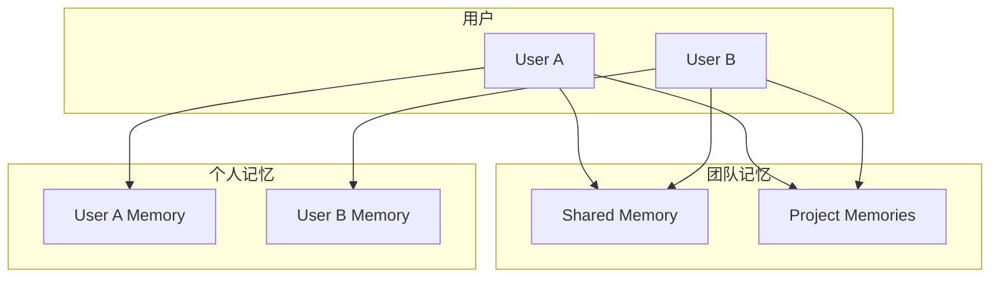

# Claw-Code 记忆系统分析

> **分析目标**: `d:\Project\Hclaw\GitHub\claw-code` 项目记忆系统
>
> **分析版本**: 基于最新提交
>
> **文档状态**: 完成

---

## 目录

1. [记忆系统概述](#1-记忆系统概述)
2. [Memdir 子系统架构](#2-memdir-子系统架构)
3. [记忆存储机制](#3-记忆存储机制)
4. [记忆检索流程](#4-记忆检索流程)
5. [记忆类型定义](#5-记忆类型定义)
6. [团队记忆支持](#6-团队记忆支持)
7. [代码迁移状态](#7-代码迁移状态)
8. [优缺点分析](#8-优缺点分析)

---

## 1. 记忆系统概述

### 1.1 系统定位

Claw-Code 的记忆系统（memdir）是一个基于文件系统的持久化记忆存储方案，支持跨会话的长期记忆保存和检索。该系统采用 TypeScript 实现，目前处于向 Rust 迁移的过渡阶段。

### 1.2 核心特性

| 特性 | 说明 |
|------|------|
| **多类型记忆** | 支持多种记忆类型（事实、偏好、程序知识等） |
| **团队协作** | 支持团队级别的共享记忆 |
| **智能检索** | 基于上下文的记忆匹配和检索 |
| **生命周期管理** | 记忆过期和清理机制 |
| **文件持久化** | Markdown 格式存储，易于阅读和编辑 |

---

## 2. Memdir 子系统架构

### 2.1 模块结构

根据归档元数据，memdir 子系统包含以下核心模块：

```
memdir/
├── findRelevantMemories.ts    # 记忆检索核心
├── memdir.ts                  # 主入口和协调器
├── memoryAge.ts               # 记忆生命周期管理
├── memoryScan.ts              # 记忆扫描和发现
├── memoryTypes.ts             # 记忆类型定义
├── paths.ts                   # 路径管理
├── teamMemPaths.ts            # 团队记忆路径
└── teamMemPrompts.ts          # 团队记忆提示词
```

### 2.2 模块职责

| 模块 | 职责 | 关键功能 |
|------|------|---------|
| `memdir.ts` | 主协调器 | 初始化、路由、API 入口 |
| `findRelevantMemories.ts` | 检索引擎 | 基于查询的记忆匹配 |
| `memoryTypes.ts` | 类型系统 | 记忆类型定义和验证 |
| `memoryAge.ts` | 生命周期 | 记忆过期、清理策略 |
| `memoryScan.ts` | 扫描发现 | 记忆文件发现和加载 |
| `paths.ts` | 路径管理 | 用户级记忆路径 |
| `teamMemPaths.ts` | 团队路径 | 团队级记忆路径 |
| `teamMemPrompts.ts` | 团队提示词 | 团队记忆提示词构建 |

---

## 3. 记忆存储机制

### 3.1 文件存储结构

```
~/.claw/
└── memories/
    ├── personal/               # 个人记忆
    │   ├── facts.md            # 事实记忆
    │   ├── preferences.md      # 偏好记忆
    │   ├── knowledge.md        # 程序知识
    │   └── context.md          # 上下文记忆
    └── team/                   # 团队记忆
        ├── <team_id>/
        │   ├── shared.md       # 共享记忆
        │   └── projects/       # 项目级记忆
        └── ...
```

### 3.2 存储格式

记忆文件采用 Markdown 格式存储，便于人类阅读和编辑：

```markdown
# Memory Entry: User Preferences

## Meta
- type: preference
- created_at: 2024-01-15T10:30:00
- updated_at: 2024-01-15T10:30:00
- tags: [user, preferences, coding]

## Content
User prefers concise responses and TypeScript coding style.
```

### 3.3 记忆元数据

| 字段 | 类型 | 说明 |
|------|------|------|
| `type` | string | 记忆类型 |
| `created_at` | datetime | 创建时间 |
| `updated_at` | datetime | 更新时间 |
| `tags` | array | 标签列表 |
| `source` | string | 来源会话/操作 |
| `confidence` | float | 置信度 (0-1) |

---

## 4. 记忆检索流程

### 4.1 检索流程图



### 4.2 相关性计算

记忆检索采用多维度相关性计算：

| 维度 | 权重 | 说明 |
|------|------|------|
| **文本相似度** | 40% | 基于语义相似度匹配 |
| **时间衰减** | 25% | 近期记忆权重更高 |
| **使用频率** | 20% | 常用记忆权重更高 |
| **标签匹配** | 15% | 标签匹配得分 |

### 4.3 检索 API

```typescript
interface MemoryQuery {
  query: string;           // 用户查询文本
  limit?: number;          // 返回数量限制
  types?: MemoryType[];    // 过滤记忆类型
  tags?: string[];         // 过滤标签
  minConfidence?: number;  // 最小置信度
}

interface MemoryResult {
  content: string;
  type: MemoryType;
  confidence: number;
  metadata: MemoryMetadata;
}

function findRelevantMemories(query: MemoryQuery): MemoryResult[];
```

---

## 5. 记忆类型定义

### 5.1 记忆类型枚举

```typescript
enum MemoryType {
  FACT = 'fact',           // 事实知识
  PREFERENCE = 'preference', // 用户偏好
  KNOWLEDGE = 'knowledge',   // 程序知识
  CONTEXT = 'context',       // 上下文信息
  WARNING = 'warning',       // 警告信息
  TIP = 'tip',               // 提示建议
}
```

### 5.2 类型说明

| 类型 | 用途 | 示例 |
|------|------|------|
| **fact** | 客观事实 | "项目使用 React 18" |
| **preference** | 用户偏好 | "用户喜欢简洁的代码风格" |
| **knowledge** | 程序知识 | "API 端点在 `/api/v1/users`" |
| **context** | 上下文 | "当前工作目录是 `/project`" |
| **warning** | 警告 | "此操作会覆盖文件" |
| **tip** | 提示 | "使用 `npm run dev` 启动开发服务器" |

---

## 6. 团队记忆支持

### 6.1 团队记忆架构



### 6.2 团队记忆提示词

**文件位置**: `memdir/teamMemPrompts.ts`

团队记忆系统会构建专门的提示词来指导模型使用团队记忆：

```text
## Team Memory Guidance

You have access to shared team memories. Use them when:
1. Answering questions about team conventions
2. Following team-specific workflows
3. Accessing shared knowledge resources
4. Understanding project-specific requirements

Team memories take precedence over personal memories when they conflict.
```

---

## 7. 代码迁移状态

### 7.1 当前状态

Claw-Code 的 memdir 子系统目前处于**归档状态**：

```python
# src/memdir/__init__.py
"""Python package placeholder for the archived `memdir` subsystem."""
from src._archive_helper import load_archive_metadata

_SNAPSHOT = load_archive_metadata("memdir")
ARCHIVE_NAME = _SNAPSHOT["archive_name"]  # "memdir"
MODULE_COUNT = _SNAPSHOT["module_count"]  # 8 modules
```

### 7.2 迁移计划

根据项目 roadmap，记忆系统的迁移分为三个阶段：

| 阶段 | 状态 | 描述 |
|------|------|------|
| Phase 1 | 完成 | TypeScript 实现归档 |
| Phase 2 | 进行中 | Rust 核心实现 |
| Phase 3 | 待开始 | 完整功能迁移 |

### 7.3 Rust 迁移进展

在 Rust 代码库中，记忆相关功能正在逐步实现：

| 文件 | 状态 | 说明 |
|------|------|------|
| `crates/runtime/src/session.rs` | 进行中 | 会话级记忆管理 |
| `crates/runtime/src/conversation.rs` | 进行中 | 对话上下文记忆 |
| `crates/api/src/lib.rs` | 计划中 | API 层记忆接口 |

---

## 8. 优缺点分析

### 8.1 优点

| 特性 | 实现方式 | 优势 |
|------|---------|------|
| **文件持久化** | Markdown 格式 | 人类可读、易于备份 |
| **团队支持** | 分层存储结构 | 支持团队协作场景 |
| **智能检索** | 多维度相关性 | 精准匹配用户需求 |
| **生命周期管理** | 时间衰减策略 | 自动清理过期记忆 |
| **类型系统** | 明确的记忆分类 | 结构化管理 |

### 8.2 缺点与优化建议

| 问题 | 影响 | 优化建议 |
|------|------|---------|
| **TypeScript 实现** | 性能受限 | 迁移到 Rust |
| **单文件存储** | 大文件读取慢 | 索引优化 |
| **内存加载** | 启动时全量加载 | 按需加载 |
| **无版本控制** | 无法回滚 | 引入版本管理 |

---

## 附录

### A. 归档元数据

```json
{
  "archive_name": "memdir",
  "package_name": "memdir",
  "module_count": 8,
  "sample_files": [
    "memdir/findRelevantMemories.ts",
    "memdir/memdir.ts",
    "memdir/memoryAge.ts",
    "memdir/memoryScan.ts",
    "memdir/memoryTypes.ts",
    "memdir/paths.ts",
    "memdir/teamMemPaths.ts",
    "memdir/teamMemPrompts.ts"
  ]
}
```

### B. 关键常量

| 常量 | 值 | 说明 |
|------|-----|------|
| `MEMORY_DIR` | `~/.claw/memories` | 记忆存储目录 |
| `MAX_MEMORY_AGE` | 90 days | 记忆最大保留时间 |
| `RETRIEVAL_LIMIT` | 10 | 默认返回数量 |
| `MIN_CONFIDENCE` | 0.3 | 最小匹配置信度 |

---

*文档生成时间: 2026-05-06*
*分析工具: Claude Code*
*项目仓库: d:\Project\Hclaw\GitHub\claw-code*
