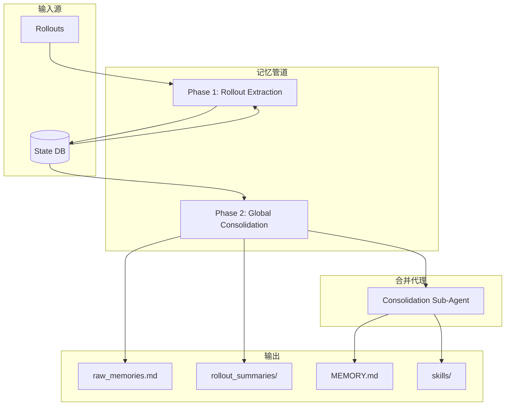
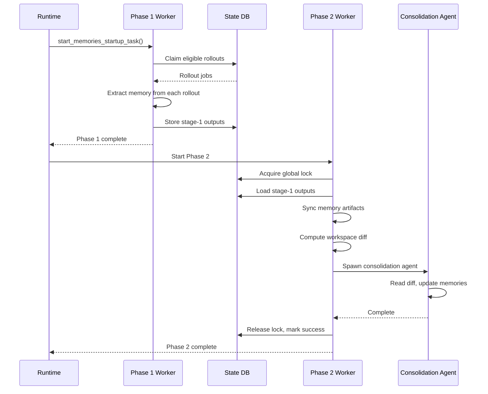
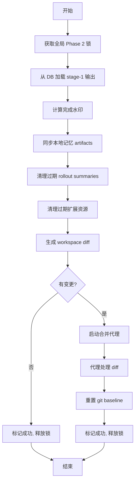
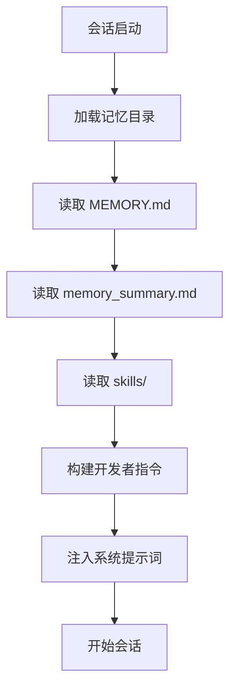

# Codex 记忆系统分析

> **分析目标**: `d:\Project\Hclaw\codex\codex-rs\memories` 模块
>
> **分析版本**: 基于最新提交
>
> **文档状态**: 完成

---

## 目录

1. [记忆系统架构总览](#1-记忆系统架构总览)
2. [双阶段处理流程](#2-双阶段处理流程)
3. [Phase 1: Rollout 提取](#3-phase-1-rollout-提取)
4. [Phase 2: 全局合并](#4-phase-2-全局合并)
5. [文件存储结构](#5-文件存储结构)
6. [状态数据库](#6-状态数据库)
7. [提示词模板](#7-提示词模板)
8. [记忆读取路径](#8-记忆读取路径)
9. [优缺点分析](#9-优缺点分析)

---

## 1. 记忆系统架构总览

### 1.1 整体架构图



### 1.2 触发条件

记忆管道在以下条件都满足时触发：

| 条件 | 说明 |
|------|------|
| 非临时会话 | `ephemeral=false` |
| 记忆功能启用 | `memory.feature_enabled=true` |
| 非子代理会话 | 不是 `sub_agent` 上下文 |
| 状态数据库可用 | State DB 连接正常 |

---

## 2. 双阶段处理流程

### 2.1 流程概览



### 2.2 阶段对比

| 特性 | Phase 1 | Phase 2 |
|------|---------|---------|
| **并行度** | 多线程并行 (最多8个) | 单线程串行 |
| **锁定方式** | 按 rollout 单独锁定 | 全局锁定 |
| **输出** | Stage-1 记录 | 合并后的记忆文件 |
| **模型** | gpt-5.4-mini | gpt-5.4 |
| **推理级别** | Low | Medium |

---

## 3. Phase 1: Rollout 提取

### 3.1 处理流程

```mermaid
flowchart TD
    A[开始] --> B[从 DB 读取 eligible rollouts]
    B --> C{还有 rollout?}
    C -->|否| D[结束]
    C -->|是| E[Claim rollout (获取锁)]
    E --> F[过滤记忆相关内容]
    F --> G[调用模型提取记忆]
    G --> H{成功?}
    H -->|否| I[标记失败, 重试延迟]
    I --> C
    H -->|是| J[脱敏处理]
    J --> K[存储到 DB]
    K --> C
```

### 3.2 配置参数

**文件位置**: `codex-rs/memories/write/src/lib.rs`

```rust
mod stage_one {
    pub(super) const MODEL: &str = "gpt-5.4-mini";
    pub(super) const REASONING_EFFORT: ReasoningEffort = ReasoningEffort::Low;
    pub(super) const CONCURRENCY_LIMIT: usize = 8;
    pub(super) const JOB_LEASE_SECONDS: i64 = 3_600;
    pub(super) const JOB_RETRY_DELAY_SECONDS: i64 = 3_600;
    pub(super) const THREAD_SCAN_LIMIT: usize = 5_000;
    pub(super) const DEFAULT_ROLLOUT_TOKEN_LIMIT: usize = 150_000;
    pub(super) const CONTEXT_WINDOW_PERCENT: i64 = 70;
}
```

### 3.3 Eligible Rollout 选择规则

| 规则 | 说明 |
|------|------|
| 来源过滤 | 仅允许交互式会话来源 |
| 时间窗口 | 在配置的年龄窗口内 |
| 空闲时间 | 足够长的空闲时间（避免总结活跃会话） |
| 未被认领 | 未被其他 worker 处理 |
| 扫描限制 | 受启动扫描/认领限制约束 |

### 3.4 输出结构

每个 rollout 提取后生成：

| 字段 | 类型 | 说明 |
|------|------|------|
| `raw_memory` | 详细文本 | 提取的原始记忆内容 |
| `rollout_summary` | 紧凑文本 | rollout 的摘要 |
| `rollout_slug` | 可选字符串 | rollout 的简短标识符 |

---

## 4. Phase 2: 全局合并

### 4.1 处理流程



### 4.2 配置参数

```rust
mod stage_two {
    pub(super) const MODEL: &str = "gpt-5.4";
    pub(super) const REASONING_EFFORT: ReasoningEffort = ReasoningEffort::Medium;
    pub(super) const JOB_LEASE_SECONDS: i64 = 3_600;
    pub(super) const JOB_RETRY_DELAY_SECONDS: i64 = 3_600;
    pub(super) const JOB_HEARTBEAT_SECONDS: u64 = 90;
}
```

### 4.3 Stage-1 选择规则

| 规则 | 说明 |
|------|------|
| 使用次数优先 | 按 `usage_count` 排序 |
| 时间回退 | 无使用记录时使用 `generated_at` |
| 最大未使用天数 | `max_unused_days` 配置限制 |
| 数量限制 | 只加载前 N 个 |

---

## 5. 文件存储结构

### 5.1 目录布局

```
~/.codex/
└── memories/
    ├── .git/                      # git baseline 目录
    ├── raw_memories.md            # 合并后的原始记忆
    ├── MEMORY.md                  # 合并后的主记忆文件
    ├── memory_summary.md          # 记忆摘要
    ├── phase2_workspace_diff.md   # 工作区差异文件
    ├── rollout_summaries/         # rollout 摘要目录
    │   ├── <rollout_id>_summary.md
    │   └── ...
    └── extensions/                # 记忆扩展
        └── <extension_name>/
            └── instructions.md
```

### 5.2 关键文件说明

| 文件 | 用途 | 更新频率 |
|------|------|---------|
| `raw_memories.md` | 合并所有 stage-1 记忆 | Phase 2 |
| `MEMORY.md` | 最终合并记忆 | 合并代理 |
| `memory_summary.md` | 记忆摘要 | 合并代理 |
| `phase2_workspace_diff.md` | 工作区变更 | Phase 2 |
| `rollout_summaries/*.md` | 单个 rollout 摘要 | Phase 2 |

### 5.3 扩展资源清理

```rust
mod extension_resources {
    pub(super) const RETENTION_DAYS: i64 = 7;  // 保留7天
}
```

---

## 6. 状态数据库

### 6.1 数据库表结构

| 表 | 用途 | 关键字段 |
|------|------|---------|
| `memory_phase1_jobs` | Phase 1 任务记录 | `rollout_id`, `status`, `output`, `lease_until` |
| `memory_phase2_jobs` | Phase 2 任务记录 | `lock_held`, `watermark`, `status` |
| `stage1_outputs` | Phase 1 输出 | `raw_memory`, `rollout_summary`, `selected_for_phase2` |

### 6.2 任务状态

**Phase 1 状态**:

| 状态 | 说明 |
|------|------|
| `pending` | 待处理 |
| `in_progress` | 处理中 |
| `succeeded` | 成功（生成记忆） |
| `succeeded_no_output` | 成功（无有用输出） |
| `failed` | 失败（带重试延迟） |

### 6.3 锁定机制

**Phase 1**: 每个 rollout 单独锁定，允许多个 worker 并行处理

**Phase 2**: 全局锁定，只有一个 worker 可以执行合并

---

## 7. 提示词模板

### 7.1 Stage 1 提示词

**文件位置**: `codex-rs/memories/write/templates/memories/stage_one_system.md`

```text
You are a memory extraction assistant. Extract key facts and insights from the conversation rollout that would be useful for future sessions.

Output format:
{
  "raw_memory": "...detailed memory content...",
  "rollout_summary": "...concise summary...",
  "rollout_slug": "optional-short-identifier"
}

Rules:
- Extract durable facts, not transient task state
- Focus on user preferences, environment facts, and learned patterns
- Keep raw_memory detailed but not verbose
- rollout_summary should be 1-2 sentences
```

### 7.2 Consolidation 提示词

**文件位置**: `codex-rs/memories/write/templates/memories/consolidation.md`

```text
You are a memory consolidation assistant. Review the workspace diff and update the memory files accordingly.

Rules:
- Merge new memories into MEMORY.md
- Remove stale memories
- Keep entries concise and organized
- Update memory_summary.md with a brief overview
- Create/update skills when appropriate
```

---

## 8. 记忆读取路径

### 8.1 读取流程



### 8.2 开发者指令构建

**文件位置**: `codex-rs/memories/read/src/prompts.rs`

```rust
pub fn build_memory_tool_developer_instructions(
    memory_root: &AbsolutePathBuf,
) -> Result<String> {
    // 读取记忆文件
    // 构建指令内容
    // 限制 token 数量
    Ok(instructions)
}
```

### 8.3 Token 限制

```rust
const MEMORY_TOOL_DEVELOPER_INSTRUCTIONS_SUMMARY_TOKEN_LIMIT: usize = 5_000;
```

---

## 9. 优缺点分析

### 9.1 优点

| 特性 | 实现方式 | 优势 |
|------|---------|------|
| **双阶段设计** | Phase 1 并行提取，Phase 2 串行合并 | 高效且保证一致性 |
| **分布式锁** | DB-based leasing | 支持多实例部署 |
| **重试机制** | 失败任务带延迟重试 | 提高可靠性 |
| **Git baseline** | 使用 git 追踪变更 | 可回滚、可审计 |
| **模型分层** | 轻量任务用 mini 模型 | 成本优化 |

### 9.2 缺点与优化建议

| 问题 | 影响 | 优化建议 |
|------|------|---------|
| **Phase 2 串行** | 高负载时可能成为瓶颈 | 增量合并策略 |
| **全局锁定** | 长时间合并阻塞其他操作 | 细粒度锁定 |
| **固定模型** | 无法根据负载调整 | 动态模型选择 |
| **内存限制** | 大记忆集可能超限 | 分页加载 |

---

## 附录

### A. 关键路径

| 路径 | 说明 |
|------|------|
| `codex-rs/memories/read/` | 读取路径实现 |
| `codex-rs/memories/write/` | 写入路径实现 |
| `codex-rs/memories/mcp/` | MCP 接口 |

### B. 环境变量

| 变量 | 用途 | 默认值 |
|------|------|---------|
| `CODEX_MEMORY_FEATURE_ENABLED` | 启用记忆功能 | true |
| `CODEX_MEMORY_MAX_UNUSED_DAYS` | 最大未使用天数 | 30 |
| `CODEX_MEMORY_PHASE1_CONCURRENCY` | Phase 1 并发数 | 8 |

---

*文档生成时间: 2026-05-06*
*分析工具: Claude Code*
*项目仓库: d:\Project\Hclaw\codex*
