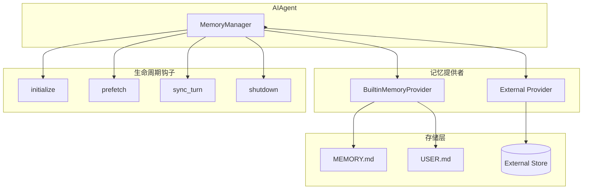
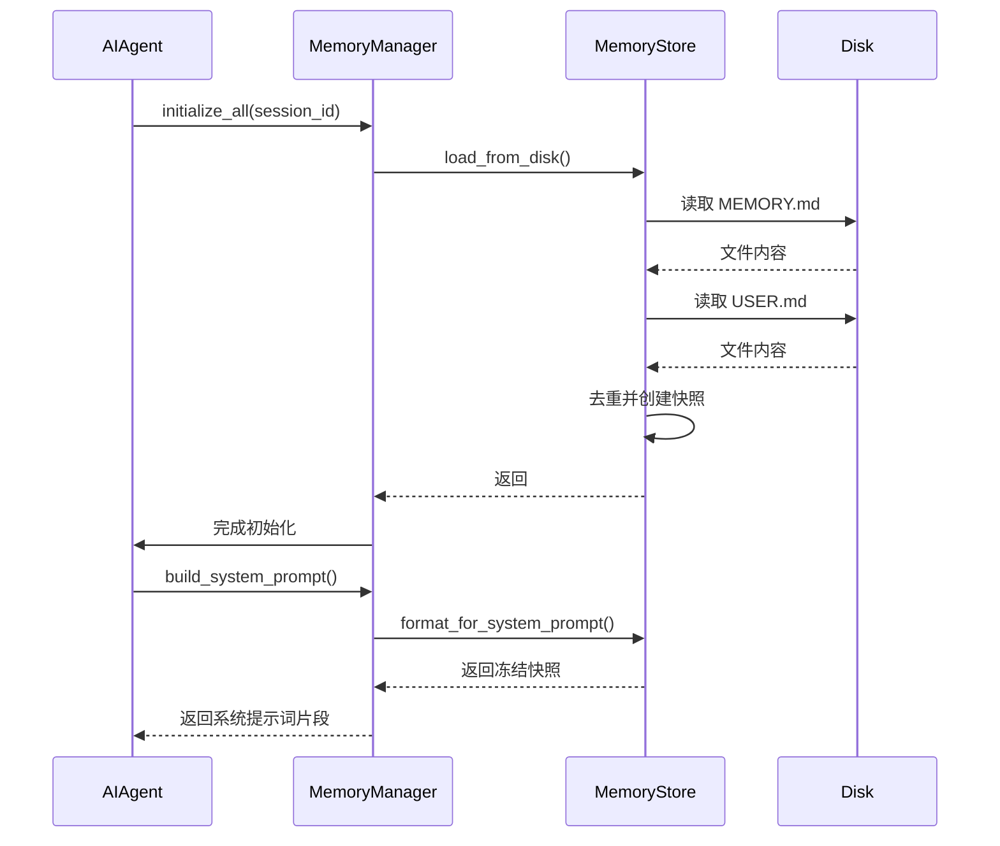
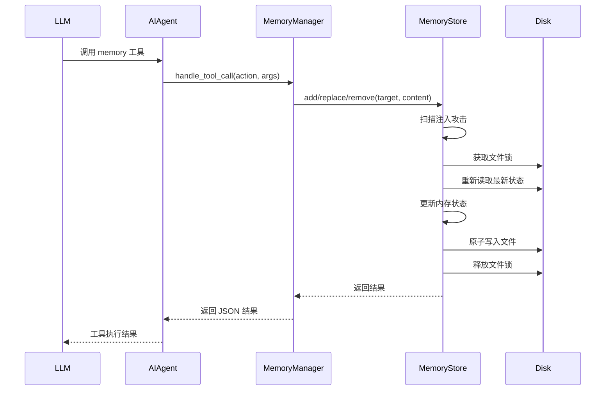

# Hermes Agent 记忆系统分析

> **分析目标**: `d:\Project\Hclaw\GitHub\hermes-agent` 项目记忆系统
>
> **分析版本**: 基于最新提交
>
> **文档状态**: 完成

---

## 目录

1. [记忆系统架构总览](#1-记忆系统架构总览)
2. [MemoryManager 协调器](#2-memorymanager-协调器)
3. [MemoryProvider 抽象层](#3-memoryprovider-抽象层)
4. [内置记忆存储](#4-内置记忆存储)
5. [记忆系统工作流程](#5-记忆系统工作流程)
6. [文件存储机制](#6-文件存储机制)
7. [安全机制](#7-安全机制)
8. [外部记忆提供者](#8-外部记忆提供者)
9. [优缺点分析](#9-优缺点分析)

---

## 1. 记忆系统架构总览

### 1.1 整体架构图



### 1.2 核心组件职责

| 组件 | 职责 | 关键特性 |
|------|------|---------|
| **MemoryManager** | 协调多个记忆提供者 | 支持内置 + 一个外部提供者 |
| **MemoryProvider** | 抽象基类 | 定义提供者接口规范 |
| **MemoryStore** | 文件持久化存储 | 双存储 (MEMORY.md / USER.md) |
| **BuiltinMemoryProvider** | 内置记忆实现 | 基于文件的持久化 |
| **External Providers** | 外部记忆服务 | Honcho, Mem0 等 |

---

## 2. MemoryManager 协调器

### 2.1 核心设计

**文件位置**: `agent/memory_manager.py`

MemoryManager 是记忆系统的单一集成点，负责：

1. **提供者注册** - 管理内置和外部提供者
2. **工具路由** - 将工具调用路由到正确的提供者
3. **生命周期管理** - 协调所有提供者的生命周期

### 2.2 提供者注册规则

```python
def add_provider(self, provider: MemoryProvider) -> None:
    """Register a memory provider.

    Built-in provider (name ``"builtin"``) is always accepted.
    Only **one** external (non-builtin) provider is allowed — a second
    attempt is rejected with a warning.
    """
    is_builtin = provider.name == "builtin"

    if not is_builtin:
        if self._has_external:
            # 拒绝第二个外部提供者
            logger.warning("Rejected memory provider '%s' — external provider '%s' is already registered")
            return
        self._has_external = True
```

**设计原则**:
- 内置提供者始终优先注册
- 最多只允许一个外部提供者（防止工具schema膨胀）
- 外部提供者不会禁用内置存储

---

## 3. MemoryProvider 抽象层

### 3.1 生命周期接口

**文件位置**: `agent/memory_provider.py`

```python
class MemoryProvider(ABC):
    """Abstract base class for memory providers."""

    @property
    @abstractmethod
    def name(self) -> str:
        """Short identifier for this provider."""

    @abstractmethod
    def is_available(self) -> bool:
        """Return True if provider is configured and ready."""

    @abstractmethod
    def initialize(self, session_id: str, **kwargs) -> None:
        """Initialize for a session."""

    def system_prompt_block(self) -> str:
        """Return text to include in the system prompt."""
        return ""

    def prefetch(self, query: str, *, session_id: str = "") -> str:
        """Recall relevant context for the upcoming turn."""
        return ""

    def sync_turn(self, user_content: str, assistant_content: str, *, session_id: str = "") -> None:
        """Persist a completed turn to the backend."""

    @abstractmethod
    def get_tool_schemas(self) -> List[Dict[str, Any]]:
        """Return tool schemas this provider exposes."""

    def shutdown(self) -> None:
        """Clean shutdown."""
```

### 3.2 可选钩子

| 钩子方法 | 触发时机 | 用途 |
|---------|---------|------|
| `on_turn_start` | 每轮开始时 | 回合计数、范围管理 |
| `on_session_end` | 会话结束时 | 会话级事实提取 |
| `on_pre_compress` | 上下文压缩前 | 提取即将丢弃的信息 |
| `on_memory_write` | 内置记忆写入时 | 镜像内置写入到外部存储 |
| `on_delegation` | 子代理完成时 | 观察子代理工作 |

---

## 4. 内置记忆存储

### 4.1 MemoryStore 设计

**文件位置**: `tools/memory_tool.py`

MemoryStore 维护两个并行状态：

| 状态 | 用途 | 更新时机 |
|------|------|---------|
| `_system_prompt_snapshot` | 系统提示词注入 | 会话开始时冻结 |
| `memory_entries` / `user_entries` | 实时状态 | 工具调用时更新 |

### 4.2 文件结构

```
~/.hermes/
└── memories/
    ├── MEMORY.md        # 代理个人笔记
    ├── USER.md          # 用户档案
    ├── MEMORY.md.lock   # 文件锁
    └── USER.md.lock     # 文件锁
```

### 4.3 字符限制

| 存储类型 | 字符限制 | 说明 |
|---------|---------|------|
| MEMORY.md | 2,200 字符 | 环境事实、项目约定、工具特性 |
| USER.md | 1,375 字符 | 用户偏好、沟通风格、期望 |

### 4.4 条目分隔符

```python
ENTRY_DELIMITER = "\n§\n"  # 段落符号
```

---

## 5. 记忆系统工作流程

### 5.1 会话启动流程



### 5.2 工具调用流程



### 5.3 关键操作

#### Add 操作

```python
def add(self, target: str, content: str) -> Dict[str, Any]:
    # 1. 扫描注入攻击
    scan_error = _scan_memory_content(content)
    if scan_error:
        return {"success": False, "error": scan_error}

    # 2. 获取文件锁
    with self._file_lock(self._path_for(target)):
        # 3. 重新读取最新状态
        self._reload_target(target)
        
        # 4. 检查重复
        if content in entries:
            return {"success": True, "message": "Entry already exists"}
        
        # 5. 检查字符限制
        if new_total > limit:
            return {"success": False, "error": "Exceeds limit"}
        
        # 6. 添加并持久化
        entries.append(content)
        self.save_to_disk(target)
```

---

## 6. 文件存储机制

### 6.1 原子写入

```python
def _write_file(path: Path, entries: List[str]):
    """Write entries to a memory file using atomic temp-file + rename."""
    content = ENTRY_DELIMITER.join(entries)
    
    # 使用临时文件写入
    fd, tmp_path = tempfile.mkstemp(
        dir=str(path.parent), suffix=".tmp", prefix=".mem_"
    )
    try:
        with os.fdopen(fd, "w", encoding="utf-8") as f:
            f.write(content)
            f.flush()
            os.fsync(f.fileno())
        # 原子替换
        atomic_replace(tmp_path, path)
    except BaseException:
        # 清理临时文件
        os.unlink(tmp_path)
        raise
```

**优势**:
- 避免并发读取时看到空文件
- 保证文件完整性

### 6.2 文件锁机制

```python
@staticmethod
@contextmanager
def _file_lock(path: Path):
    """Acquire an exclusive file lock for read-modify-write safety."""
    lock_path = path.with_suffix(path.suffix + ".lock")
    
    if fcntl:
        # Unix: fcntl.flock
        fcntl.flock(fd, fcntl.LOCK_EX)
    elif msvcrt:
        # Windows: msvcrt.locking
        msvcrt.locking(fd.fileno(), msvcrt.LK_LOCK, 1)
```

---

## 7. 安全机制

### 7.1 内容扫描

```python
_MEMORY_THREAT_PATTERNS = [
    # 提示词注入
    (r'ignore\s+(previous|all|above|prior)\s+instructions', "prompt_injection"),
    (r'you\s+are\s+now\s+', "role_hijack"),
    (r'do\s+not\s+tell\s+the\s+user', "deception_hide"),
    
    # 凭证泄露
    (r'curl\s+[^\n]*\$\{?\w*(KEY|TOKEN|SECRET|PASSWORD|CREDENTIAL|API)', "exfil_curl"),
    (r'cat\s+[^\n]*(\.env|credentials|\.netrc|\.pgpass)', "read_secrets"),
    
    # SSH 后门
    (r'authorized_keys', "ssh_backdoor"),
    (r'\$HOME/\.ssh|\~/\.ssh', "ssh_access"),
]

_INVISIBLE_CHARS = {
    '\u200b', '\u200c', '\u200d', '\u2060', '\ufeff',
    '\u202a', '\u202b', '\u202c', '\u202d', '\u202e',
}
```

### 7.2 扫描流程

```python
def _scan_memory_content(content: str) -> Optional[str]:
    # 检查不可见字符
    for char in _INVISIBLE_CHARS:
        if char in content:
            return f"Blocked: content contains invisible unicode..."

    # 检查威胁模式
    for pattern, pid in _MEMORY_THREAT_PATTERNS:
        if re.search(pattern, content, re.IGNORECASE):
            return f"Blocked: content matches threat pattern '{pid}'..."

    return None
```

---

## 8. 外部记忆提供者

### 8.1 支持的提供者

| 提供者 | 路径 | 类型 |
|------|------|------|
| **Honcho** | `plugins/memory/honcho/` | 记忆插件 |
| **Mem0** | `plugins/memory/mem0/` | 记忆插件 |

### 8.2 配置方式

```yaml
# config.yaml
memory:
  provider: honcho  # 或 mem0, 留空使用内置
```

### 8.3 数据镜像

当外部提供者注册时，内置记忆的写入会通过 `on_memory_write` 钩子同步：

```python
def on_memory_write(self, action: str, target: str, content: str, metadata=None):
    """Called when the built-in memory tool writes an entry."""
    for provider in self._providers:
        if provider.name == "builtin":
            continue  # 跳过内置提供者
        provider.on_memory_write(action, target, content, metadata)
```

---

## 9. 优缺点分析

### 9.1 优点

| 特性 | 实现方式 | 优势 |
|------|---------|------|
| **冻结快照模式** | 会话开始时冻结系统提示词 | 保持前缀缓存稳定 |
| **原子写入** | 临时文件 + rename | 并发安全 |
| **多提供者支持** | MemoryManager 协调 | 可扩展外部存储 |
| **内容安全扫描** | 模式匹配 + 不可见字符检测 | 防止提示词注入 |
| **字符限制** | 按存储类型限制 | 控制 token 消耗 |

### 9.2 缺点与优化建议

| 问题 | 影响 | 优化建议 |
|------|------|---------|
| **单外部提供者限制** | 无法同时使用多个外部存储 | 支持提供者链 |
| **无版本历史** | 无法回滚记忆变更 | 添加版本控制 |
| **同步写入** | 大写入会阻塞 | 异步写入队列 |
| **固定字符限制** | 无法根据模型调整 | 动态限制 |

---

## 附录

### A. 工具 Schema

```python
MEMORY_SCHEMA = {
    "name": "memory",
    "description": "Save durable information to persistent memory...",
    "parameters": {
        "action": {"type": "string", "enum": ["add", "replace", "remove"]},
        "target": {"type": "string", "enum": ["memory", "user"]},
        "content": {"type": "string"},
        "old_text": {"type": "string"},
    },
    "required": ["action", "target"],
}
```

### B. 工具操作指南

| 操作 | 参数 | 说明 |
|------|------|------|
| `add` | `target`, `content` | 添加新条目 |
| `replace` | `target`, `old_text`, `content` | 替换匹配条目 |
| `remove` | `target`, `old_text` | 删除匹配条目 |

---

*文档生成时间: 2026-05-06*
*分析工具: Claude Code*
*项目仓库: d:\Project\Hclaw\GitHub\hermes-agent*
