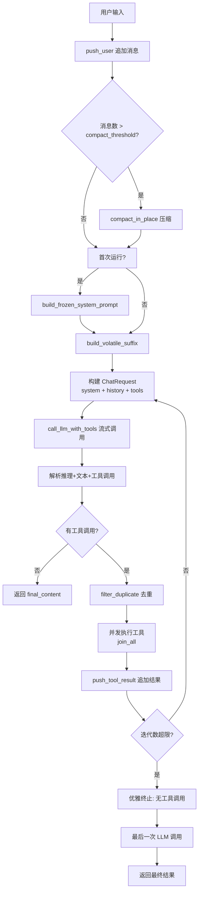
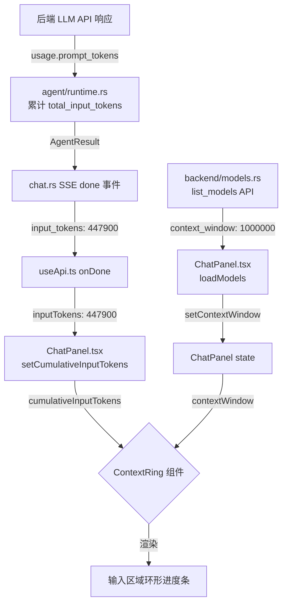
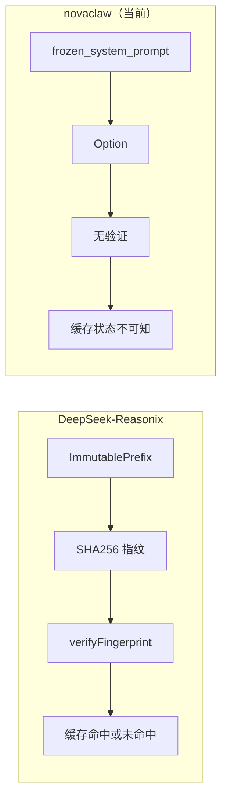
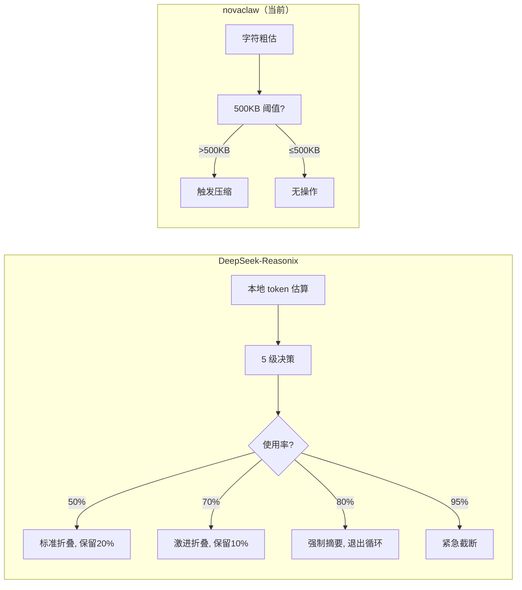

# novaclaw 后端缓存优化分析报告

> 分析日期：2026-05-26 | 目标：`d:\Project\novaclaw\backend\src` | 对标：DeepSeek-Reasonix v0.48.0

---

## 一、当前架构概述

### 1.1 后端技术栈

| 组件 | 实现 | 文件 |
|------|------|------|
| Web 框架 | Axum 0.7 + WebSocket | [server/mod.rs](file:///d:/Project/novaclaw/backend/src/server/mod.rs) |
| LLM 客户端 | Reqwest + SSE 流式 | [llm/client.rs](file:///d:/Project/novaclaw/backend/src/llm/client.rs) |
| Agent 循环 | ReAct Loop | [agent/runtime.rs](file:///d:/Project/novaclaw/backend/src/agent/runtime.rs) |
| 会话管理 | AgentSession（内存 + API 持久化） | [agent/session.rs](file:///d:/Project/novaclaw/backend/src/agent/session.rs) |
| 提示词构建 | SystemPromptBuilder | [agent/prompt.rs](file:///d:/Project/novaclaw/backend/src/agent/prompt.rs) |
| 工具系统 | ToolRegistry | [tools/registry.rs](file:///d:/Project/novaclaw/backend/src/tools/registry.rs) |
| 记忆系统 | MemoryStore（MEMORY.md + USER.md） | [memory/store.rs](file:///d:/Project/novaclaw/backend/src/memory/store.rs) |

### 1.2 Agent 循环执行流程（已实现）



---

## 二、与 DeepSeek-Reasonix 缓存机制逐项对比

### 2.1 总体对比矩阵

| 维度 | DeepSeek-Reasonix | novaclaw 当前实现 | 差距等级 |
|------|-------------------|-------------------|---------|
| **前缀冻结** | ImmutablePrefix 类，SHA256 指纹检测 | `frozen_system_prompt` 字段（仅存储，无指纹） | ⚠️ 中 |
| **追加日志** | AppendOnlyLog 类，严格禁止原位修改 | `messages: Vec<AgentMessage>`（例外：compact_in_place 允许重写） | ⚠️ 中 |
| **易失暂存** | VolatileScratch，思考内容不发送给 API | `volatile_suffix` 追加到 user 消息末尾（正确实现了隔离） | ✅ 好 |
| **缓存度量** | Usage 类：hit/miss 分类 + `cacheHitRatio` | `cache_hit_tokens` / `cache_miss_tokens` 计数，`cache_hit_rate()` 计算 | ✅ 好 |
| **工具调用修复** | 4 阶段修复（Scavenge/Truncation/Storm/Flatten） | `filter_duplicate_tool_calls` + doom-loop 检测 + `strip_orphan_tool_calls` | ⚠️ 中 |
| **上下文折叠** | 5 级阈值（50%→95%），AI 摘要+greedy | `compact_threshold`（消息数触发）+ AI 摘要（有实现） | ⚠️ 中 |
| **成本控制** | 5 层成本体系，Flash 优先，自动升级 | 无 | 🔴 严重 |
| **V4 模板对齐** | 完整移植 DeepSeek V4 聊天模板 | 通用 OpenAI 格式 | 🔴 严重 |
| **请求预检** | `decidePreflight` + token 估算 + body 字节限制 | `maybe_compact_for_preflight`（字符估算） | ⚠️ 中 |
| **并行工具调度** | 安全分组 + Promise.allSettled | `futures::future::join_all`（无安全分组） | ⚠️ 低 |
| **流式工具调用** | 实时 tool_call_delta 事件 | 流结束时攒批发出 | ⚠️ 中 |

---

## 三、逐项深度分析

### 3.1 前缀稳定性（缓存命中的基石）

#### DeepSeek-Reasonix 做法

[src/memory/runtime.ts](file:///d:/Project/novaclaw/参考项目/DeepSeek-Reasonix/src/memory/runtime.ts#L10-L76)

```typescript
class ImmutablePrefix {
  private _fingerprintCache: string | null = null;

  private computeFingerprint(): string {
    // SHA256(system + tools + fewShots) → 16 字符 hex
    return createHash("sha256").update(blob).digest("hex").slice(0, 16);
  }

  addTool(spec: ToolSpec): boolean {
    // 添加新工具 → 指纹失效 → 下次请求缓存未命中
    this._fingerprintCache = null;
  }
}
```

核心要点：
- **指纹检测**：每次请求前验证指纹是否变化，变化意味着缓存即将丢失
- **硬性不变约束**：`verifyFingerprint()` 在 dev 模式下抛出异常
- **工具集变更显式触发**：`addTool/removeTool` 明确无效化缓存

#### novaclaw 当前实现

[agent/session.rs](file:///d:/Project/novaclaw/backend/src/agent/session.rs#L1-L85)

```rust
pub struct AgentSession {
    pub frozen_system_prompt: Option<String>,   // 仅存储
    pub messages: Vec<AgentMessage>,             // 允许原位修改
    pub cache_hit_tokens: u64,
    pub cache_miss_tokens: u64,
}
```

[agent/prompt.rs](file:///d:/Project/novaclaw/backend/src/agent/prompt.rs#L1-L80)

```rust
pub struct SystemPromptBuilder<'a> {
    soul_manager: Option<SoulManager>,
    memory_content: Option<String>,  // volatile 部分
}

impl SystemPromptBuilder {
    // build_frozen() — 不含 memory、环境等易变内容
    pub async fn build_frozen(&self) -> String {
        // 1. Identity (SOUL.md)
        // 2. System rules
        // 3. Output format
        // 4. --- boundary
    }

    // build_volatile() — memory + 环境 + 技能
    pub fn build_volatile(&self) -> String {
        // 2. Memory
        // 6. Environment
        // 7. Skills
    }
}
```

[agent/runtime.rs](file:///d:/Project/novaclaw/backend/src/agent/runtime.rs#L850-L905)

```rust
// 正确：将 volatile 后缀追加到最后一个 user 消息末尾
if let Some(ref volatile) = self.volatile_suffix {
    if let Some(last_msg) = messages.last_mut() {
        if last_msg.role == "user" {
            let augmented = format!("{}\n\n---\n## Context & Environment\n\n{}", content, volatile);
            last_msg.content = serde_json::Value::String(augmented);
        }
    }
}
```

**✅ 已经正确的地方：**
1. `frozen_system_prompt` 概念已实现，且在会话期内只构建一次
2. `volatile_suffix`（memory + 日期 + 环境 + 技能）追加到最后一个 user 消息，不影响前缀稳定性
3. `reasoning_content` 不发送给 API（见 `call_llm_with_tools` 中 `reasoning_content: None`）

**⚠️ 可以优化的地方：**

**问题 1：缺少指纹检测机制**

[agent/runtime.rs](file:///d:/Project/novaclaw/backend/src/agent/runtime.rs#L1068-L1085)

```rust
async fn build_frozen_system_prompt(&self) -> String {
    if let Some(ref override_prompt) = self.session.system_prompt_override {
        return override_prompt.clone();
    }
    let soul_manager = {
        let state = crate::APP_STATE.read().await;
        state.soul_manager.clone()
    };
    crate::agent::prompt::SystemPromptBuilder::new(...)
        .with_soul_manager(soul_manager)
        .build_frozen().await
}
```

没有指纹检测机制：
- 无法感知 `system_prompt_override` 是否与之前不同
- 无法感知 `SOUL.md` 是否在会话期间被修改
- 无法在 dev 模式下预警缓存漂移

**建议改进：**
```rust
// 在 AgentSession 中添加指纹字段
pub frozen_prefix_fingerprint: Option<String>,  // SHA256 前缀指纹
pub prefix_invalidated: bool,                    // 前缀是否已失效

// build_frozen 成功后计算指纹
pub fn set_frozen_system_prompt(&mut self, prompt: String) -> bool {
    if self.frozen_system_prompt.is_some() {
        let new_fingerprint = Self::compute_fingerprint(&prompt);
        if self.frozen_prefix_fingerprint.as_deref() != Some(&new_fingerprint) {
            // 前缀已变化！标记缓存失效
            self.prefix_invalidated = true;
            // 更新存储
            self.frozen_system_prompt = Some(prompt);
            self.frozen_prefix_fingerprint = Some(new_fingerprint);
            return false;
        }
        return false;  // 完全一致，跳过
    }
    // 首次设置
    self.frozen_system_prompt = Some(prompt);
    self.frozen_prefix_fingerprint = Self::compute_fingerprint(...);
    true
}
```

**问题 2：工具 schema 变化会影响前缀**

在 DeepSeek-Reasonix 中，`tools` 定义属于 `ImmutablePrefix` 的一部分。但在 novaclaw 的实现中：

[agent/runtime.rs](file:///d:/Project/novaclaw/backend/src/agent/runtime.rs#L773-L775)

```rust
let tools = if self.grace_terminating {
    Vec::new()
} else {
    self.tool_registry.get_schemas().await
};
```

`tool_schemas` 每次从 `ToolRegistry` 获取，不包含在 `frozen_system_prompt` 中，而是作为独立的 `tools` 字段发送。在 DeepSeek API（OpenAI 兼容格式）中，`tools` 参数属于请求体的一部分，其 JSON 序列化的字节序列**直接决定前缀缓存**。

- 如果 `ToolRegistry` 返回的工具顺序在不同请求之间变化（例如异步加载的 MCP 工具顺序不固定），将直接破坏缓存
- 目前 `ToolRegistry::get_schemas()` 的实现需要检查是否有固定排序

**建议改进：**
```rust
// 方案：在 build_frozen 时一并生成 frozen_tool_schemas
// 确保每次请求的工具 schema 顺序一致
pub async fn build_frozen(&self) -> (String, Vec<ToolDef>) {
    // 1. 构建 frozen system prompt
    // 2. 同时确定工具列表（排序后的）
    // 3. 两者一起作为前缀缓存候选
}
```

**问题 3：compact_in_place 后缓存丢失未做预警**

[agent/session.rs](file:///d:/Project/novaclaw/backend/src/agent/session.rs#L170-L220)

```rust
pub fn compact_in_place(&mut self, keep_last: usize, ai_summary: Option<String>) {
    // 合并前 2 条 + 摘要 + 后 keep_last 条
    self.messages = front;  // 前 2 条
    self.messages.push(summary);
    self.messages.extend(back);
    self.compaction_count += 1;
    // 日志：下次请求会触发缓存未命中
}
```

压缩后日志有提示，但没有：
- 在 `AgentResult` 中返回缓存失效事件
- 在前端 TUI/UI 上显示缓存状态变化
- 缓存命中率下降的可视化预警

---

### 3.2 上下文预检（Preflight Check）

#### DeepSeek-Reasonix 做法

[src/context-manager.ts](file:///d:/Project/novaclaw/参考项目/DeepSeek-Reasonix/src/context-manager.ts#L1-L250)

```typescript
// 5 级阈值系统（基于 token 使用率）
export const HISTORY_FOLD_THRESHOLD = 0.5;           // 50%
export const HISTORY_FOLD_TAIL_FRACTION = 0.2;       // 保留 20%
export const HISTORY_FOLD_AGGRESSIVE_THRESHOLD = 0.7;// 70%
export const FORCE_SUMMARY_THRESHOLD = 0.8;          // 80%
export const PREFLIGHT_EMERGENCY_THRESHOLD = 0.95;   // 95%

// 双重预检：token + body 字节数
export const MAX_BODY_BYTES = 700_000;
export const MAX_BODY_BYTES_TARGET = 500_000;
```

核心要点：
- **基于 token 使用比例**（而非消息条数）：感知不同模型的不同上下文窗口
- **本地 token 估算**：完整移植 DeepSeek V4 分词器，本地精确估算
- **body 字节限制**：DeepSeek 网关对请求体大小有 ~880KB 硬性限制，700KB 为安全阈值

#### novaclaw 当前实现

[agent/runtime.rs](file:///d:/Project/novaclaw/backend/src/agent/runtime.rs#L1335-L1351)

```rust
const PREFLIGHT_CHAR_LIMIT: usize = 500_000;  // 基于字符数

fn maybe_compact_for_preflight(&mut self) {
    let total_chars: usize = self.session.messages.iter()
        .map(|m| m.content.len() + 100)  // +100 为 JSON 开销
        .sum();
    if total_chars > Self::PREFLIGHT_CHAR_LIMIT {
        self.session.compact_in_place(keep, None);
    }
}
```

**⚠️ 差距分析：**

| 对比项 | DeepSeek-Reasonix | novaclaw | 影响 |
|--------|-------------------|----------|------|
| 单位 | **token**（精确） | **字符**（粗略） | token 数通常为字符数的 25%-40%，500K 字符的实际 token 远超 1M |
| 粒度 | **5 级阈值** | **单二进制阈值** | 缺乏渐进式压缩，到达阈值后直接触发 |
| 工具定义 token | **计入** | 未计入 | 工具 schema 可能占用大量 token（~500 tokens/工具） |
| 模型适配 | **不同模型不同上下文** | 未区分 | v4-flash 和 v4-pro 上下文窗口相同，但其他模型不同 |
| body 字节 | **700KB 硬性限制** | 未检测 | 可能触发 DeepSeek 网关 413 错误 |

**建议改进方向：**

```rust
// 1. 实现本地 token 估算器（或至少使用更精确的字节→token 换算）
// 例如 DeepSeek 模型平均 1 token ≈ 3.5 字符（中文）/ 4 字符（英文混合）

fn estimate_tokens(text: &str) -> usize {
    // 粗略估算：中文约 1.5 tokens/字，英文约 0.25 tokens/字符
    let chinese_chars = text.chars().filter(|&c| c >= '\u{4e00}' && c <= '\u{9fff}').count();
    let other_chars = text.len() - chinese_chars;
    (chinese_chars * 2 / 3 + other_chars / 4) / 2  // 安全估算
}

// 2. 多级阈值系统
pub struct PreflightDecision {
    pub should_fold: bool,
    pub aggressive: bool,
    pub force_summary: bool,
    pub tail_budget_tokens: usize,
}

impl PreflightDecision {
    // 基于 token 使用率的决策
    pub fn decide(prompt_tokens: usize, ctx_max: usize, model: &str) -> Self {
        let ratio = prompt_tokens as f64 / ctx_max as f64;
        if ratio > 0.95 { /* 紧急截断 */ }
        else if ratio > 0.80 { /* 强制摘要 */ }
        else if ratio > 0.70 { /* 激进折叠 */ }
        else if ratio > 0.50 { /* 标准折叠 */ }
        else { /* 无需操作 */ }
    }
}
```

---

### 3.3 工具调用稳定性

#### DeepSeek-Reasonix 做法

[src/repair/index.ts](file:///d:/Project/novaclaw/参考项目/DeepSeek-Reasonix/src/repair/index.ts#L1-L129)

4 阶段修复流水线：

```
Flatten → Scavenge → Truncation → Storm
   ↓            ↓           ↓          ↓
参数扁平化    从思考内容   修复截断   抑制重复
(深嵌套→点记) 打捞工具调用  JSON     (滑动窗口)
```

- **Flatten**：参数超过 10 个或嵌套深度 > 2 时扁平化为点记法，DeepSeek 模型才能正常生成
- **Scavenge**：DeepSeek 常将工具调用 JSON 放在 `reasoning_content` 而非 `tool_calls` 字段
- **Truncation**：输出被 `max_tokens` 截断，JSON 不完整时尝试修复
- **Storm**：滑动窗口内相同 `(name, args_signature)` 出现多次则抑制

#### novaclaw 当前实现

[agent/runtime.rs](file:///d:/Project/novaclaw/backend/src/agent/runtime.rs#L700-L750)

```rust
// 去重逻辑（基于 hash）
fn filter_duplicate_tool_calls(&self, tool_calls: &[AgentToolCall]) -> Vec<AgentToolCall> {
    // 跨迭代去重 + 同批次去重 + 重试次数限制
}

// doom-loop 检测
if self.consecutive_doom_count >= 3 {
    tracing::warn!("[Agent] doom-loop 检测: 连续 {} 次相同工具调用，强制熔断", ...);
}

// 孤立 tool_calls 清理
fn strip_orphan_tool_calls(messages: &mut Vec<AgentMessage>) {
    // 移除没有对应 tool 响应的 tool_calls
}
```

**✅ 已经正确的地方：**
1. 跨迭代去重（`executed_tools: HashSet`）比 DeepSeek-Reasonix 的滑动窗口更严格
2. doom-loop 检测（连续 3 次相同调用熔断）覆盖了风暴场景
3. `strip_orphan_tool_calls` 清理无效调用，防止 API 400 错误
4. 工具结果 8000 字符截断 + 轮末 6000 字符压缩

**⚠️ 缺失的修复能力：**

| 缺失项 | DeepSeek-Reasonix 实现 | 在 novaclaw 中的影响 |
|--------|----------------------|---------------------|
| **Scavenge** | 从 `reasoning_content` 中正则提取工具调用 | DeepSeek 模型经常将 JSON 嵌入思考内容，不会放入 `tool_calls` 字段 → 工具调用丢失 |
| **Truncation** | `repairTruncatedJson()` 修复不完整的 JSON 参数 | 长参数被截断时，整个工具调用会失败 |
| **Flatten** | 深嵌套参数展开后发送 | 复杂工具（如含 schema 的）DeepSeek 无法正确生成嵌套参数 |

**建议实现的 Scavenge 修复：**

[agent/cot.rs](file:///d:/Project/novaclaw/backend/src/agent/cot.rs)（需检查现有实现）

```rust
/// 从推理内容中打捞工具调用（Scavenge 模式）
/// DeepSeek 模型经常在 reasoning_content 中输出工具调用 JSON
/// 而不放入 tool_calls 字段
fn scavenge_tool_calls_from_reasoning(
    reasoning: &str,
    allowed_names: &[String],
) -> Vec<(String, String, String)> {
    let mut results = Vec::new();
    
    // 1. 尝试匹配 JSON 格式的工具调用
    // 常见的格式: {"name": "read_file", "arguments": {"file_path": "..."}}
    let re = regex::Regex::new(r#"(?is)\{\s*"name"\s*:\s*"(\w+)"\s*,\s*"arguments"\s*:\s*(\{[\s\S]*?\})\s*\}"#).unwrap();
    for cap in re.captures_iter(reasoning) {
        let name = cap[1].to_string();
        if allowed_names.contains(&name) {
            results.push((name, cap[2].to_string(), String::new()));
        }
    }
    
    // 2. 尝试匹配 DSML 格式（DeepSeek 专有）
    // <invoke name="read_file"><parameter name="file_path">/path</parameter></invoke>
    let dsml_re = regex::Regex::new(r#"(?is)<invoke\s+name="(\w+)"\s*>([\s\S]*?)</invoke>"#).unwrap();
    for cap in dsml_re.captures_iter(reasoning) {
        let name = cap[1].to_string();
        if !results.iter().any(|(n, _, _)| n == &name) {  // 去重
            // 将 DSML 参数转换为 JSON
            let args_json = dsml_to_json(&cap[2]);
            results.push((name, args_json, String::new()));
        }
    }
    
    results
}
```

---

### 3.4 缓存命中率度量

#### DeepSeek-Reasonix 做法

[src/client.ts](file:///d:/Project/novaclaw/参考项目/DeepSeek-Reasonix/src/client.ts#L1-L37)

```typescript
class Usage {
    promptCacheHitTokens: number;
    promptCacheMissTokens: number;
    
    get cacheHitRatio(): number {
        const denom = this.promptCacheHitTokens + this.promptCacheMissTokens;
        return denom > 0 ? this.promptCacheHitTokens / denom : 0;
    }
    
    static fromApi(raw: RawUsage): Usage {
        // 从 API 响应解析缓存统计
        // DeepSeek 返回 prompt_cache_hit_tokens + prompt_cache_miss_tokens
    }
}
```

#### novaclaw 当前实现

[llm/types.rs](file:///d:/Project/novaclaw/backend/src/llm/types.rs#L155-L177)

```rust
pub struct Usage {
    pub prompt_tokens: Option<i64>,
    pub completion_tokens: Option<i64>,
    pub total_tokens: Option<i64>,
    pub cached_tokens: Option<i64>,  // ⚠️ 字段名为 cached_tokens
}
```

[agent/session.rs](file:///d:/Project/novaclaw/backend/src/agent/session.rs#L36-L39)

```rust
pub struct AgentSession {
    pub cache_hit_tokens: u64,
    pub cache_miss_tokens: u64,
}

pub fn cache_hit_rate(&self) -> f64 {
    let total = self.cache_hit_tokens + self.cache_miss_tokens;
    if total == 0 { 0.0 }
    else { self.cache_hit_tokens as f64 / total as f64 }
}
```

[agent/runtime.rs](file:///d:/Project/novaclaw/backend/src/agent/runtime.rs#L715-L732)

```rust
// Token 统计逻辑
if input_tokens > 0 || output_tokens > 0 {
    self.session.total_input_tokens += input_tokens;
    self.session.total_output_tokens += output_tokens;
    self.total_cached_tokens += cached_tokens;
    self.last_input_tokens = input_tokens;
    self.last_output_tokens = output_tokens;
    if cached_tokens > 0 {
        self.session.cache_hit_tokens += cached_tokens;
        self.session.cache_miss_tokens += input_tokens.saturating_sub(cached_tokens);
    } else {
        self.session.cache_miss_tokens += input_tokens;
    }
}
```

**✅ 已经正确的地方：**
1. 缓存命中/未命中计数已正确分离
2. `cache_hit_rate()` 计算方法正确
3. `cached_tokens` 从 API 响应中正确解析

**⚠️ 问题：`cached_tokens` vs `prompt_cache_hit_tokens`**

DeepSeek API 在非流式模式下返回 `usage.prompt_cache_hit_tokens` 和 `usage.prompt_cache_miss_tokens`，但在流式模式下（`stream_options: {"include_usage": true}`），这些字段可能以不同方式返回。

当前代码中 `Usage` 结构体使用：
```rust
pub cached_tokens: Option<i64>,  // 非标准字段名
```

而 DeepSeek API 实际返回的是：
```json
{
  "usage": {
    "prompt_tokens": 1000,
    "completion_tokens": 200,
    "prompt_cache_hit_tokens": 800,
    "prompt_cache_miss_tokens": 200
  }
}
```

需要确认 `cached_tokens` 字段是否能正确映射到 `prompt_cache_hit_tokens`。

**建议改进：**
```rust
pub struct Usage {
    pub prompt_tokens: Option<i64>,
    pub completion_tokens: Option<i64>,
    pub total_tokens: Option<i64>,
    // 符合 DeepSeek API 的字段名
    #[serde(alias = "cached_tokens")]  // 兼容旧字段名
    pub prompt_cache_hit_tokens: Option<i64>,
    pub prompt_cache_miss_tokens: Option<i64>,
}
```

---

### 3.5 成本控制体系

#### DeepSeek-Reasonix 做法

[src/telemetry/stats.ts](file:///d:/Project/novaclaw/参考项目/DeepSeek-Reasonix/src/telemetry/stats.ts#L1-L224)

```typescript
// 精确到模型的定价矩阵
const DEEPSEEK_PRICING = {
  "deepseek-v4-flash": { inputCacheHit: 0.0028, inputCacheMiss: 0.14, output: 0.28 },
  "deepseek-v4-pro":   { inputCacheHit: 0.003625, inputCacheMiss: 0.435, output: 0.87 },
};

// 分级成本控制
// Layer 1: Flash 优先（默认）
// Layer 2: 自动升级（<<<NEEDS_PRO>>> 标记）
// Layer 3: 单回合 /pro
// Layer 4: 失败触发升级
// Layer 5: 自动上下文压缩
```

#### novaclaw 当前实现

novaclaw 后端**完全没有成本控制机制**：
- 没有成本计算
- 没有模型分级（Flash vs Pro）
- 没有自动升级机制
- 没有预算限制
- 前端没有成本可视化

**🔴 严重差距：**

| 功能 | 状态 | 影响 |
|------|------|------|
| 成本计算 | ❌ 缺失 | 用户不知道每次对话花了多少钱 |
| Flash 优先 | ❌ 缺失 | 所有调用使用用户配置的模型（通常是 Pro），成本高 |
| 自动升级 | ❌ 缺失 | 简单任务也使用 Pro 模型 |
| 预算限制 | ❌ 缺失 | 没有 monthly/daily cap，可能产生意外账单 |
| 缓存节省可视化 | ❌ 缺失 | 用户感知不到缓存的价值 |

**建议改进（最小化实现）：**

```rust
// 1. 添加定价表
pub const DEEPSEEK_PRICING: phf::Map<&'static str, Pricing> = ...;

pub struct Pricing {
    pub input_cache_hit_usd_per_1m: f64,
    pub input_cache_miss_usd_per_1m: f64,
    pub output_usd_per_1m: f64,
}

// 2. 成本计算
pub fn calculate_cost(model: &str, prompt_hit: u64, prompt_miss: u64, output: u64) -> f64 {
    let p = pricing_for(model);
    (prompt_hit as f64 * p.input_cache_hit_usd_per_1m
        + prompt_miss as f64 * p.input_cache_miss_usd_per_1m
        + output as f64 * p.output_usd_per_1m) / 1_000_000.0
}

// 3. 在 AgentResult 中返回成本
pub struct AgentResult {
    // ...
    pub cost_usd: f64,
    pub total_cost_usd: f64,
}
```

---

### 3.6 DeepSeek V4 聊天模板对齐

#### DeepSeek-Reasonix 做法

[src/tokenizer.ts](file:///d:/Project/novaclaw/参考项目/DeepSeek-Reasonix/src/tokenizer.ts#L449-L530)

```typescript
// 完整实现了 DeepSeek V4 的 Python 聊天模板
// 包括：DSML 标记、工具结果合并、thinking/reasoning 包装
export function formatDeepSeekPrompt(messages, tools): string {
    // 1. 合并工具结果到 user 消息
    // 2. 删除多余 reasoning_content
    // 3. 渲染工具定义 DSML
    // 4. 按角色拼接模板
    // 5. 特殊处理: BOS, USER_SP, ASSISTANT_SP, THINK_START, THINK_END, EOS
}
```

#### novaclaw 当前实现

[llm/client.rs](file:///d:/Project/novaclaw/backend/src/llm/client.rs#L1-L308)

```rust
// 标准 OpenAI 兼容格式
let request = ChatRequest {
    model: self.session.model.clone(),
    messages,      // 标准 OpenAI messages 格式
    temperature: Some(self.config.temperature),
    stream: true,
    tools: if llm_tools.is_empty() { None } else { Some(llm_tools) },
    stream_options: Some(serde_json::json!({"include_usage": true})),
};
```

**🔴 关键问题：当前使用标准 OpenAI 格式发送给 DeepSeek API**

虽然 DeepSeek API 兼容 OpenAI 格式，但**不使用 V4 专有聊天模板会导致以下问题**：

| 问题 | 表现 | 严重性 |
|------|------|--------|
| **工具结果格式不一致** | OpenAI 格式将 tool 消息作为单独数组项；V4 模板将其合并到 user 消息 | 缓存前缀字节序列与 DeepSeek 训练数据不一致 |
| **缺少 DSML 标记** | V4 模板使用 `<invoke>` / `<parameter>` 标记包裹工具调用 | 模型可能无法正确解析工具调用边界 |
| **reasoning_content** | 当前 `reasoning_content: None` 不发送给 API（正确） | 正常 |
| **模板字节序列** | V4 模板使用特定的 BOS/分隔符序列 | 字节序列不同则缓存不命中 |

**建议改进方向：**

1. **如果仅使用 DeepSeek 模型**：应当移植 V4 聊天模板，将消息重新格式化为 DeepSeek 专有格式
2. **如果支持多模型**：在 `ChatRequest` 构建前根据模型选择格式化路径

```rust
/// 根据模型选择消息格式化策略
fn format_messages_for_model(
    model: &str,
    messages: Vec<ChatMessage>,
    tools: Vec<ToolDef>,
) -> ChatRequest {
    if model.contains("deepseek") {
        // DeepSeek V4 特化格式
        format_deepseek_v4_messages(messages, tools)
    } else {
        // 标准 OpenAI 格式
        ChatRequest {
            model: model.to_string(),
            messages,
            tools: Some(tools),
            stream: true,
            // ...
        }
    }
}
```

---

### 3.7 上下文用量可视化（环形进度条）

> **新增功能需求**：当用户使用 DeepSeek 模型时，在聊天输入区域显示一个环形进度条，直观展示 1M 上下文窗口的使用率。鼠标悬停显示精确百分比和 Token 数值。

#### 数据流分析

当前后端已经通过 SSE `done` 事件发送了所有必要的数据：

```
后端 SSE done 事件 → 前端 onDone 回调
{
  "input_tokens": 447900,       // 累计输入 Token（所有请求之和）✅ 已有
  "last_input_tokens": 7098,    // 本次请求输入 Token          ✅ 已有
  ...
}
```

**关键结论：后端数据已完备，无需修改 AgentResult 或 SSE 事件结构。** 只需要以下变更：

| 变更点 | 文件 | 说明 |
|--------|------|------|
| 修复 context_window | [backend/models.rs](file:///d:/Project/novaclaw/backend/src/server/routes/models.rs) | 当前所有模型硬编码 128000，DeepSeek 应为 1_000_000 |
| 新建 ContextRing 组件 | [src/components/ContextRing.tsx](file:///d:/Project/novaclaw/src/components/ContextRing.tsx) | SVG 环形进度条 + hover 提示 |
| 修改 ChatPanel | [src/components/ChatPanel.tsx](file:///d:/Project/novaclaw/src/components/ChatPanel.tsx) | 累计 inputTokens，条件渲染环形进度条 |

---

#### 3.7.1 后端修复：模型上下文窗口配置

[backend/routes/models.rs](file:///d:/Project/novaclaw/backend/src/server/routes/models.rs#L14-L24)

当前代码（所有模型统一 128000）：
```rust
for provider in &state.models_config.providers {
    for model_name in &provider.models {
        models.push(serde_json::json!({
            "id": format!("{}/{}", provider.name, model_name),
            "name": model_name,
            "provider": provider.name,
            "context_window": 128000,   // 🔴 所有模型写死 128K
            "max_tokens": 4096,
        }));
    }
}
```

需要改为根据模型/提供商返回正确的上下文窗口：
```rust
fn get_context_window(model_name: &str, provider: &str) -> u64 {
    let p = provider.to_lowercase();
    let m = model_name.to_lowercase();

    // DeepSeek V4 全系列：1M 上下文
    if p.contains("deepseek") || m.contains("deepseek") {
        if m.contains("v4") || m.contains("reasoner") || m.contains("chat") || m.contains("coder") {
            return 1_000_000;
        }
    }

    // OpenAI GPT-4 系列：128K
    if p.contains("openai") || m.contains("gpt-4") || m.contains("gpt-3.5") {
        return 128_000;
    }

    // Claude 系列：200K
    if p.contains("anthropic") || m.contains("claude") {
        return 200_000;
    }

    // 默认：128K
    128_000
}
```

然后在列表生成时调用：
```rust
models.push(serde_json::json!({
    "id": format!("{}/{}", provider.name, model_name),
    "name": model_name,
    "provider": provider.name,
    "context_window": get_context_window(model_name, &provider.name),
    "max_tokens": 4096,
}));
```

---

#### 3.7.2 前端新建 ContextRing 组件

**新建文件：** [src/components/ContextRing.tsx](file:///d:/Project/novaclaw/src/components/ContextRing.tsx)

```tsx
interface ContextRingProps {
  usedTokens: number       // 累计已使用 input tokens
  totalTokens: number      // 模型上下文窗口 (DeepSeek = 1_000_000)
  modelProvider: string    // 提供商名称，用于检测是否 DeepSeek
}

export function ContextRing({ usedTokens, totalTokens, modelProvider }: ContextRingProps) {
  // 非 DeepSeek 模型不显示
  if (!modelProvider.toLowerCase().includes('deepseek')) return null

  const ratio = Math.min(usedTokens / totalTokens, 1)
  const percentage = (ratio * 100).toFixed(1)
  const circumference = 2 * Math.PI * 18  // r=18 → ~113.1

  // 颜色：<50% 绿色, 50-80% 黄色, >80% 红色
  const strokeColor = ratio < 0.5 ? '#22c55e'
    : ratio < 0.8 ? '#eab308'
    : '#ef4444'

  // 格式化显示
  const formatTokens = (n: number) =>
    n >= 1_000_000 ? `${(n / 1_000_000).toFixed(1)}M`
    : n >= 1_000 ? `${(n / 1_000).toFixed(1)}K`
    : n.toString()

  return (
    <div className="relative group flex items-center justify-center">
      {/* SVG 圆环 */}
      <svg width="44" height="44" viewBox="0 0 44 44">
        {/* 背景圆环 */}
        <circle
          cx="22" cy="22" r="18"
          fill="none"
          stroke="currentColor"
          strokeWidth="3"
          className="text-foreground/10"
        />
        {/* 进度圆环 */}
        <circle
          cx="22" cy="22" r="18"
          fill="none"
          stroke={strokeColor}
          strokeWidth="3"
          strokeDasharray={circumference}
          strokeDashoffset={circumference * (1 - ratio)}
          strokeLinecap="round"
          transform="rotate(-90 22 22)"
          className="transition-all duration-500"
        />
      </svg>
      {/* 中心百分比 */}
      <span
        className="absolute text-[10px] font-mono font-bold"
        style={{ color: strokeColor }}
      >
        {percentage}%
      </span>

      {/* hover 提示 */}
      <div className="absolute bottom-full left-1/2 -translate-x-1/2 mb-2 hidden group-hover:block z-50">
        <div className="px-3 py-2 rounded-lg bg-card border border-border shadow-xl text-xs whitespace-nowrap">
          <div className="font-medium text-foreground/90">上下文用量</div>
          <div className="text-foreground/60 mt-0.5">
            {formatTokens(usedTokens)} / {formatTokens(totalTokens)}
          </div>
          <div className="text-foreground/40 mt-0.5">
            ({percentage}% 已使用)
          </div>
        </div>
        {/* 三角箭头 */}
        <div className="flex justify-center">
          <div className="w-2 h-2 bg-card border-r border-b border-border -mt-1 rotate-45" />
        </div>
      </div>
    </div>
  )
}
```

**视觉呈现：**

| 状态 | 使用率 | 圆环颜色 | 中心文本 | 行为 |
|------|--------|---------|---------|------|
| 安全 | < 50% | 绿色 `#22c55e` | `12.3%` | 正常对话 |
| 警戒 | 50% - 80% | 黄色 `#eab308` | `67.5%` | 提示接近限制 |
| 危险 | > 80% | 红色 `#ef4444` | `91.2%` | 建议考虑压缩或新会话 |
| 鼠标悬停 | — | — | 保持不变 | 弹出 Tooltip：`上下文用量\n447.9K / 1000.0K\n(44.8% 已使用)` |

---

#### 3.7.3 前端 ChatPanel 集成

[src/components/ChatPanel.tsx](file:///d:/Project/novaclaw/src/components/ChatPanel.tsx)

**步骤 1：新增状态变量（约 L105 附近）**

```tsx
// 上下文用量追踪（DeepSeek 模型专用）
const [cumulativeInputTokens, setCumulativeInputTokens] = useState(0)
const [contextWindow, setContextWindow] = useState(0)
```

**步骤 2：从 ModelOption 中记录 context_window（加载模型时）**

当前 `ModelOption` 类型需要扩展：
```tsx
interface ModelOption {
  name: string
  providerId: string
  contextWindow?: number  // 新增
}
```

在 `loadModels` 中保存 `contextWindow`：
```tsx
const loadModels = useCallback(() => {
  listProviders().then(providers => {
    if (providers && providers.length > 0) {
      const options: ModelOption[] = []
      for (const p of providers) {
        for (const m of p.models) {
          options.push({ name: m, providerId: p.name, contextWindow: p.contextWindow })
        }
      }
      setModelOptions(options)
    }
  }).catch(() => {})
}, [listProviders])

// 同时从 /api/models 获取精确的 context_window
fetch(`${getApiBase()}/models`).then(r => r.json()).then(body => {
  if (body.success && Array.isArray(body.data)) {
    const modelMap: Record<string, number> = {}
    for (const m of body.data) {
      modelMap[m.name as string] = m.context_window as number
    }
    setModelContextMap(modelMap)
  }
}).catch(() => {})
```

**步骤 3：切换模型时更新 context_window**

```tsx
const handleModelChange = useCallback((modelName: string) => {
  setSelectedModel(modelName)
  setDefaultModelName(modelName)
  setDefaultModel(modelName).catch(() => {})
  // 更新 context_window
  const opt = modelOptions.find(o => o.name === modelName)
  if (opt?.contextWindow) {
    setContextWindow(opt.contextWindow)
  } else if (modelContextMap[modelName]) {
    setContextWindow(modelContextMap[modelName])
  }
}, [setDefaultModelName, setDefaultModel, modelOptions, modelContextMap])
```

**步骤 4：在 onDone 中累计 inputTokens**

[src/components/ChatPanel.tsx](file:///d:/Project/novaclaw/src/components/ChatPanel.tsx#L637-L643)

当前代码：
```tsx
// 固化最终文本为 assistant 消息（携带 Token 用量）
if (content) {
  setMessages(prev => [...prev, {
    id: genId(), role: 'assistant', content,
    inputTokens: (result as any).inputTokens,
    outputTokens: (result as any).outputTokens,
    cachedTokens: (result as any).cachedTokens,
    lastInputTokens: (result as any).lastInputTokens,
    lastOutputTokens: (result as any).lastOutputTokens,
  }])
}
```

在 `onDone` 中追加：
```tsx
onDone: (result) => {
  // ... 现有逻辑 ...

  // 更新上下文用量
  const tokens = (result as any).inputTokens
  if (typeof tokens === 'number' && tokens > 0) {
    setCumulativeInputTokens(tokens)
  }
}
```

**步骤 5：在输入区域添加环形进度条**

[src/components/ChatPanel.tsx](file:///d:/Project/novaclaw/src/components/ChatPanel.tsx#L1260-L1370)

在底部输入区域的模型选择按钮旁边渲染环形进度条：
```tsx
<div className="flex items-center gap-1">
  {/* DeepSeek 上下文用量环形进度条 */}
  {contextWindow > 0 && (
    <ContextRing
      usedTokens={cumulativeInputTokens}
      totalTokens={contextWindow}
      modelProvider={modelOptions.find(o => o.name === selectedModel)?.providerId || ''}
    />
  )}

  {/* 模型选择按钮（现有） */}
  <div className="relative">
    <button onClick={() => { setModelOpen(!modelOpen); loadModels() }}
      className="flex items-center gap-1 px-3 py-1 rounded text-xs ...">
      ...
    </button>
  </div>

  {/* 发送按钮（现有） */}
  <button onClick={isStreaming ? handleStop : handleSend} ...>
    ...
  </button>
</div>
```

---

#### 数据流全景图



---

#### 最终效果预览

```
┌─────────────────────────────────────────────────┐
│  输入区域                                         │
│  ┌──────────────────────────────┐                │
│  │ 请输入消息...                  │                │
│  └──────────────────────────────┘                │
│                                                   │
│  📎  [🔄 44.8%] [deepseek-chat ▼]  [🚀]         │
│       ↑                                       ↑   │
│       环形进度条 (hover: 447.9K/1000.0K)      发送 │
│                                                   │
│  模型选择                                          │
└─────────────────────────────────────────────────┘
```

环形进度条仅在使用 DeepSeek 模型时显示，其他模型自动隐藏。用户可通过悬停查看精确的上下文使用情况，帮助判断是否需要开始新会话以避免上下文超限。

---

## 四、按优先级排序的改进建议

### P0：高收益、低风险（建议立即实施）

| # | 改进项 | 涉及文件 | 预期收益 |
|---|--------|---------|---------|
| 1 | **添加指纹检测**：对 `frozen_system_prompt` 添加 SHA256 指纹，detect 缓存漂移 | [agent/session.rs](file:///d:/Project/novaclaw/backend/src/agent/session.rs) | 保证前缀稳定性 |
| 2 | **修正 Usage 字段名**：将 `cached_tokens` 改为 `prompt_cache_hit_tokens`，增加 `prompt_cache_miss_tokens` | [llm/types.rs](file:///d:/Project/novaclaw/backend/src/llm/types.rs) | 精确缓存度量 |
| 3 | **工具 schema 排序**：确保 `ToolRegistry::get_schemas()` 返回固定顺序，按 name 排序 | [tools/registry.rs](file:///d:/Project/novaclaw/backend/src/tools/registry.rs) | 缓存前缀稳定 |
| 4 | **修复 context_window**：models.rs 中 DeepSeek 模型返回 1M，其他模型返回正确值 | [models.rs](file:///d:/Project/novaclaw/backend/src/server/routes/models.rs) | 前端准确获取上下文窗口 |
| 5 | **上下文用量可视化**：输入区域环形进度条，显示 DeepSeek 1M 上下文使用率 + hover 提示 | [ContextRing.tsx](file:///d:/Project/novaclaw/src/components/ContextRing.tsx) + [ChatPanel.tsx](file:///d:/Project/novaclaw/src/components/ChatPanel.tsx) | 用户实时感知上下文消耗 |

### P1：中等收益、中等风险（建议近期实施）

| # | 改进项 | 涉及文件 | 预期收益 |
|---|--------|---------|---------|
| 5 | **实现 Scavenge 修复**：从 `reasoning_content` 中正则提取工具调用 JSON | 新建 `agent/repair.rs` 或扩展 [agent/cot.rs](file:///d:/Project/novaclaw/backend/src/agent/cot.rs) | 减少工具调用丢失 |
| 6 | **多级上下文预检**：基于 token 使用率的 5 级阈值系统 | [agent/runtime.rs](file:///d:/Project/novaclaw/backend/src/agent/runtime.rs) | 平滑渐进压缩 |
| 7 | **body 字节限制检测**：检查请求体是否接近 880KB 硬性限制 | [llm/client.rs](file:///d:/Project/novaclaw/backend/src/llm/client.rs) | 防止 API 413 错误 |
| 8 | **缓存命中率可视化**：在 AgentResult 中返回 `cache_hit_rate`，前端展示 | [agent/runtime.rs](file:///d:/Project/novaclaw/backend/src/agent/runtime.rs) + 前端 | 用户可见的缓存价值 |

### P2：高收益、高风险（建议规划后实施）

| # | 改进项 | 涉及文件 | 预期收益 |
|---|--------|---------|---------|
| 9 | **消息序列化锁定**：将 `messages` 从 `Vec<AgentMessage>` 改为 `AppendOnlyLog` 封装类，严格禁止原位修改 | 新建 `agent/log.rs`，重构 [agent/runtime.rs](file:///d:/Project/novaclaw/backend/src/agent/runtime.rs) | 前缀缓存稳定性的根本保证 |
| 10 | **V4 聊天模板移植**：实现 DeepSeek V4 的 Python 聊天模板（DSML 格式） | 新建 `llm/deepseek_template.rs` | 与 DeepSeek 模型训练数据完全对齐 |
| 11 | **成本控制体系**：Flash 优先 + 自动升级 + 预算限制 | [agent/runtime.rs](file:///d:/Project/novaclaw/backend/src/agent/runtime.rs) + [config.rs](file:///d:/Project/novaclaw/backend/src/config.rs) | 降低 60-80% 成本 |
| 12 | **本地 token 估算**：移植 DeepSeek BPE 分词器或实现快速近似估算 | 新建 `llm/tokenizer.rs` | 精确预检，避免超限 |

---

## 五、关键代码对比：一图看懂差距

### 5.1 前缀冻结对比



### 5.2 上下文预检对比



### 5.3 工具调用修复对比

```mermaid
flowchart LR
    subgraph "DeepSeek-Reasonix"
        E1[API 原始响应] --> E2[Flatten 参数扁平化]
        E2 --> E3[Scavenge 打捞遗漏调用]
        E3 --> E4[Truncation 修复截断JSON]
        E4 --> E5[Storm 抑制重复调用]
        E5 --> E6[干净的 ToolCall[]]
    end
    subgraph "novaclaw（当前）"
        F1[API 原始响应] --> F2[filter_duplicate 去重]
        F2 --> F3[doom-loop 检测]
        F3 --> F4[strip_orphan 清理]
        F4 --> F5[可能不完整的 ToolCall[]]
    end
```

---

## 六、核心代码位置速查表

| 功能领域 | 文件 | 关键行 | 说明 |
|---------|------|--------|------|
| frozen_system_prompt 构建 | [agent/runtime.rs](file:///d:/Project/novaclaw/backend/src/agent/runtime.rs) | L1068-L1085 | `build_frozen_system_prompt()` |
| volatile 后缀构建 | [agent/runtime.rs](file:///d:/Project/novaclaw/backend/src/agent/runtime.rs) | L1268-L1299 | `build_volatile_suffix()` |
| volatile 注入到 user 消息 | [agent/runtime.rs](file:///d:/Project/novaclaw/backend/src/agent/runtime.rs) | L850-L905 | 追加到最后一个 user 消息 |
| frozen 层定义 | [agent/prompt.rs](file:///d:/Project/novaclaw/backend/src/agent/prompt.rs) | L88-L105 | `build_frozen()` Identity+Rules+Format |
| volatile 层定义 | [agent/prompt.rs](file:///d:/Project/novaclaw/backend/src/agent/prompt.rs) | L107-L120 | `build_volatile()` Memory+Env+Skills |
| 上下文压缩 | [agent/session.rs](file:///d:/Project/novaclaw/backend/src/agent/session.rs) | L170-L220 | `compact_in_place()` |
| 预检压缩 | [agent/runtime.rs](file:///d:/Project/novaclaw/backend/src/agent/runtime.rs) | L1335-L1351 | `maybe_compact_for_preflight()` |
| 工具调用去重 | [agent/runtime.rs](file:///d:/Project/novaclaw/backend/src/agent/runtime.rs) | L700-L750 | `filter_duplicate_tool_calls()` |
| doom-loop 检测 | [agent/runtime.rs](file:///d:/Project/novaclaw/backend/src/agent/runtime.rs) | L651-L690 | 连续 3 次相同调用熔断 |
| 缓存 Token 统计 | [agent/runtime.rs](file:///d:/Project/novaclaw/backend/src/agent/runtime.rs) | L715-L732 | hit/miss 分类计数 |
| 缓存命中率计算 | [agent/session.rs](file:///d:/Project/novaclaw/backend/src/agent/session.rs) | L103-L108 | `cache_hit_rate()` |
| Usage 结构体 | [llm/types.rs](file:///d:/Project/novaclaw/backend/src/llm/types.rs) | L155-L177 | `pub struct Usage` |
| API 流式解析（含 usage） | [llm/client.rs](file:///d:/Project/novaclaw/backend/src/llm/client.rs) | L250-L308 | SSE 流解析 |
| AI 摘要生成 | [agent/runtime.rs](file:///d:/Project/novaclaw/backend/src/agent/runtime.rs) | L1136-L1265 | `generate_ai_summary()` |
| 工具结果压缩 | [agent/runtime.rs](file:///d:/Project/novaclaw/backend/src/agent/runtime.rs) | L675-L698 | 轮末压缩大工具结果 |
| 孤立 tool_calls 清理 | [agent/session.rs](file:///d:/Project/novaclaw/backend/src/agent/session.rs) | L250-L293 | `strip_orphan_tool_calls()` |
| 配置项 | [config.rs](file:///d:/Project/novaclaw/backend/src/config.rs) | L21-L23 | `compact_threshold`, `compact_keep` |
| 工具 schema 获取 | [tools/registry.rs](file:///d:/Project/novaclaw/backend/src/tools/registry.rs) | — | `get_schemas()` 返回顺序待确认 |

---

## 七、总结

### 已经做得很好的地方

1. **frozen_system_prompt 概念已实现** — 这是实现前缀缓存的最关键设计，已经正确地从 `build_frozen()` 和 `build_volatile()` 进行了分离
2. **volatile 内容注入到 user 消息末尾** — 这一设计确保了 volatile 内容不污染前缀字节序列，与 DeepSeek-Reasonix 的 ImmutablePrefix 设计理念一致
3. **reasoning_content 不发送给 API** — 正确识别了思考内容不应进入请求体
4. **缓存命中/未命中计数分离** — `cache_hit_tokens` / `cache_miss_tokens` + `cache_hit_rate()` 计算正确
5. **工具结果压缩去重** — 8000 字符截断 + 轮末 6000 字符压缩 + filter_duplicate + doom-loop 已经很接近专业实现

### 差距最大的三个方向

1. **缺少指纹检测（P0）** — 当前无法感知前缀何时被破坏，是缓存优化中最基础的缺失
2. **通用 OpenAI 格式（P2）** — 直接使用 OpenAI 格式发送给 DeepSeek API，没有使用 V4 专有聊天模板，可能影响模型对工具调用的解析准确性
3. **成本控制体系（P2）** — 完全没有成本计算和控制，用户缺乏对缓存价值的感知

### 建议的实施路径

```
第一周（P0）：
  ├── 添加 frozen 指纹检测 → session.rs
  ├── 修正 Usage 字段名 → llm/types.rs
  ├── 工具 schema 排序 → tools/registry.rs
  ├── 修复 context_window → models.rs（DeepSeek 1M）
  └── 上下文用量可视化 → ContextRing.tsx + ChatPanel.tsx（环形进度条）

第二周（P1）：
  ├── 实现 Scavenge 修复 → agent/repair.rs
  ├── 多级上下文预检 → agent/runtime.rs
  ├── body 字节限制检测 → llm/client.rs
  ├── 缓存命中率可视化 → 前端
  └── 添加成本计算 → agent/runtime.rs

第三-四周（P2）：
  ├── 消息序列化锁定（AppendOnlyLog）→ agent/log.rs
  ├── V4 聊天模板移植 → llm/deepseek_template.rs
  ├── 成本控制体系 → agent/runtime.rs + config.rs
  └── 本地 token 估算 → llm/tokenizer.rs
```

---

> **注意**：本报告仅提供分析与改进建议，不涉及任何代码修改。所有建议改进均需要在实际开发中根据具体情况调整实施细节。