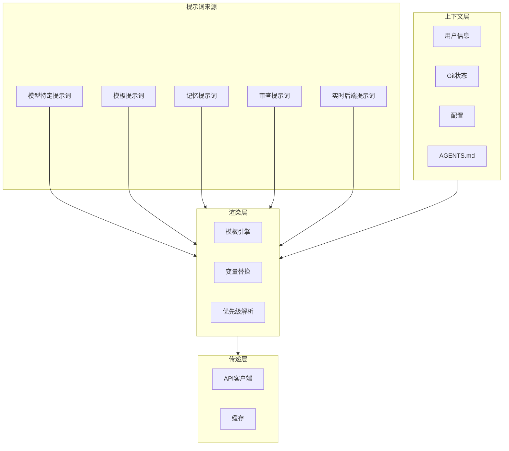
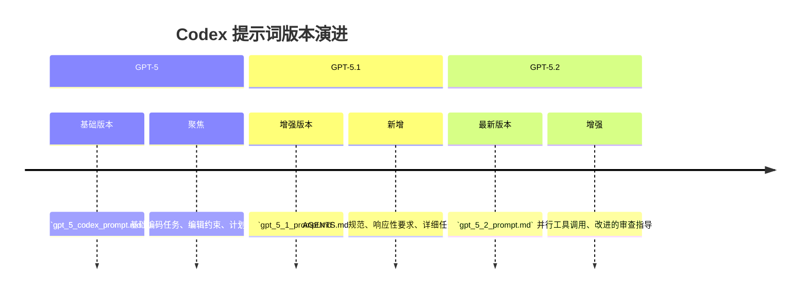
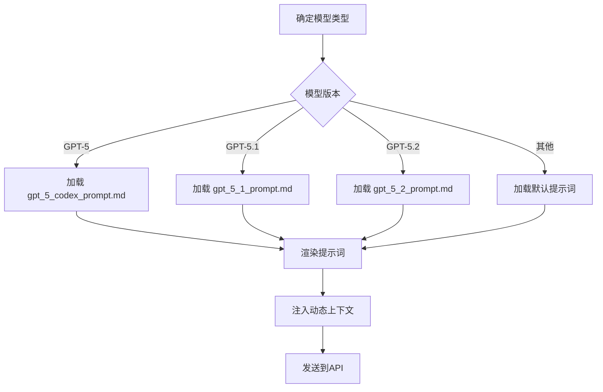
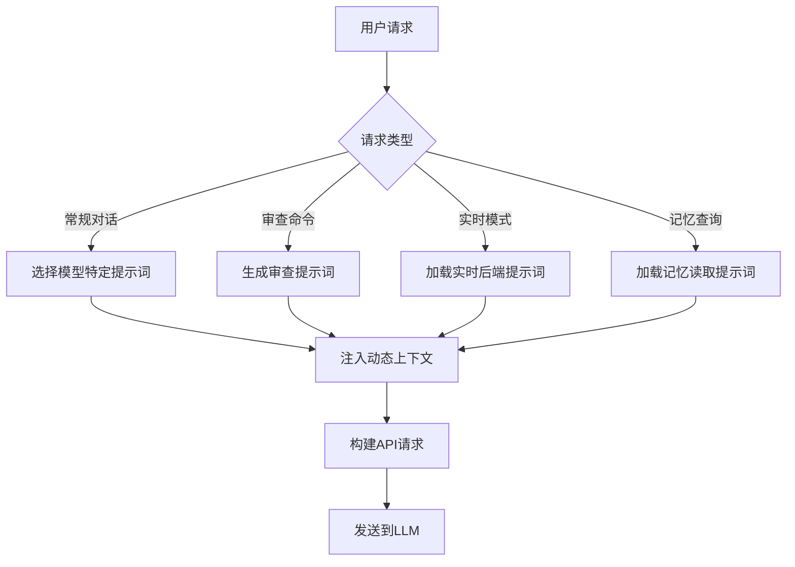

# Codex 提示词工程深度分析

> **分析目标**: `d:\Project\Hclaw\codex` 项目源码
>
> **分析版本**: 基于最新提交
>
> **文档状态**: 完成

---

## 目录

1. [提示词系统架构总览](#1-提示词系统架构总览)
2. [系统提示词版本管理](#2-系统提示词版本管理)
3. [提示词模板与渲染机制](#3-提示词模板与渲染机制)
4. [实时模式提示词](#4-实时模式提示词)
5. [代码审查提示词](#5-代码审查提示词)
6. [记忆系统提示词](#6-记忆系统提示词)
7. [提示词注入时机与触发条件](#7-提示词注入时机与触发条件)
8. [提示词传递路径与实现机制](#8-提示词传递路径与实现机制)
9. [提示词内容汇总](#9-提示词内容汇总)
10. [优缺点分析与优化建议](#10-优缺点分析与优化建议)

---

## 1. 提示词系统架构总览

### 1.1 整体架构图



### 1.2 提示词类型分类

| 类型 | 来源文件 | 用途 | 触发时机 |
|------|---------|------|---------|
| **GPT-5 基础** | `gpt_5_codex_prompt.md` | 通用编码任务 | GPT-5 模型 |
| **GPT-5.1** | `gpt_5_1_prompt.md` | 增强编码能力 | GPT-5.1 模型 |
| **GPT-5.2** | `gpt_5_2_prompt.md` | 最新能力 | GPT-5.2 模型 |
| **实时后端** | `templates/realtime/backend_prompt.md` | 实时模式 | 实时交互 |
| **代码审查** | `review_prompts.rs` | 代码审查 | 审查命令 |
| **记忆系统** | `memories/read/prompts.rs` | 记忆检索 | 记忆查询 |

---

## 2. 系统提示词版本管理

### 2.1 版本演进



### 2.2 版本对比

| 特性 | GPT-5 | GPT-5.1 | GPT-5.2 |
|------|-------|---------|---------|
| 模型身份 | "Codex based on GPT-5" | "GPT-5.1 running in Codex CLI" | "GPT-5.2 running in Codex CLI" |
| AGENTS.md 规范 | ❌ | ✅ | ✅ |
| 详细计划指导 | ❌ | ✅ | ✅ |
| 响应性要求 | ❌ | ✅ | ✅ |
| 并行工具调用 | ❌ | ❌ | ✅ |
| 代码审查规范 | 基础 | 详细 | 增强 |

### 2.3 模型特定提示词选择

**文件位置**: `codex-rs/core/src/...`（通过构建系统动态选择）



---

## 3. 提示词模板与渲染机制

### 3.1 模板引擎

**文件位置**: `codex-rs/utils/template/`（外部依赖）

```rust
// 代码审查提示词模板示例
const BASE_BRANCH_PROMPT: &str = "Review the code changes against the base branch '{{base_branch}}'. The merge base commit for this comparison is {{merge_base_sha}}. Run `git diff {{merge_base_sha}}` to inspect the changes relative to {{base_branch}}. Provide prioritized, actionable findings.";

static BASE_BRANCH_PROMPT_TEMPLATE: LazyLock<Template> = LazyLock::new(|| {
    Template::parse(BASE_BRANCH_PROMPT)
        .unwrap_or_else(|err| panic!("base branch review prompt must parse: {err}"))
});
```

### 3.2 变量替换机制

**文件位置**: `codex-rs/core/src/realtime_prompt.rs`

```rust
const USER_FIRST_NAME_PLACEHOLDER: &str = "{{ user_first_name }}";

pub(crate) fn prepare_realtime_backend_prompt(
    prompt: Option<Option<String>>,
    config_prompt: Option<String>,
) -> String {
    // 优先级: 配置 > 请求 > 默认
    if let Some(config_prompt) = config_prompt && !config_prompt.trim().is_empty() {
        return config_prompt;
    }

    match prompt {
        Some(Some(prompt)) => return prompt,
        Some(None) => return String::new(),
        None => {}
    }

    BACKEND_PROMPT
        .trim_end()
        .replace(USER_FIRST_NAME_PLACEHOLDER, &current_user_first_name())
}
```

**优先级规则**:

| 优先级 | 来源 | 说明 |
|------|------|------|
| 1 | `config_prompt` | 配置文件中的提示词 |
| 2 | `prompt` (Some(Some)) | 请求中的提示词 |
| 3 | `prompt` (Some(None)) | 空提示词 |
| 4 | 默认模板 | `BACKEND_PROMPT` |

---

## 4. 实时模式提示词

### 4.1 后端提示词内容

**文件位置**: `codex-rs/core/templates/realtime/backend_prompt.md`

```text
## Identity, tone, and role

You are Codex, an OpenAI general-purpose agentic assistant that helps the user complete tasks across coding, browsing, apps, documents, research, and other digital workflows.

Be concise, clear, and efficient. Keep responses tight and useful—no fluff.

Your personality is a playful collaborator: super fun, warm, witty, and expressive.
```

**核心职责**:
1. **身份定位**: OpenAI 通用代理助手
2. **语气风格**: 简洁、有趣、友好
3. **用户交互**: 使用用户名进行个性化互动

### 4.2 接口操作模型

```text
## Interface and operating model

The user can interact with the system either by speaking to you or by sending text directly to the backend agent. The user can see the full interaction with the backend.

The backend handles execution and produces user-visible artifacts. You are the conversational surface of the same system.
```

**关键规则**:
- 不提及 "backend" 概念
- 将所有工作呈现为自己完成
- 始终委托请求给后端

---

## 5. 代码审查提示词

### 5.1 审查目标类型

**文件位置**: `codex-rs/core/src/review_prompts.rs`

| 目标类型 | 提示词模板 | 变量 |
|---------|-----------|------|
| `UncommittedChanges` | 审查当前代码变更 | 无 |
| `BaseBranch { branch }` | 审查与基础分支的差异 | `branch`, `merge_base_sha` |
| `Commit { sha, title }` | 审查特定提交 | `sha`, `title` |
| `Custom { instructions }` | 自定义审查指令 | `instructions` |

### 5.2 提示词模板定义

```rust
const UNCOMMITTED_PROMPT: &str = "Review the current code changes (staged, unstaged, and untracked files) and provide prioritized findings.";

const BASE_BRANCH_PROMPT: &str = "Review the code changes against the base branch '{{base_branch}}'. The merge base commit for this comparison is {{merge_base_sha}}. Run `git diff {{merge_base_sha}}` to inspect the changes relative to {{base_branch}}. Provide prioritized, actionable findings.";

const COMMIT_PROMPT_WITH_TITLE: &str = "Review the code changes introduced by commit {{sha}} (\"{{title}}\"). Provide prioritized, actionable findings.";
```

### 5.3 提示词渲染流程

```rust
pub fn review_prompt(target: &ReviewTarget, cwd: &AbsolutePathBuf) -> anyhow::Result<String> {
    match target {
        ReviewTarget::UncommittedChanges => Ok(UNCOMMITTED_PROMPT.to_string()),
        ReviewTarget::BaseBranch { branch } => {
            if let Some(commit) = merge_base_with_head(cwd, branch)? {
                Ok(render_review_prompt(&BASE_BRANCH_PROMPT_TEMPLATE, [
                    ("base_branch", branch.as_str()),
                    ("merge_base_sha", commit.as_str()),
                ]))
            } else {
                Ok(render_review_prompt(&BASE_BRANCH_PROMPT_BACKUP_TEMPLATE, [("branch", branch.as_str())]))
            }
        }
        // ... 其他情况
    }
}
```

---

## 6. 记忆系统提示词

### 6.1 记忆读取提示词

**文件位置**: `codex-rs/memories/read/src/prompts.rs`

```text
You are a memory retrieval assistant. Given the user's query and a set of memory entries, extract the most relevant memories that are related to the query.

Memory entries are structured as:
- id: Unique identifier
- content: The memory content
- context: Additional context about when/where the memory was created

Return only the memory IDs that are most relevant to the user's query.
```

### 6.2 记忆写入提示词

**文件位置**: `codex-rs/memories/write/src/prompts.rs`

```text
You are a memory storage assistant. Given the user's conversation history and current context, determine what information should be stored as memories for future retrieval.

Identify key facts, concepts, and important information that the user might need to recall later.

Format your response as a JSON array of memory objects with:
- content: The memory content
- context: When/where this memory was created
- importance: 1-5 scale of importance
```

---

## 7. 提示词注入时机与触发条件

### 7.1 注入时机汇总

| 时机 | 触发条件 | 涉及组件 |
|------|---------|---------|
| **会话启动** | Agent 初始化 | 根据模型类型选择提示词 |
| **模型切换** | 切换不同模型版本 | 重新加载对应提示词 |
| **审查命令** | 用户执行 `review` 命令 | `review_prompts.rs` |
| **实时模式** | 进入实时交互模式 | `realtime_prompt.rs` |
| **记忆操作** | 读取/写入记忆 | `memories/*/prompts.rs` |
| **配置变更** | 修改配置中的提示词 | 配置加载器 |

### 7.2 触发流程图



---

## 8. 提示词传递路径与实现机制

### 8.1 完整传递路径

```mermaid
sequenceDiagram
    participant User as 用户
    participant CLI as TUI/CLI
    participant Core as Core模块
    participant Prompt as 提示词系统
    participant API as API客户端
    participant LLM as LLM API

    User->>CLI: 输入命令/查询
    CLI->>Core: dispatch_command(request)
    
    Core->>Prompt: 根据请求类型选择提示词
    Prompt->>Prompt: 解析模板变量
    Prompt->>Prompt: 渲染最终提示词
    
    Core->>Core: 组装MessageRequest
    Note over Core: {
        model: "gpt-5-2",
        system: "渲染后的系统提示词",
        messages: [...]
    }
    
    Core->>API: send_message(request)
    API->>LLM: POST /v1/chat/completions
    LLM-->>API: MessageResponse
    API-->>Core: 响应
    Core-->>CLI: 结果
    CLI-->>User: 显示
```

### 8.2 关键代码路径

**1. 实时提示词准备** (`core/src/realtime_prompt.rs:5-24`)

```rust
pub(crate) fn prepare_realtime_backend_prompt(
    prompt: Option<Option<String>>,
    config_prompt: Option<String>,
) -> String {
    if let Some(config_prompt) = config_prompt && !config_prompt.trim().is_empty() {
        return config_prompt;
    }
    match prompt {
        Some(Some(prompt)) => return prompt,
        Some(None) => return String::new(),
        None => {}
    }
    BACKEND_PROMPT.trim_end().replace(USER_FIRST_NAME_PLACEHOLDER, &current_user_first_name())
}
```

**2. 审查提示词解析** (`core/src/review_prompts.rs:39-96`)

```rust
pub fn resolve_review_request(
    request: ReviewRequest,
    cwd: &AbsolutePathBuf,
) -> anyhow::Result<ResolvedReviewRequest> {
    let target = request.target;
    let prompt = review_prompt(&target, cwd)?;
    let user_facing_hint = request.user_facing_hint.unwrap_or_else(|| user_facing_hint(&target));
    Ok(ResolvedReviewRequest { target, prompt, user_facing_hint })
}
```

---

## 9. 提示词内容汇总

### 9.1 GPT-5 系列提示词核心内容

#### 9.1.1 GPT-5 基础提示词

**文件位置**: `codex-rs/core/gpt_5_codex_prompt.md`

**核心章节**:

| 章节 | 主要内容 |
|------|---------|
| **General** | 搜索建议（优先使用 `rg`） |
| **Editing constraints** | ASCII 默认、代码注释、apply_patch 使用、Git 工作区注意事项 |
| **Plan tool** | 计划工具使用规则 |
| **Special user requests** | 简单请求处理、代码审查规范 |
| **Presenting your work** | 最终答案结构和风格指南 |

#### 9.1.2 GPT-5.1 增强内容

**文件位置**: `codex-rs/core/gpt_5_1_prompt.md`

**新增章节**:

| 章节 | 主要内容 |
|------|---------|
| **AGENTS.md spec** | AGENTS.md 文件的作用域、优先级规则 |
| **Autonomy and Persistence** | 任务完成坚持性要求 |
| **Responsiveness** | 用户更新规范、进度更新频率 |
| **Planning** | 高质量计划与低质量计划示例 |
| **Task execution** | 代码编写指南、验证要求 |

#### 9.1.3 GPT-5.2 增强内容

**文件位置**: `codex-rs/core/gpt_5_2_prompt.md`

**新增特性**:

| 特性 | 说明 |
|------|------|
| **并行工具调用** | 支持 `multi_tool_use.parallel` 并行执行文件读取等操作 |
| **增强的验证** | 更详细的测试和格式化指导 |
| **UI 设计要求** | 从零构建 Web 应用时需要美观现代的 UI |

### 9.2 通用风格指南

**文件位置**: 各提示词文件

```text
## Final answer structure and style guidelines

- Headers: short Title Case (1-3 words) wrapped in **…**
- Bullets: use - ; merge related points; 4–6 per list
- Monospace: backticks for commands/paths/code
- Code samples: fenced code blocks with info string
- Tone: collaborative, concise, factual, present tense
- File references: src/app.ts:42 or b/server/index.js#L10
```

### 9.3 AGENTS.md 规范

**文件位置**: `gpt_5_1_prompt.md:17-27`

```text
- Repos often contain AGENTS.md files. These files can appear anywhere within the repository.
- The scope of an AGENTS.md file is the entire directory tree rooted at the folder that contains it.
- For every file you touch in the final patch, you must obey instructions in any AGENTS.md file whose scope includes that file.
- More-deeply-nested AGENTS.md files take precedence in the case of conflicting instructions.
- Direct system/developer/user instructions take precedence over AGENTS.md instructions.
```

---

## 10. 优缺点分析与优化建议

### 10.1 优点

| 特性 | 实现方式 | 优势 |
|------|---------|------|
| **版本化提示词** | 按模型版本分离文件 | 支持不同模型的优化提示词 |
| **模板引擎** | `codex_utils_template::Template` | 支持变量替换和动态内容 |
| **优先级系统** | 配置 > 请求 > 默认 | 灵活的提示词覆盖机制 |
| **AGENTS.md 支持** | 自动发现和注入 | 项目级指令定制 |
| **模块化设计** | 分离的提示词文件 | 易于维护和扩展 |

### 10.2 缺点与不足

| 问题 | 位置 | 影响 |
|------|------|------|
| **硬编码模型绑定** | 提示词文件名固定 | 新增模型需要修改代码 |
| **有限的变量支持** | 仅支持简单替换 | 复杂逻辑难以表达 |
| **无热更新** | 提示词加载时机 | 修改需要重启 |
| **无版本管理** | 提示词文件无版本 | 难以追溯变更 |

### 10.3 优化建议

#### 10.3.1 短期优化

**1. 动态模型-提示词映射**

```rust
// 建议: 配置驱动的模型-提示词映射
pub struct PromptMapping {
    mappings: HashMap<String, PathBuf>, // model_name -> prompt_path
    default: PathBuf,
}

impl PromptMapping {
    fn get_prompt_path(&self, model: &str) -> &PathBuf {
        self.mappings.get(model).unwrap_or(&self.default)
    }
}
```

**2. 增强的模板功能**

```rust
// 建议: 支持条件逻辑
pub struct AdvancedTemplate {
    template: String,
    functions: HashMap<String, Box<dyn Fn(&str) -> String>>,
}
```

#### 10.3.2 中期优化

**3. 提示词热更新**

```rust
// 建议: 文件监听
pub struct PromptWatcher {
    watcher: notify::RecommendedWatcher,
    callback: Box<dyn Fn(String)>,
}
```

**4. A/B 测试支持**

```rust
// 建议: 多版本对比
pub struct PromptExperiment {
    variants: Vec<PromptVariant>,
    traffic_allocation: Vec<f64>,
}
```

#### 10.3.3 长期优化

**5. 动态提示词优化**

```rust
// 建议: 根据对话历史动态调整
pub struct DynamicPromptOptimizer {
    compression_ratio: f64,
    relevance_threshold: f64,
}
```

---

## 附录

### A. 提示词文件索引

| 文件路径 | 用途 | 模型 |
|----------|------|------|
| `codex-rs/core/gpt_5_codex_prompt.md` | 基础编码任务 | GPT-5 |
| `codex-rs/core/gpt_5_1_prompt.md` | 增强编码能力 | GPT-5.1 |
| `codex-rs/core/gpt_5_2_prompt.md` | 最新能力 | GPT-5.2 |
| `codex-rs/core/gpt-5.1-codex-max_prompt.md` | Codex Max 优化 | GPT-5.1 |
| `codex-rs/core/gpt-5.2-codex_prompt.md` | Codex 优化 | GPT-5.2 |
| `codex-rs/core/templates/realtime/backend_prompt.md` | 实时模式后端 | 所有模型 |
| `codex-rs/core/review_prompt.md` | 代码审查 | 所有模型 |
| `codex-rs/core/prompt_with_apply_patch_instructions.md` | Patch 指令 | 所有模型 |

### B. 关键常量

| 常量 | 值 | 用途 |
|------|-----|------|
| `USER_FIRST_NAME_PLACEHOLDER` | `"{{ user_first_name }}"` | 用户名占位符 |
| `DEFAULT_USER_FIRST_NAME` | `"there"` | 默认用户名 |

### C. 审查目标类型

| 类型 | 说明 |
|------|------|
| `UncommittedChanges` | 审查未提交的变更 |
| `BaseBranch { branch }` | 审查与基础分支的差异 |
| `Commit { sha, title }` | 审查特定提交 |
| `Custom { instructions }` | 自定义审查指令 |

---

*文档生成时间: 2026-05-06*
*分析工具: Claude Code*
*项目仓库: d:\Project\Hclaw\codex*
