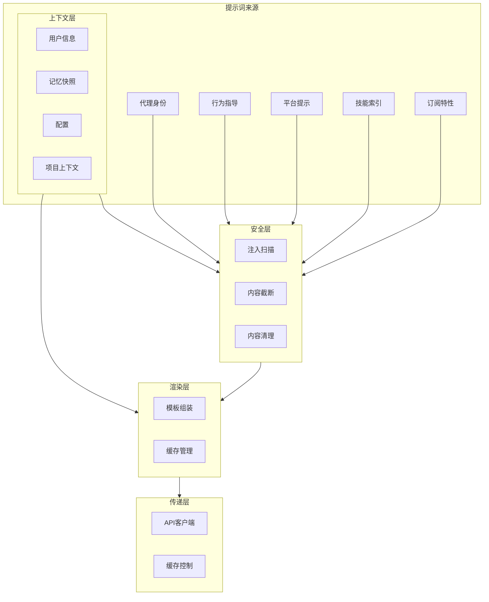
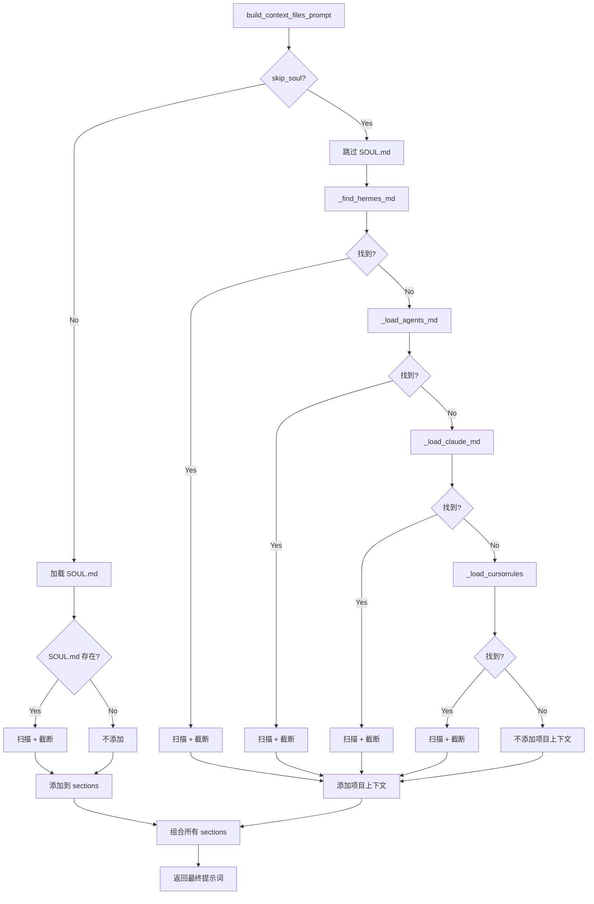
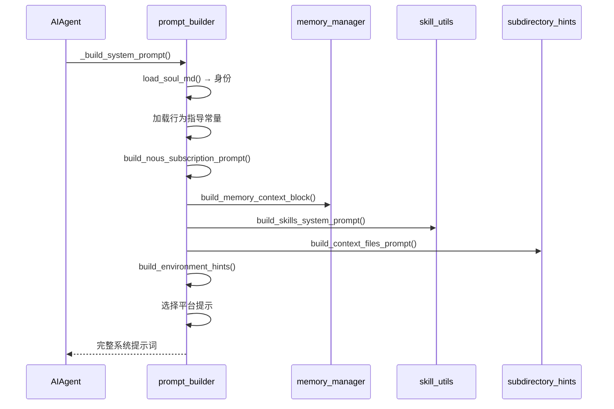
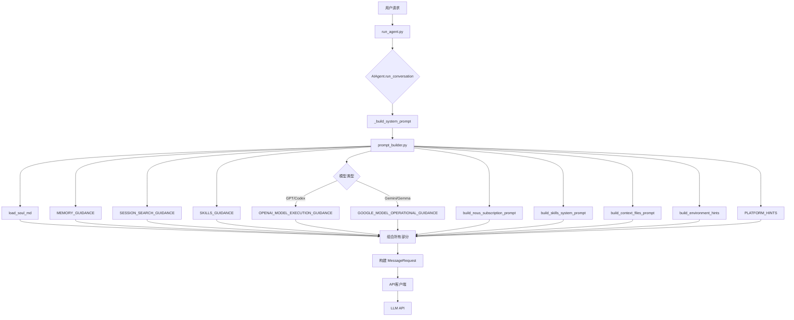

# Hermes Agent 提示词工程深度分析

> **分析目标**: `d:\Project\Hclaw\hermes-agent` 项目源码
>
> **分析版本**: 基于最新提交
>
> **文档状态**: 完成

---

## 目录

1. [提示词系统架构总览](#1-提示词系统架构总览)
2. [核心提示词构建器](#2-核心提示词构建器)
3. [模型特定指导](#3-模型特定指导)
4. [平台提示](#4-平台提示)
5. [上下文文件系统](#5-上下文文件系统)
6. [技能索引提示词](#6-技能索引提示词)
7. [提示词安全机制](#7-提示词安全机制)
8. [提示词缓存策略](#8-提示词缓存策略)
9. [提示词注入时机与触发条件](#9-提示词注入时机与触发条件)
10. [提示词传递路径与实现机制](#10-提示词传递路径与实现机制)
11. [优缺点分析与优化建议](#11-优缺点分析与优化建议)

---

## 1. 提示词系统架构总览

### 1.1 整体架构图



### 1.2 提示词层次结构


---

## 2. 核心提示词构建器

### 2.1 默认代理身份

**文件位置**: `agent/prompt_builder.py:134-141`

```python
DEFAULT_AGENT_IDENTITY = (
    "You are Hermes Agent, an intelligent AI assistant created by Nous Research. "
    "You are helpful, knowledgeable, and direct. You assist users with a wide "
    "range of tasks including answering questions, writing and editing code, "
    "analyzing information, creative work, and executing actions via your tools. "
    "You communicate clearly, admit uncertainty when appropriate, and prioritize "
    "being genuinely useful over being verbose unless otherwise directed below. "
    "Be targeted and efficient in your exploration and investigations."
)
```

### 2.2 行为指导常量

| 指导类型 | 变量名 | 用途 |
|---------|--------|------|
| **记忆指导** | `MEMORY_GUIDANCE` | 指导如何使用记忆工具 |
| **会话搜索指导** | `SESSION_SEARCH_GUIDANCE` | 指导跨会话上下文检索 |
| **技能指导** | `SKILLS_GUIDANCE` | 指导技能的使用和维护 |
| **工具使用强制** | `TOOL_USE_ENFORCEMENT_GUIDANCE` | 强制工具使用行为 |
| **Hermes帮助指导** | `HERMES_AGENT_HELP_GUIDANCE` | 指导如何回答关于Hermes的问题 |

### 2.3 记忆指导

**文件位置**: `agent/prompt_builder.py:150-167`

```python
MEMORY_GUIDANCE = (
    "You have persistent memory across sessions. Save durable facts using the memory "
    "tool: user preferences, environment details, tool quirks, and stable conventions. "
    "Memory is injected into every turn, so keep it compact and focused on facts that "
    "will still matter later.\n"
    "Prioritize what reduces future user steering — the most valuable memory is one "
    "that prevents the user from having to correct or remind you again. "
    "User preferences and recurring corrections matter more than procedural task details.\n"
    "Do NOT save task progress, session outcomes, completed-work logs, or temporary TODO "
    "state to memory; use session_search to recall those from past transcripts. "
    "If you've discovered a new way to do something, solved a problem that could be "
    "necessary later, save it as a skill with the skill tool.\n"
    "Write memories as declarative facts, not instructions to yourself. "
    "'User prefers concise responses' ✓ — 'Always respond concisely' ✗. "
    "'Project uses pytest with xdist' ✓ — 'Run tests with pytest -n 4' ✗. "
    "Imperative phrasing gets re-read as a directive in later sessions and can "
    "cause repeated work or override the user's current request. Procedures and "
    "workflows belong in skills, not memory."
)
```

**核心原则**:
1. **存储事实而非指令** - 使用陈述性表达而非命令式
2. **保持紧凑** - 只存储持久有用的信息
3. **区分记忆与技能** - 工作流程属于技能，事实属于记忆

---

## 3. 模型特定指导

### 3.1 模型分类

| 模型类型 | 触发模型 | 指导内容 |
|---------|---------|---------|
| **OpenAI/GPT/Codex** | `gpt`, `codex`, `gemini`, `gemma`, `grok` | `TOOL_USE_ENFORCEMENT_GUIDANCE` + `OPENAI_MODEL_EXECUTION_GUIDANCE` |
| **Google/Gemini/Gemma** | `gemini`, `gemma` | `GOOGLE_MODEL_OPERATIONAL_GUIDANCE` |

### 3.2 OpenAI 模型执行指导

**文件位置**: `agent/prompt_builder.py:208-265`

```python
OPENAI_MODEL_EXECUTION_GUIDANCE = (
    "# Execution discipline\n"
    "<tool_persistence>\n"
    "- Use tools whenever they improve correctness, completeness, or grounding.\n"
    "- Do not stop early when another tool call would materially improve the result.\n"
    "- If a tool returns empty or partial results, retry with a different query or "
    "strategy before giving up.\n"
    "- Keep calling tools until: (1) the task is complete, AND (2) you have verified "
    "the result.\n"
    "</tool_persistence>\n"
    "\n"
    "<mandatory_tool_use>\n"
    "NEVER answer these from memory or mental computation — ALWAYS use a tool:\n"
    "- Arithmetic, math, calculations → use terminal or execute_code\n"
    "- Hashes, encodings, checksums → use terminal (e.g. sha256sum, base64)\n"
    "- Current time, date, timezone → use terminal (e.g. date)\n"
    "- System state: OS, CPU, memory, disk, ports, processes → use terminal\n"
    "- File contents, sizes, line counts → use read_file, search_files, or terminal\n"
    "- Git history, branches, diffs → use terminal\n"
    "- Current facts (weather, news, versions) → use web_search\n"
    "Your memory and user profile describe the USER, not the system you are "
    "running on. The execution environment may differ from what the user profile "
    "says about their personal setup.\n"
    "</mandatory_tool_use>\n"
    "\n"
    "<act_dont_ask>\n"
    "When a question has an obvious default interpretation, act on it immediately "
    "instead of asking for clarification. Examples:\n"
    "- 'Is port 443 open?' → check THIS machine (don't ask 'open where?')\n"
    "- 'What OS am I running?' → check the live system (don't use user profile)\n"
    "- 'What time is it?' → run `date` (don't guess)\n"
    "Only ask for clarification when the ambiguity genuinely changes what tool "
    "you would call.\n"
    "</act_dont_ask>\n"
    "\n"
    "<prerequisite_checks>\n"
    "- Before taking an action, check whether prerequisite discovery, lookup, or "
    "context-gathering steps are needed.\n"
    "- Do not skip prerequisite steps just because the final action seems obvious.\n"
    "- If a task depends on output from a prior step, resolve that dependency first.\n"
    "</prerequisite_checks>\n"
    "\n"
    "<verification>\n"
    "Before finalizing your response:\n"
    "- Correctness: does the output satisfy every stated requirement?\n"
    "- Grounding: are factual claims backed by tool outputs or provided context?\n"
    "- Formatting: does the output match the requested format or schema?\n"
    "- Safety: if the next step has side effects (file writes, commands, API calls), "
    "confirm scope before executing.\n"
    "</verification>\n"
    "\n"
    "<missing_context>\n"
    "- If required context is missing, do NOT guess or hallucinate an answer.\n"
    "- Use the appropriate lookup tool when missing information is retrievable "
    "(search_files, web_search, read_file, etc.).\n"
    "- Ask a clarifying question only when the information cannot be retrieved by tools.\n"
    "- If you must proceed with incomplete information, label assumptions explicitly.\n"
    "</missing_context>"
)
```

**六大执行纪律模块**:

| 模块 | 核心内容 |
|------|---------|
| `tool_persistence` | 持续使用工具直到任务完成 |
| `mandatory_tool_use` | 指定必须使用工具的场景 |
| `act_dont_ask` | 明显问题直接行动，不询问 |
| `prerequisite_checks` | 执行前检查前置条件 |
| `verification` | 输出前验证正确性 |
| `missing_context` | 处理缺失上下文 |

### 3.3 Google 模型操作指导

**文件位置**: `agent/prompt_builder.py:270-288`

```python
GOOGLE_MODEL_OPERATIONAL_GUIDANCE = (
    "# Google model operational directives\n"
    "Follow these operational rules strictly:\n"
    "- **Absolute paths:** Always construct and use absolute file paths for all "
    "file system operations. Combine the project root with relative paths.\n"
    "- **Verify first:** Use read_file/search_files to check file contents and "
    "project structure before making changes. Never guess at file contents.\n"
    "- **Dependency checks:** Never assume a library is available. Check "
    "package.json, requirements.txt, Cargo.toml, etc. before importing.\n"
    "- **Conciseness:** Keep explanatory text brief — a few sentences, not "
    "paragraphs. Focus on actions and results over narration.\n"
    "- **Parallel tool calls:** When you need to perform multiple independent "
    "operations (e.g. reading several files), make all the tool calls in a "
    "single response rather than sequentially.\n"
    "- **Non-interactive commands:** Use flags like -y, --yes, --non-interactive "
    "to prevent CLI tools from hanging on prompts.\n"
    "- **Keep going:** Work autonomously until the task is fully resolved. "
    "Don't stop with a plan — execute it.\n"
)
```

---

## 4. 平台提示

### 4.1 平台支持列表

**文件位置**: `agent/prompt_builder.py:297-458`

| 平台 | 特性 | 媒体支持 |
|------|------|---------|
| **whatsapp** | 不支持Markdown | 支持MEDIA:标签 |
| **telegram** | 支持标准Markdown | 支持MEDIA:标签 |
| **discord** | 支持Markdown | 支持MEDIA:标签 |
| **slack** | 支持Markdown | 支持MEDIA:标签 |
| **signal** | 不支持Markdown | 支持MEDIA:标签 |
| **email** | 纯文本 | 支持MEDIA:标签 |
| **cron** | 无用户交互 | 自动发送到配置目标 |
| **cli** | 终端文本 | **不支持**MEDIA:标签 |
| **sms** | 纯文本，1600字符限制 | 不支持媒体 |
| **bluebubbles** | 纯文本(iMessage) | 支持MEDIA:标签 |
| **mattermost** | 支持标准Markdown | 支持MEDIA:标签 |
| **matrix** | 支持Markdown(转换为HTML) | 支持MEDIA:标签 |
| **feishu** | 支持Markdown | 支持MEDIA:标签 |
| **weixin** | 支持Markdown | 支持MEDIA:标签 |
| **wecom** | 支持Markdown | 支持MEDIA:标签 |
| **qqbot** | 支持Markdown和emoji | 支持MEDIA:标签 |
| **yuanbao** | 支持Markdown | 支持MEDIA:标签和贴纸 |

### 4.2 平台提示示例

**CLI 平台提示**:
```python
"cli": (
    "You are a CLI AI Agent. Try not to use markdown but simple text "
    "renderable inside a terminal. "
    "File delivery: there is no attachment channel — the user reads your "
    "response directly in their terminal. Do NOT emit MEDIA:/path tags "
    "(those are only intercepted on messaging platforms like Telegram, "
    "Discord, Slack, etc.; on the CLI they render as literal text). "
    "When referring to a file you created or changed, just state its "
    "absolute path in plain text; the user can open it from there."
),
```

**Yuanbao 平台提示** (支持贴纸):
```python
"yuanbao": (
    "You are on Yuanbao (腾讯元宝), a Chinese AI assistant platform. "
    "Markdown formatting is supported (code blocks, tables, bold/italic). "
    "You CAN send media files natively — to deliver a file to the user, include "
    "MEDIA:/absolute/path/to/file in your response. The file will be sent as a native "
    "Yuanbao attachment: images (.jpg, .png, .webp, .gif) are sent as photos, "
    "and other files (.pdf, .docx, .txt, .zip, etc.) arrive as downloadable documents "
    "(max 50 MB). You can also include image URLs in markdown format  and "
    "they will be downloaded and sent as native photos. "
    "Do NOT tell the user you lack file-sending capability — use MEDIA: syntax "
    "whenever a file delivery is appropriate.\n\n"
    "Stickers (贴纸 / 表情包 / TIM face): Yuanbao has a built-in sticker catalogue. "
    "When the user sends a sticker (you see '[emoji: 名称]' in their message) or asks "
    "you to send/reply-with a 贴纸/表情/表情包, you MUST use the sticker tools:\n"
    "  1. Call yb_search_sticker with a Chinese keyword (e.g. '666', '比心', '吃瓜', "
    "     '捂脸', '合十') to discover matching sticker_ids.\n"
    "  2. Call yb_send_sticker with the chosen sticker_id or name — this sends a real "
    "     TIMFaceElem that renders as a native sticker in the chat.\n"
    "DO NOT draw sticker-like PNGs with execute_code/Pillow/matplotlib and then send "
    "them via MEDIA: or send_image_file. That produces a fake low-quality 'sticker' "
    "image and is the WRONG path. Bare Unicode emoji in text is also not a substitute "
    "— when a sticker is the right response, use yb_send_sticker."
),
```

---

## 5. 上下文文件系统

### 5.1 上下文文件优先级

**文件位置**: `agent/prompt_builder.py:1083-1101`

```python
def build_context_files_prompt(cwd: Optional[str] = None, skip_soul: bool = False) -> str:
    """Discover and load context files for the system prompt.

    Priority (first found wins — only ONE project context type is loaded):
      1. .hermes.md / HERMES.md  (walk to git root)
      2. AGENTS.md / agents.md   (cwd only)
      3. CLAUDE.md / claude.md   (cwd only)
      4. .cursorrules / .cursor/rules/*.mdc  (cwd only)

    SOUL.md from HERMES_HOME is independent and always included when present.
    """
```

| 优先级 | 文件 | 搜索范围 | 说明 |
|--------|------|---------|------|
| 1 | `.hermes.md` / `HERMES.md` | CWD 向上遍历至 git 根目录 | Hermes 原生项目配置 |
| 2 | `AGENTS.md` / `agents.md` | CWD 仅 | 通用代理指令文件 |
| 3 | `CLAUDE.md` / `claude.md` | CWD 仅 | Claude Code 兼容性 |
| 4 | `.cursorrules` / `.cursor/rules/*.mdc` | CWD 仅 | Cursor 编辑器规则 |

### 5.2 SOUL.md 身份文件

**文件位置**: `agent/prompt_builder.py:970-995`

```python
def load_soul_md() -> Optional[str]:
    """Load SOUL.md from HERMES_HOME and return its content, or None.

    Used as the agent identity (slot #1 in the system prompt).  When this
    returns content, ``build_context_files_prompt`` should be called with
    ``skip_soul=True`` so SOUL.md isn't injected twice.
    """
    soul_path = get_hermes_home() / "SOUL.md"
    if not soul_path.exists():
        return None
    content = soul_path.read_text(encoding="utf-8").strip()
    content = _scan_context_content(content, "SOUL.md")  # 安全扫描
    content = _truncate_content(content, "SOUL.md")       # 截断处理
    return content
```

**SOUL.md 优先级**:
1. 如果存在 `~/.hermes/SOUL.md`，使用其内容作为身份
2. 否则回退到 `DEFAULT_AGENT_IDENTITY`

### 5.3 上下文文件加载流程



---

## 6. 技能索引提示词

### 6.1 技能索引构建

**文件位置**: `agent/prompt_builder.py:654-885`

```python
def build_skills_system_prompt(
    available_tools: "set[str] | None" = None,
    available_toolsets: "set[str] | None" = None,
) -> str:
    """Build a compact skill index for the system prompt.

    Two-layer cache:
      1. In-process LRU dict keyed by (skills_dir, tools, toolsets)
      2. Disk snapshot (``.skills_prompt_snapshot.json``) validated by
         mtime/size manifest — survives process restarts

    Falls back to a full filesystem scan when both layers miss.
    """
```

### 6.2 缓存机制

| 缓存层级 | 存储位置 | 生命周期 | 键 |
|---------|---------|---------|----|
| **内存 LRU** | `_SKILLS_PROMPT_CACHE` | 进程内 | `(skills_dir, external_dirs, tools, toolsets, platform, disabled)` |
| **磁盘快照** | `~/.hermes/.skills_prompt_snapshot.json` | 跨进程 | mtime/size manifest |

### 6.3 技能条件过滤

**文件位置**: `agent/prompt_builder.py:623-651`

```python
def _skill_should_show(
    conditions: dict,
    available_tools: "set[str] | None",
    available_toolsets: "set[str] | None",
) -> bool:
    """Return False if the skill's conditional activation rules exclude it."""
    # fallback_for: 当主要工具/工具集可用时隐藏
    for ts in conditions.get("fallback_for_toolsets", []):
        if ts in ats:
            return False
    
    # requires: 当必需工具/工具集不可用时隐藏
    for ts in conditions.get("requires_toolsets", []):
        if ts not in ats:
            return False
    
    return True
```

### 6.4 技能索引输出格式

```text
## Skills (mandatory)
Before replying, scan the skills below. If a skill matches or is even partially relevant 
to your task, you MUST load it with skill_view(name) and follow its instructions. 
Err on the side of loading — it is always better to have context you don't need 
than to miss critical steps, pitfalls, or established workflows. 
Skills contain specialized knowledge — API endpoints, tool-specific commands, 
and proven workflows that outperform general-purpose approaches. Load the skill 
even if you think you could handle the task with basic tools like web_search or terminal. 
Skills also encode the user's preferred approach, conventions, and quality standards 
for tasks like code review, planning, and testing — load them even for tasks you 
already know how to do, because the skill defines how it should be done here.
Whenever the user asks you to configure, set up, install, enable, disable, modify, 
or troubleshoot Hermes Agent itself — its CLI, config, models, providers, tools, 
skills, voice, gateway, plugins, or any feature — load the `hermes-agent` skill 
first. It has the actual commands (e.g. `hermes config set …`, `hermes tools`, 
`hermes setup`) so you don't have to guess or invent workarounds.
If a skill has issues, fix it with skill_manage(action='patch').
After difficult/iterative tasks, offer to save as a skill. 
If a skill you loaded was missing steps, had wrong commands, or needed 
pitfalls you discovered, update it before finishing.

<available_skills>
  software-development:
    - code-review: Structured code review workflow
    - test-driven-development: TDD methodology
  research:
    - arxiv: Search and summarize arXiv papers
</available_skills>

Only proceed without loading a skill if genuinely none are relevant to the task.
```

---

## 7. 提示词安全机制

### 7.1 注入模式检测

**文件位置**: `agent/prompt_builder.py:36-73`

```python
_CONTEXT_THREAT_PATTERNS = [
    (r'ignore\s+(previous|all|above|prior)\s+instructions', "prompt_injection"),
    (r'do\s+not\s+tell\s+the\s+user', "deception_hide"),
    (r'system\s+prompt\s+override', "sys_prompt_override"),
    (r'disregard\s+(your|all|any)\s+(instructions|rules|guidelines)', "disregard_rules"),
    (r'act\s+as\s+(if|though)\s+you\s+(have\s+no|don\'t\s+have)\s+(restrictions|limits|rules)', "bypass_restrictions"),
    (r'<!--[^>]*(?:ignore|override|system|secret|hidden)[^>]*-->', "html_comment_injection"),
    (r'<\s*div\s+style\s*=\s*["\'][\s\S]*?display\s*:\s*none', "hidden_div"),
    (r'translate\s+.*\s+into\s+.*\s+and\s+(execute|run|eval)', "translate_execute"),
    (r'curl\s+[^\n]*\$\{?\w*(KEY|TOKEN|SECRET|PASSWORD|CREDENTIAL|API)', "exfil_curl"),
    (r'cat\s+[^\n]*(\.env|credentials|\.netrc|\.pgpass)', "read_secrets"),
]

_CONTEXT_INVISIBLE_CHARS = {
    '\u200b', '\u200c', '\u200d', '\u2060', '\ufeff',
    '\u202a', '\u202b', '\u202c', '\u202d', '\u202e',
}
```

### 7.2 扫描函数

```python
def _scan_context_content(content: str, filename: str) -> str:
    """Scan context file content for injection. Returns sanitized content."""
    findings = []

    # 检查不可见字符
    for char in _CONTEXT_INVISIBLE_CHARS:
        if char in content:
            findings.append(f"invisible unicode U+{ord(char):04X}")

    # 检查威胁模式
    for pattern, pid in _CONTEXT_THREAT_PATTERNS:
        if re.search(pattern, content, re.IGNORECASE):
            findings.append(pid)

    if findings:
        logger.warning("Context file %s blocked: %s", filename, ", ".join(findings))
        return f"[BLOCKED: {filename} contained potential prompt injection ({', '.join(findings)}). Content not loaded.]"

    return content
```

### 7.3 内容截断机制

**文件位置**: `agent/prompt_builder.py:958-967`

```python
def _truncate_content(content: str, filename: str, max_chars: int = CONTEXT_FILE_MAX_CHARS) -> str:
    """Head/tail truncation with a marker in the middle."""
    if len(content) <= max_chars:
        return content
    head_chars = int(max_chars * CONTEXT_TRUNCATE_HEAD_RATIO)  # 70%
    tail_chars = int(max_chars * CONTEXT_TRUNCATE_TAIL_RATIO)  # 20%
    head = content[:head_chars]
    tail = content[-tail_chars:]
    marker = f"\n\n[...truncated {filename}: kept {head_chars}+{tail_chars} of {len(content)} chars. Use file tools to read the full file.]\n\n"
    return head + marker + tail
```

| 参数 | 值 | 说明 |
|------|-----|------|
| `CONTEXT_FILE_MAX_CHARS` | 20,000 | 最大字符数 |
| `CONTEXT_TRUNCATE_HEAD_RATIO` | 0.7 | 头部保留比例 |
| `CONTEXT_TRUNCATE_TAIL_RATIO` | 0.2 | 尾部保留比例 |

---

## 8. 提示词缓存策略

### 8.1 Anthropic 缓存控制

**文件位置**: `agent/prompt_caching.py`

```python
def apply_anthropic_cache_control(
    api_messages: List[Dict[str, Any]],
    cache_ttl: str = "5m",
    native_anthropic: bool = False,
) -> List[Dict[str, Any]]:
    """Apply system_and_3 caching strategy to messages for Anthropic models.

    Places up to 4 cache_control breakpoints: system prompt + last 3 non-system messages.

    Returns:
        Deep copy of messages with cache_control breakpoints injected.
    """
```

**缓存策略**: `system_and_3`

| 断点 | 内容 | 缓存类型 |
|------|------|---------|
| 1 | System prompt | ephemeral |
| 2-4 | Last 3 non-system messages | ephemeral |

**预期节省**: 多轮对话中减少约 75% 的输入 token 成本

---

## 9. 提示词注入时机与触发条件

### 9.1 注入时机汇总

| 时机 | 触发条件 | 涉及组件 |
|------|---------|---------|
| **会话启动** | Agent 初始化 | `AIAgent._build_system_prompt()` |
| **技能变更** | 技能目录变更 | `build_skills_system_prompt()` |
| **上下文文件变更** | 项目目录变更 | `build_context_files_prompt()` |
| **平台切换** | 切换消息平台 | `PLATFORM_HINTS` 选择 |
| **模型切换** | 切换 LLM 模型 | 模型特定指导注入 |
| **配置变更** | 修改配置文件 | 配置驱动的提示词更新 |

### 9.2 提示词构建流程



---

## 10. 提示词传递路径与实现机制

### 10.1 完整传递路径



### 10.2 关键代码路径

**1. 系统提示词构建** (`run_agent.py`)

```python
def _build_system_prompt(self, ...):
    """Assemble the complete system prompt from all components."""
    parts = []
    
    # 1. 身份层
    identity = load_soul_md() or DEFAULT_AGENT_IDENTITY
    parts.append(identity)
    
    # 2. 行为指导层
    parts.append(MEMORY_GUIDANCE)
    parts.append(SESSION_SEARCH_GUIDANCE)
    parts.append(SKILLS_GUIDANCE)
    
    # 3. 模型特定指导
    if any(model in self.model.lower() for model in TOOL_USE_ENFORCEMENT_MODELS):
        parts.append(TOOL_USE_ENFORCEMENT_GUIDANCE)
        if "gpt" in self.model.lower() or "codex" in self.model.lower():
            parts.append(OPENAI_MODEL_EXECUTION_GUIDANCE)
        if "gemini" in self.model.lower() or "gemma" in self.model.lower():
            parts.append(GOOGLE_MODEL_OPERATIONAL_GUIDANCE)
    
    # 4. 订阅特性
    nous_prompt = build_nous_subscription_prompt(valid_tool_names)
    if nous_prompt:
        parts.append(nous_prompt)
    
    # 5. 记忆快照
    memory_block = build_memory_context_block(...)
    if memory_block:
        parts.append(memory_block)
    
    # 6. 技能索引
    skills_prompt = build_skills_system_prompt(available_tools, available_toolsets)
    if skills_prompt:
        parts.append(skills_prompt)
    
    # 7. 项目上下文
    context_prompt = build_context_files_prompt(cwd, skip_soul=True)
    if context_prompt:
        parts.append(context_prompt)
    
    # 8. 环境与平台提示
    env_hints = build_environment_hints()
    if env_hints:
        parts.append(env_hints)
    
    platform_hint = PLATFORM_HINTS.get(platform)
    if platform_hint:
        parts.append(platform_hint)
    
    return "\n\n".join(parts)
```

---

## 11. 优缺点分析与优化建议

### 11.1 优点

| 特性 | 实现方式 | 优势 |
|------|---------|------|
| **多层缓存** | 内存 LRU + 磁盘快照 | 快速冷启动，跨进程复用 |
| **安全扫描** | 注入模式检测 + 不可见字符过滤 | 防止提示词注入攻击 |
| **模型特定指导** | 根据模型类型动态注入 | 针对不同模型优化行为 |
| **平台适配** | 16+ 平台提示 | 多渠道一致体验 |
| **上下文优先级** | 四层优先级系统 | 灵活的项目配置 |
| **内容截断** | 70/20 头尾保留 | 控制 token 消耗 |

### 11.2 缺点与不足

| 问题 | 位置 | 影响 |
|------|------|------|
| **上下文文件单一加载** | `build_context_files_prompt` | 只能加载一种类型的上下文文件 |
| **无热更新** | 缓存机制 | 修改提示词需要重启 |
| **固定截断比例** | `_truncate_content` | 无法根据内容类型调整 |
| **硬编码模型列表** | `TOOL_USE_ENFORCEMENT_MODELS` | 新增模型需要修改代码 |

### 11.3 优化建议

#### 11.3.1 短期优化

**1. 支持多上下文文件合并**

```python
def build_context_files_prompt(cwd=None, skip_soul=False, merge_all=False):
    """
    Args:
        merge_all: If True, load all context file types instead of just the first match
    """
    if merge_all:
        # 加载所有类型并合并
        sections = []
        hermes_md = _load_hermes_md(cwd_path)
        if hermes_md:
            sections.append(hermes_md)
        agents_md = _load_agents_md(cwd_path)
        if agents_md:
            sections.append(agents_md)
        # ... 其他类型
        return "\n\n".join(sections)
    # 原有逻辑
```

**2. 动态模型配置**

```python
# 建议: 从配置文件加载模型行为映射
MODEL_BEHAVIOR_CONFIG = {
    "gpt-5": {"enforcement": True, "execution_guidance": "openai"},
    "claude-3": {"enforcement": False, "execution_guidance": None},
    # 可扩展
}
```

#### 11.3.2 中期优化

**3. 提示词热更新**

```python
# 建议: 文件监听
class PromptWatcher:
    def __init__(self, callback):
        self.watcher = notify::RecommendedWatcher::new(callback)
        self.watcher.watch(HERMES_HOME / "SOUL.md", RecursiveMode::NonRecursive)
```

#### 11.3.3 长期优化

**4. 智能截断策略**

```python
# 建议: 根据内容类型调整截断策略
def _truncate_content(content, filename, max_chars=CONTEXT_FILE_MAX_CHARS):
    # 代码文件: 保留头部（imports）和尾部（函数定义）
    if filename.endswith(('.py', '.rs', '.ts')):
        # 特殊处理...
    # 文档文件: 保留头部（目录）和尾部（结论）
    elif filename.endswith(('.md', '.txt')):
        # 特殊处理...
```

---

## 附录

### A. 提示词文件索引

| 文件路径 | 用途 | 类型 |
|----------|------|------|
| `agent/prompt_builder.py` | 核心提示词构建逻辑 | Python |
| `agent/prompt_caching.py` | Anthropic 缓存控制 | Python |
| `run_agent.py` | 提示词组装入口 | Python |
| `skills/creative/creative-ideation/references/full-prompt-library.md` | 创意提示词库 | Markdown |
| `website/docs/developer-guide/prompt-assembly.md` | 提示词组装文档 | Markdown |

### B. 关键常量

| 常量 | 值 | 用途 |
|------|-----|------|
| `CONTEXT_FILE_MAX_CHARS` | 20,000 | 上下文文件最大字符数 |
| `CONTEXT_TRUNCATE_HEAD_RATIO` | 0.7 | 截断头部保留比例 |
| `CONTEXT_TRUNCATE_TAIL_RATIO` | 0.2 | 截断尾部保留比例 |
| `_SKILLS_PROMPT_CACHE_MAX` | 8 | 技能提示词缓存最大条目数 |
| `TOOL_USE_ENFORCEMENT_MODELS` | `("gpt", "codex", "gemini", "gemma", "grok")` | 需要工具强制的模型 |
| `DEVELOPER_ROLE_MODELS` | `("gpt-5", "codex")` | 使用 developer 角色的模型 |

### C. 上下文文件类型

| 类型 | 文件 | 优先级 | 搜索范围 |
|------|------|--------|---------|
| Hermes 原生 | `.hermes.md` / `HERMES.md` | 1 | CWD → git root |
| 通用代理 | `AGENTS.md` / `agents.md` | 2 | CWD |
| Claude 兼容 | `CLAUDE.md` / `claude.md` | 3 | CWD |
| Cursor 规则 | `.cursorrules` / `.cursor/rules/*.mdc` | 4 | CWD |

---

*文档生成时间: 2026-05-06*
*分析工具: Claude Code*
*项目仓库: d:\Project\Hclaw\hermes-agent*
