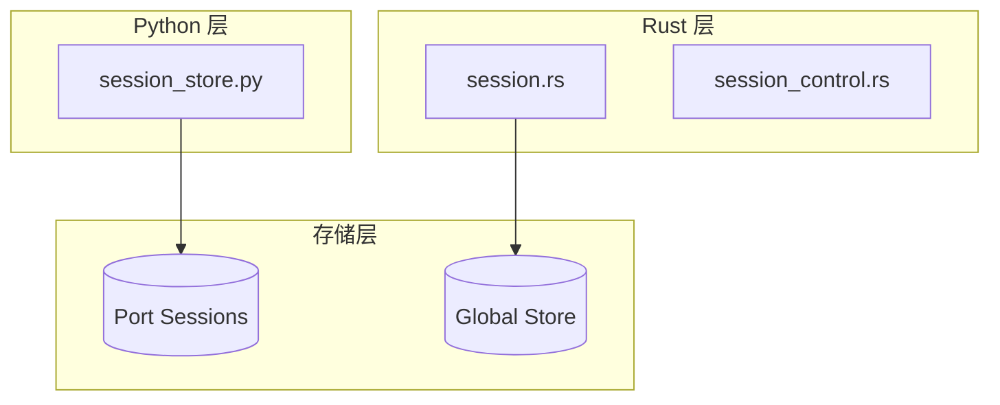

# Claw-Code 会话管理系统分析

> **分析目标**: `d:\Project\Hclaw\GitHub\claw-code` 项目会话管理功能
>
> **分析版本**: 基于最新提交
>
> **文档状态**: 完成

---

## 目录

1. [会话管理架构总览](#1-会话管理架构总览)
2. [会话创建机制](#2-会话创建机制)
3. [会话存储方案](#3-会话存储方案)
4. [会话状态管理](#4-会话状态管理)
5. [会话有效期控制](#5-会话有效期控制)
6. [会话安全措施](#6-会话安全措施)
7. [会话标识方式](#7-会话标识方式)
8. [会话数据结构设计](#8-会话数据结构设计)
9. [会话相关API接口说明](#9-会话相关api接口说明)
10. [异常处理策略](#10-异常处理策略)
11. [与其他系统模块的交互关系](#11-与其他系统模块的交互关系)
12. [优缺点分析](#12-优缺点分析)

---

## 1. 会话管理架构总览

### 1.1 整体架构



### 1.2 双语言实现现状

| 语言 | 状态 | 用途 |
|------|------|------|
| **Python** | 归档 | 旧版会话存储（迁移中） |
| **Rust** | 活跃开发 | 新版会话管理核心 |

---

## 2. 会话创建机制

### 2.1 Python 实现

```python
@dataclass(frozen=True)
class StoredSession:
    session_id: str
    messages: tuple[str, ...]
    input_tokens: int
    output_tokens: int

DEFAULT_SESSION_DIR = Path('.port_sessions')

def save_session(session: StoredSession, directory: Path | None = None) -> Path:
    target_dir = directory or DEFAULT_SESSION_DIR
    target_dir.mkdir(parents=True, exist_ok=True)
    path = target_dir / f'{session.session_id}.json'
    path.write_text(json.dumps(asdict(session), indent=2))
    return path
```

### 2.2 Rust 实现

```rust
impl Session {
    #[must_use]
    pub fn new() -> Self {
        let now = current_time_millis();
        Self {
            version: SESSION_VERSION,
            session_id: generate_session_id(),
            created_at_ms: now,
            updated_at_ms: now,
            messages: Vec::new(),
            compaction: None,
            fork: None,
            workspace_root: None,
            prompt_history: Vec::new(),
            last_health_check_ms: None,
            model: None,
            persistence: None,
        }
    }
}

fn generate_session_id() -> String {
    let millis = current_time_millis();
    let counter = SESSION_ID_COUNTER.fetch_add(1, Ordering::Relaxed);
    format!("session-{millis}-{counter}")
}
```

---

## 3. 会话存储方案

### 3.1 Python 存储

```
.port_sessions/
└── {session_id}.json   # 会话数据
```

### 3.2 Rust 存储

```
~/.local/share/opencode/
└── sessions/
    ├── {session_id}.jsonl       # 主会话文件
    └── {session_id}.rot-{ts}.jsonl  # 轮转日志
```

### 3.3 轮转策略

```rust
const ROTATE_AFTER_BYTES: u64 = 256 * 1024;  // 256KB
const MAX_ROTATED_FILES: usize = 3;

fn rotate_session_file_if_needed(path: &Path) -> Result<(), SessionError> {
    let Ok(metadata) = fs::metadata(path) else {
        return Ok(());
    };
    if metadata.len() < ROTATE_AFTER_BYTES {
        return Ok(());
    }
    let rotated_path = rotated_log_path(path);
    fs::rename(path, rotated_path)?;
    Ok(())
}
```

---

## 4. 会话状态管理

### 4.1 消息角色

```rust
pub enum MessageRole {
    System,
    User,
    Assistant,
    Tool,
}
```

### 4.2 内容块类型

```rust
pub enum ContentBlock {
    Text {
        text: String,
    },
    ToolUse {
        id: String,
        name: String,
        input: String,
    },
    ToolResult {
        tool_use_id: String,
        tool_name: String,
        output: String,
        is_error: bool,
    },
}
```

### 4.3 会话压缩状态

```rust
pub struct SessionCompaction {
    pub count: u32,                            // 压缩次数
    pub removed_message_count: usize,           // 移除消息数
    pub summary: String,                        // 压缩摘要
}
```

### 4.4 会话分叉

```rust
pub struct SessionFork {
    pub parent_session_id: String,              // 父会话 ID
    pub branch_name: Option<String>,            // 分支名称
}
```

---

## 5. 会话有效期控制

### 5.1 Workspace 绑定

```rust
#[must_use]
pub fn with_workspace_root(mut self, workspace_root: impl Into<PathBuf>) -> Self {
    self.workspace_root = Some(workspace_root.into());
    self
}
```

> **设计目的**: 防止多个 `opencode serve` 实例共享全局会话存储时，写入错误的工作目录。

---

## 6. 会话安全措施

### 6.1 原子写入

```rust
fn write_atomic(path: &Path, contents: &str) -> Result<(), SessionError> {
    if let Some(parent) = path.parent() {
        fs::create_dir_all(parent)?;
    }
    let temp_path = temporary_path_for(path);
    fs::write(&temp_path, contents)?;
    fs::rename(temp_path, path)?;
    Ok(())
}

fn temporary_path_for(path: &Path) -> PathBuf {
    let file_name = path.file_name().and_then(|value| value.to_str()).unwrap_or("session");
    path.with_file_name(format!(
        "{file_name}.tmp-{}-{}",
        current_time_millis(),
        SESSION_ID_COUNTER.fetch_add(1, Ordering::Relaxed)
    ))
}
```

### 6.2 Workspace 隔离

```rust
/// Per-worktree session isolation: returns a session directory namespaced
/// by the workspace fingerprint of the given working directory.
/// This prevents parallel `opencode serve` instances from colliding.
```

---

## 7. 会话标识方式

### 7.1 会话 ID 格式

```rust
// 格式: session-{timestamp_ms}-{counter}
// 示例: session-1715301045678-0
fn generate_session_id() -> String {
    let millis = current_time_millis();
    let counter = SESSION_ID_COUNTER.fetch_add(1, Ordering::Relaxed);
    format!("session-{millis}-{counter}")
}
```

### 7.2 单调时间戳

```rust
static LAST_TIMESTAMP_MS: AtomicU64 = AtomicU64::new(0);

fn current_time_millis() -> u64 {
    let wall_clock = SystemTime::now()
        .duration_since(UNIX_EPOCH)
        .map(|duration| u64::try_from(duration.as_millis()).unwrap_or(u64::MAX))
        .unwrap_or_default();

    let mut candidate = wall_clock;
    loop {
        let previous = LAST_TIMESTAMP_MS.load(Ordering::Relaxed);
        if candidate <= previous {
            candidate = previous.saturating_add(1);
        }
        match LAST_TIMESTAMP_MS.compare_exchange(
            previous,
            candidate,
            Ordering::SeqCst,
            Ordering::SeqCst,
        ) {
            Ok(_) => return candidate,
            Err(actual) => candidate = actual.saturating_add(1),
        }
    }
}
```

---

## 8. 会话数据结构设计

### 8.1 Session 结构

```rust
pub struct Session {
    pub version: u32,                           // 版本号
    pub session_id: String,                      // 会话 ID
    pub created_at_ms: u64,                      // 创建时间
    pub updated_at_ms: u64,                      // 更新时间
    pub messages: Vec<ConversationMessage>,      // 消息列表
    pub compaction: Option<SessionCompaction>,    // 压缩状态
    pub fork: Option<SessionFork>,               // 分叉信息
    pub workspace_root: Option<PathBuf>,         // 工作目录根路径
    pub prompt_history: Vec<SessionPromptEntry>,  // 提示历史
    pub last_health_check_ms: Option<u64>,       // 健康检查时间
    pub model: Option<String>,                   // 使用的模型
    persistence: Option<SessionPersistence>,      // 持久化路径
}
```

### 8.2 ConversationMessage

```rust
pub struct ConversationMessage {
    pub role: MessageRole,        // 角色
    pub blocks: Vec<ContentBlock>, // 内容块
    pub usage: Option<TokenUsage>, // Token 使用统计
}
```

### 8.3 SessionPromptEntry

```rust
pub struct SessionPromptEntry {
    pub timestamp_ms: u64,        // 时间戳
    pub text: String,             // 提示文本
}
```

---

## 9. 会话相关API接口说明

### 9.1 核心方法

| 方法 | 功能 | 参数 | 返回值 |
|------|------|------|--------|
| `Session::new()` | 创建新会话 | 无 | `Session` |
| `with_persistence_path()` | 设置持久化路径 | `path: PathBuf` | `Session` |
| `with_workspace_root()` | 设置工作目录 | `workspace_root: PathBuf` | `Session` |
| `save_to_path()` | 保存会话到文件 | `path: Path` | `Result<(), SessionError>` |
| `load_from_path()` | 从文件加载会话 | `path: Path` | `Result<Session, SessionError>` |
| `push_message()` | 添加消息 | `message: ConversationMessage` | `Result<(), SessionError>` |
| `push_user_text()` | 添加用户文本 | `text: String` | `Result<(), SessionError>` |
| `record_compaction()` | 记录压缩 | `summary: String`, `removed_count: usize` | `()` |
| `fork()` | 创建分叉会话 | `branch_name: Option<String>` | `Session` |

---

## 10. 异常处理策略

### 10.1 错误类型

```rust
pub enum SessionError {
    Io(std::io::Error),           // IO 错误
    Json(JsonError),              // JSON 解析错误
    Format(String),               // 格式错误
}

impl std::error::Error for SessionError {}
```

### 10.2 向后兼容加载

```rust
pub fn load_from_path(path: impl AsRef<Path>) -> Result<Self, SessionError> {
    let path = path.as_ref();
    let contents = fs::read_to_string(path)?;
    let session = match JsonValue::parse(&contents) {
        Ok(value)
            if value
                .as_object()
                .is_some_and(|object| object.contains_key("messages")) =>
        {
            // 新格式
            Self::from_json(&value)?
        }
        Err(_) | Ok(_) => {
            // 旧 JSONL 格式
            Self::from_jsonl(&contents)?
        }
    };
    Ok(session.with_persistence_path(path.to_path_buf()))
}
```

---

## 11. 与其他系统模块的交互关系

### 11.1 模块交互

| 模块 | 交互方式 | 说明 |
|------|---------|------|
| **CLI** | 创建/加载会话 | 初始化会话 |
| **Runtime** | 会话状态管理 | 消息追加、压缩 |
| **Worktree** | Workspace 绑定 | 隔离并行会话 |
| **Compression** | 压缩记录 | 会话摘要 |

---

## 12. 优缺点分析

### 12.1 优点

| 特性 | 实现方式 | 优势 |
|------|---------|------|
| **单调时间戳** | AtomicU64 保证 | 避免并发 ID 冲突 |
| **文件轮转** | 256KB 阈值 | 防止大文件 |
| **原子写入** | 临时文件 + rename | 保证数据完整性 |
| **向后兼容** | JSON + JSONL | 平滑迁移 |
| **Workspace 隔离** | 绑定工作目录 | 防止写入错误位置 |

### 12.2 缺点与优化建议

| 问题 | 影响 | 优化建议 |
|------|------|---------|
| **Python 实现归档** | 功能受限 | 完成 Rust 迁移 |
| **同步写入** | 高并发瓶颈 | 异步写入队列 |

---

## 附录

### A. 会话文件格式

**JSONL 格式**:
```jsonl
{"type":"session_meta","version":1,"session_id":"session-1715301045678-0","created_at_ms":1715301045678,"updated_at_ms":1715301045678}
{"type":"message","message":{"role":"user","blocks":[{"type":"text","text":"Hello"}]}}
{"type":"message","message":{"role":"assistant","blocks":[{"type":"text","text":"Hi!"}]}}
```

---

*文档生成时间: 2026-05-06*
*分析工具: Claude Code*
*项目仓库: d:\Project\Hclaw\GitHub\claw-code*
