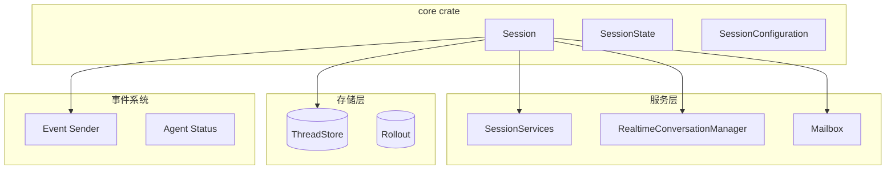
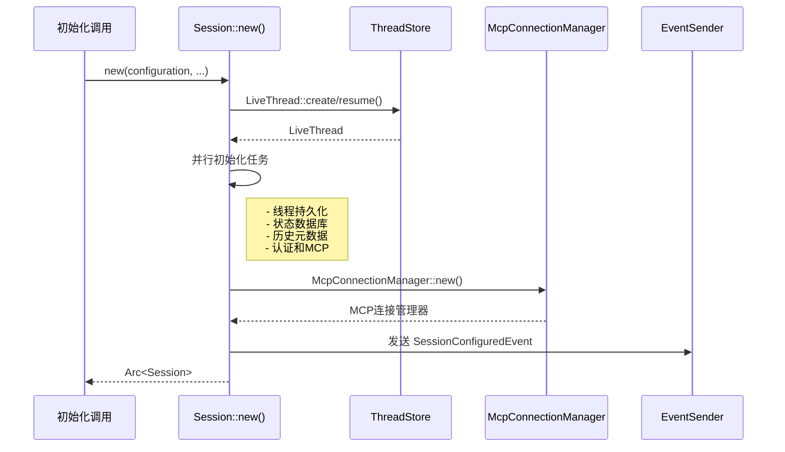
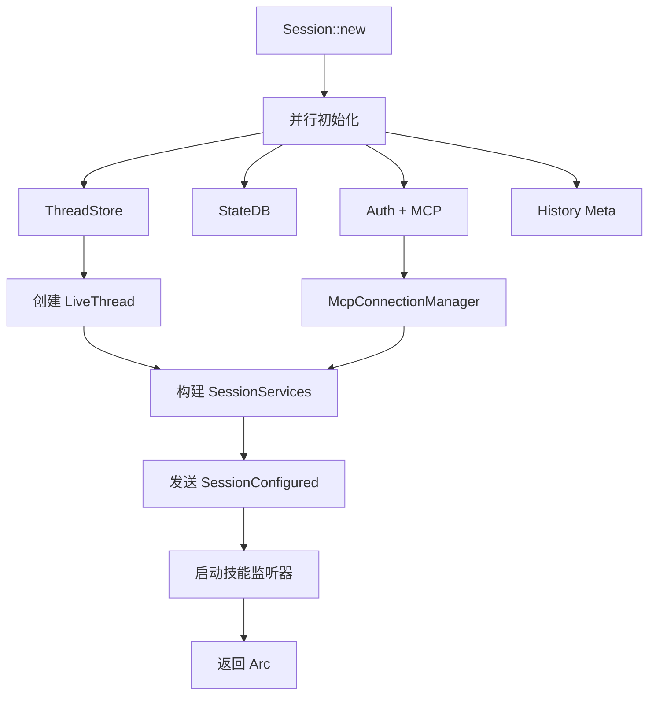

# Codex 会话管理系统分析

> **分析目标**: `d:\Project\Hclaw\GitHub\codex` 项目会话管理功能
>
> **分析版本**: 基于最新提交
>
> **文档状态**: 完成

---

## 目录

1. [会话管理架构总览](#1-会话管理架构总览)
2. [会话创建机制](#2-会话创建机制)
3. [会话存储方案](#3-会话存储方案)
4. [会话状态管理](#4-会话状态管理)
5. [会话有效期控制](#5-会话有效期控制)
6. [会话安全措施](#6-会话安全措施)
7. [会话标识方式](#7-会话标识方式)
8. [会话数据结构设计](#8-会话数据结构设计)
9. [会话相关API接口说明](#9-会话相关api接口说明)
10. [异常处理策略](#10-异常处理策略)
11. [与其他系统模块的交互关系](#11-与其他系统模块的交互关系)
12. [优缺点分析](#12-优缺点分析)

---

## 1. 会话管理架构总览

### 1.1 整体架构



### 1.2 核心组件职责

| 组件 | 职责 | 关键功能 |
|------|------|---------|
| **Session** | 会话核心 | 管理会话生命周期、状态、服务 |
| **SessionConfiguration** | 配置管理 | 模型、权限、环境配置 |
| **SessionState** | 状态管理 | 运行时状态、设置更新 |
| **SessionServices** | 服务容器 | MCP、工具、钩子、代理等 |
| **RealtimeConversationManager** | 对话管理 | 实时消息管理 |
| **ThreadStore** | 线程存储 | 持久化会话元数据 |

---

## 2. 会话创建机制

### 2.1 会话初始化流程



### 2.2 会话初始化关键代码

```rust
pub(crate) async fn new(
    mut session_configuration: SessionConfiguration,
    config: Arc<Config>,
    auth_manager: Arc<AuthManager>,
    models_manager: SharedModelsManager,
    exec_policy: Arc<ExecPolicyManager>,
    tx_event: Sender<Event>,
    agent_status: watch::Sender<AgentStatus>,
    initial_history: InitialHistory,
    session_source: SessionSource,
    // ... 更多参数
) -> anyhow::Result<Arc<Self>> {
    // 并行初始化任务
    let thread_persistence_fut = async { /* 创建/恢复线程 */ };
    let state_db_fut = async { /* 状态数据库 */ };
    let history_meta_fut = async { /* 历史元数据 */ };
    let auth_and_mcp_fut = async { /* 认证和MCP */ };
    
    let (thread_persistence_result, state_db_ctx, history_meta, auth_mcp) = 
        tokio::join!(thread_persistence_fut, state_db_fut, history_meta_fut, auth_and_mcp_fut);
    
    // 创建会话实例
    let sess = Arc::new(Session {
        conversation_id,
        tx_event,
        agent_status,
        state: Mutex::new(state),
        conversation: Arc::new(RealtimeConversationManager::new()),
        services,
        // ...
    });
    
    // 发送配置完成事件
    sess.send_event_raw(Event {
        id: INITIAL_SUBMIT_ID.to_owned(),
        msg: EventMsg::SessionConfigured(SessionConfiguredEvent { /* ... */ }),
    }).await;
    
    Ok(sess)
}
```

---

## 3. 会话存储方案

### 3.1 存储架构

| 存储类型 | 用途 | 实现 |
|---------|------|------|
| **ThreadStore** | 会话元数据 | SQLite / 远程存储 |
| **Rollout** | 事件追踪 | 文件系统 |
| **StateDB** | 线程状态 | SQLite |

### 3.2 线程持久化

```rust
let live_thread = match &initial_history {
    InitialHistory::New | InitialHistory::Cleared | InitialHistory::Forked(_) => {
        LiveThread::create(
            Arc::clone(&thread_store),
            CreateThreadParams {
                thread_id: conversation_id,
                forked_from_id,
                source: session_source,
                base_instructions: BaseInstructions {
                    text: session_configuration.base_instructions.clone(),
                },
                dynamic_tools: session_configuration.dynamic_tools.clone(),
                metadata: ThreadPersistenceMetadata {
                    cwd: Some(config.cwd.to_path_buf()),
                    model_provider: config.model_provider_id.clone(),
                    memory_mode: if config.memories.generate_memories {
                        ThreadMemoryMode::Enabled
                    } else {
                        ThreadMemoryMode::Disabled
                    },
                },
                event_persistence_mode,
            },
        ).await?
    }
    InitialHistory::Resumed(resumed_history) => {
        LiveThread::resume(
            Arc::clone(&thread_store),
            ResumeThreadParams { /* ... */ },
        ).await?
    }
};
```

---

## 4. 会话状态管理

### 4.1 会话配置

```rust
pub(crate) struct SessionConfiguration {
    pub(super) provider: ModelProviderInfo,           // 模型提供者
    pub(super) collaboration_mode: CollaborationMode, // 协作模式
    pub(super) approval_policy: Constrained<AskForApproval>, // 审批策略
    pub(super) permission_profile: Constrained<PermissionProfile>, // 权限配置
    pub(super) cwd: AbsolutePathBuf,                  // 当前工作目录
    pub(super) codex_home: AbsolutePathBuf,           // Codex 主目录
    pub(super) thread_name: Option<String>,           // 线程名称
    pub(super) environments: Vec<TurnEnvironmentSelection>, // 环境列表
    // ... 更多配置项
}
```

### 4.2 会话设置更新

```rust
pub(crate) struct SessionSettingsUpdate {
    pub(crate) cwd: Option<PathBuf>,
    pub(crate) approval_policy: Option<AskForApproval>,
    pub(crate) permission_profile: Option<PermissionProfile>,
    pub(crate) collaboration_mode: Option<CollaborationMode>,
    pub(crate) environments: Option<Vec<TurnEnvironmentSelection>>,
    // ...
}
```

### 4.3 应用设置更新

```rust
pub(crate) fn apply(&self, updates: &SessionSettingsUpdate) -> ConstraintResult<Self> {
    let mut next_configuration = self.clone();
    
    if let Some(collaboration_mode) = updates.collaboration_mode.clone() {
        next_configuration.collaboration_mode = collaboration_mode;
    }
    if let Some(approval_policy) = updates.approval_policy {
        next_configuration.approval_policy.set(approval_policy)?;
    }
    // ... 更多更新逻辑
    
    Ok(next_configuration)
}
```

---

## 5. 会话有效期控制

### 5.1 Ephemeral 模式

```rust
// 在初始化时检查是否为临时模式
let thread_persistence_fut = async {
    if config.ephemeral {
        Ok::<_, anyhow::Error>(None)  // 不持久化
    } else {
        // 创建持久化线程
        let live_thread = LiveThread::create(/* ... */).await?;
        Ok(Some(live_thread))
    }
};
```

---

## 6. 会话安全措施

### 6.1 权限配置

```rust
pub(super) fn sandbox_policy(&self) -> SandboxPolicy {
    self.permission_profile()
        .to_legacy_sandbox_policy(&self.cwd)
        .unwrap_or_else(|_| {
            // 降级到兼容策略
            codex_sandboxing::compatibility_sandbox_policy_for_permission_profile(
                self.permission_profile.get(),
                &self.file_system_sandbox_policy(),
                self.network_sandbox_policy(),
                &self.cwd,
            )
        })
}
```

### 6.2 网络代理审计

```rust
let network_proxy_audit_metadata = NetworkProxyAuditMetadata {
    conversation_id: Some(conversation_id.to_string()),
    app_version: Some(env!("CARGO_PKG_VERSION").to_string()),
    user_account_id: account_id,
    auth_mode: auth_mode.map(|mode| mode.to_string()),
    originator: Some(originator),
    user_email: account_email,
    terminal_type: Some(terminal_type),
    model: Some(session_model.clone()),
    slug: Some(session_model),
};
```

---

## 7. 会话标识方式

### 7.1 ThreadId

```rust
let conversation_id = match &initial_history {
    InitialHistory::New | InitialHistory::Cleared | InitialHistory::Forked(_) => {
        ThreadId::default()
    }
    InitialHistory::Resumed(resumed_history) => resumed_history.conversation_id,
};
```

### 7.2 会话来源

```rust
pub(crate) enum SessionSource {
    Cli,
    Vscode,
    Exec,
    Mcp,
    SubAgent(SubAgentSource),
    // ... 其他来源
}
```

---

## 8. 会话数据结构设计

### 8.1 Session 结构

```rust
pub(crate) struct Session {
    pub(crate) conversation_id: ThreadId,                       // 会话 ID
    pub(super) tx_event: Sender<Event>,                         // 事件发送器
    pub(super) agent_status: watch::Sender<AgentStatus>,        // 代理状态
    pub(super) state: Mutex<SessionState>,                      // 运行时状态
    pub(super) managed_network_proxy_refresh_lock: Semaphore,   // 网络代理锁
    pub(super) features: ManagedFeatures,                       // 功能开关
    pub(crate) conversation: Arc<RealtimeConversationManager>,  // 对话管理器
    pub(crate) active_turn: Mutex<Option<ActiveTurn>>,          // 当前回合
    pub(super) mailbox: Mailbox,                                // 消息邮箱
    pub(super) mailbox_rx: Mutex<MailboxReceiver>,              // 邮箱接收器
    pub(crate) goal_runtime: GoalRuntimeState,                  // 目标运行时
    pub(crate) guardian_review_session: GuardianReviewSessionManager, // 审查会话
    pub(crate) services: SessionServices,                       // 服务容器
    pub(super) next_internal_sub_id: AtomicU64,                 // 子任务 ID 计数器
}
```

### 8.2 SessionServices

```rust
pub(crate) struct SessionServices {
    pub(super) mcp_connection_manager: Arc<RwLock<McpConnectionManager>>,
    pub(super) unified_exec_manager: UnifiedExecProcessManager,
    pub(super) analytics_events_client: AnalyticsEventsClient,
    pub(super) hooks: ArcSwap<Hooks>,
    pub(super) rollout_thread_trace: ThreadTraceContext,
    pub(super) user_shell: Arc<Shell>,
    pub(super) exec_policy: Arc<ExecPolicyManager>,
    pub(super) auth_manager: Arc<AuthManager>,
    pub(super) session_telemetry: SessionTelemetry,
    pub(super) models_manager: Arc<ModelsManager>,
    pub(super) tool_approvals: Mutex<ApprovalStore>,
    pub(super) guardian_rejections: Mutex<HashMap<...>>,
    pub(super) skills_manager: Arc<SkillsManager>,
    pub(super) plugins_manager: Arc<PluginsManager>,
    pub(super) mcp_manager: Arc<McpManager>,
    // ... 更多服务
}
```

---

## 9. 会话相关API接口说明

### 9.1 会话创建参数

| 参数 | 类型 | 说明 |
|------|------|------|
| `session_configuration` | `SessionConfiguration` | 会话配置 |
| `config` | `Arc<Config>` | 全局配置 |
| `auth_manager` | `Arc<AuthManager>` | 认证管理器 |
| `models_manager` | `SharedModelsManager` | 模型管理器 |
| `exec_policy` | `Arc<ExecPolicyManager>` | 执行策略 |
| `tx_event` | `Sender<Event>` | 事件发送器 |
| `agent_status` | `watch::Sender<AgentStatus>` | 状态观察者 |
| `initial_history` | `InitialHistory` | 初始历史 |
| `session_source` | `SessionSource` | 会话来源 |

### 9.2 配置更新方法

| 方法 | 功能 | 参数 | 返回值 |
|------|------|------|--------|
| `SessionConfiguration::apply()` | 应用设置更新 | `updates: &SessionSettingsUpdate` | `ConstraintResult<Self>` |
| `SessionConfiguration::sandbox_policy()` | 获取沙箱策略 | 无 | `SandboxPolicy` |
| `SessionConfiguration::thread_config_snapshot()` | 获取配置快照 | 无 | `ThreadConfigSnapshot` |

---

## 10. 异常处理策略

### 10.1 会话初始化失败处理

```rust
let session_result: anyhow::Result<Arc<Self>> = async {
    // ... 初始化逻辑
}.await;

match session_result {
    Ok(sess) => {
        live_thread_init.commit();
        Ok(sess)
    }
    Err(err) => {
        live_thread_init.discard().await;
        Err(err)
    }
}
```

### 10.2 MCP 服务初始化失败

```rust
if !required_mcp_servers.is_empty() {
    let failures = sess
        .services
        .mcp_connection_manager
        .read()
        .await
        .required_startup_failures(&required_mcp_servers)
        .await;
    
    if !failures.is_empty() {
        let details = failures
            .iter()
            .map(|failure| format!("{}: {}", failure.server, failure.error))
            .collect::<Vec<_>>()
            .join("; ");
        anyhow::bail!("required MCP servers failed to initialize: {details}");
    }
}
```

---

## 11. 与其他系统模块的交互关系

### 11.1 模块交互

| 模块 | 交互方式 | 说明 |
|------|---------|------|
| **认证系统** | AuthManager | 用户认证、API 密钥管理 |
| **模型系统** | ModelsManager | 模型选择、调用管理 |
| **MCP 系统** | McpConnectionManager | MCP 服务器连接、工具调用 |
| **技能系统** | SkillsManager | 技能加载、管理 |
| **插件系统** | PluginsManager | 插件加载、生命周期 |
| **事件系统** | Event Sender | 事件发布、状态通知 |
| **遥测系统** | SessionTelemetry | 会话指标收集 |

### 11.2 服务初始化流程



---

## 12. 优缺点分析

### 12.1 优点

| 特性 | 实现方式 | 优势 |
|------|---------|------|
| **并行初始化** | tokio::join! | 减少启动延迟 |
| **服务容器** | Arc + RwLock | 线程安全的服务访问 |
| **配置隔离** | Constrained<T> | 配置变更保护 |
| **事件驱动** | tokio::sync::watch | 实时状态同步 |
| **临时模式** | ephemeral 配置 | 支持无持久化运行 |

### 12.2 缺点与优化建议

| 问题 | 影响 | 优化建议 |
|------|------|---------|
| **复杂初始化** | 代码量大 | 模块化重构 |
| **同步锁** | 高并发瓶颈 | 更细粒度锁 |

---

## 附录

### A. 初始化任务并行化

```rust
// 并行执行独立的初始化任务
let (
    thread_persistence_result,
    state_db_ctx,
    (history_log_id, history_entry_count),
    (auth, mcp_servers, auth_statuses),
) = tokio::join!(
    thread_persistence_fut,
    state_db_fut,
    history_meta_fut,
    auth_and_mcp_fut
);
```

---

*文档生成时间: 2026-05-06*
*分析工具: Claude Code*
*项目仓库: d:\Project\Hclaw\GitHub\codex*
