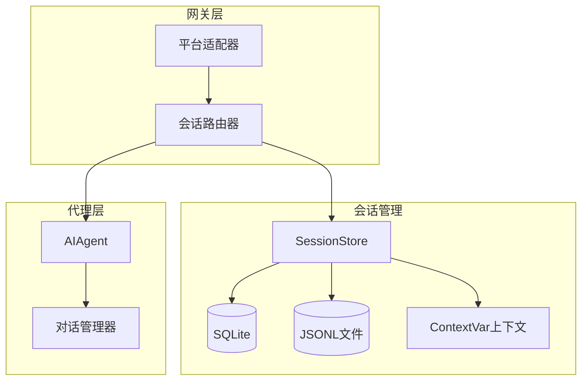
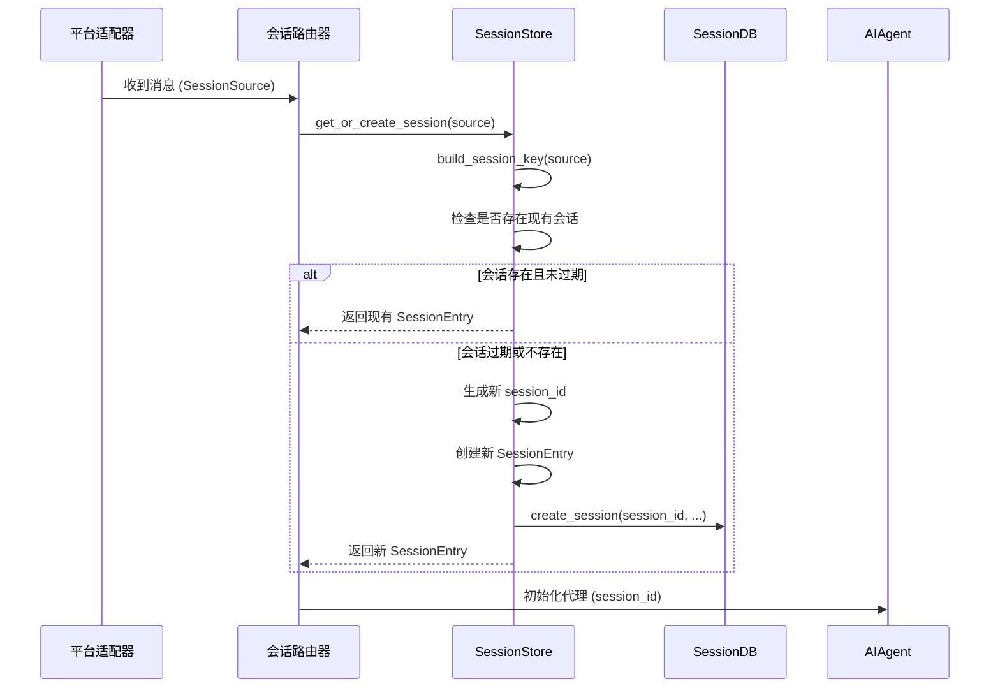
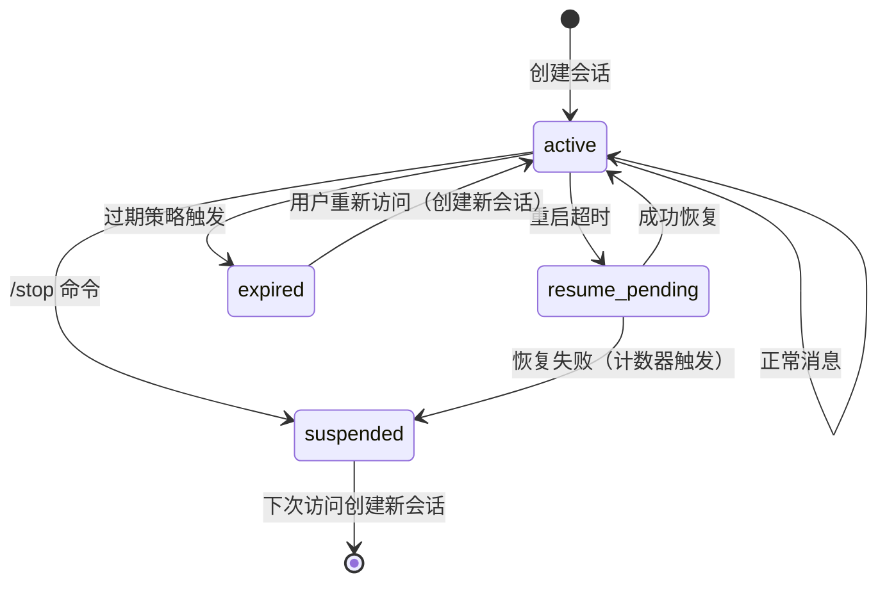
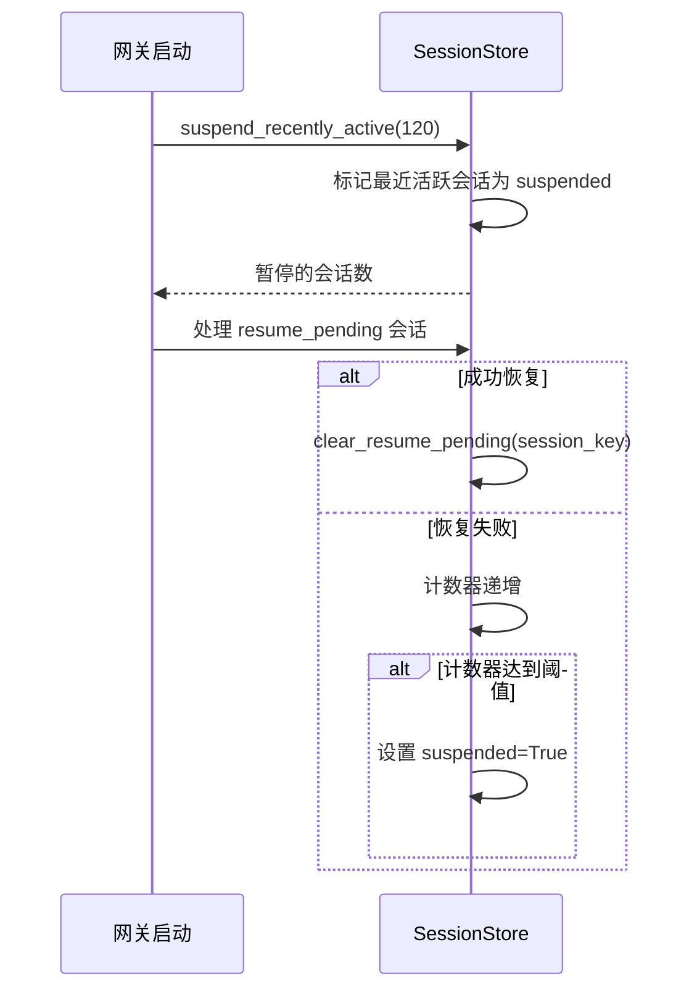

# Hermes Agent 会话管理系统分析

> **分析目标**: `d:\Project\Hclaw\GitHub\hermes-agent` 项目会话管理功能
>
> **分析版本**: 基于最新提交
>
> **文档状态**: 完成

---

## 目录

1. [会话管理架构总览](#1-会话管理架构总览)
2. [会话创建机制](#2-会话创建机制)
3. [会话存储方案](#3-会话存储方案)
4. [会话状态管理](#4-会话状态管理)
5. [会话有效期控制](#5-会话有效期控制)
6. [会话安全措施](#6-会话安全措施)
7. [会话标识方式](#7-会话标识方式)
8. [会话数据结构设计](#8-会话数据结构设计)
9. [会话相关API接口说明](#9-会话相关api接口说明)
10. [异常处理策略](#10-异常处理策略)
11. [与其他系统模块的交互关系](#11-与其他系统模块的交互关系)
12. [优缺点分析](#12-优缺点分析)

---

## 1. 会话管理架构总览

### 1.1 整体架构



### 1.2 核心组件职责

| 组件 | 职责 | 关键功能 |
|------|------|---------|
| **SessionStore** | 会话存储管理 | 创建/获取/重置会话、过期检测、持久化 |
| **SessionDB** | SQLite 数据库 | 会话元数据存储、消息持久化、全文搜索 |
| **LegacyJSONL** | 历史记录文件 | 向后兼容的消息日志 |
| **ContextVars** | 异步上下文变量 | 并发安全的会话上下文传递 |
| **SessionSource** | 来源描述 | 消息来源平台、用户、聊天信息 |

---

## 2. 会话创建机制

### 2.1 会话创建流程



### 2.2 会话键构建逻辑

```python
def build_session_key(
    source: SessionSource,
    group_sessions_per_user: bool = True,
    thread_sessions_per_user: bool = False,
) -> str:
    """构建确定性会话键"""
    platform = source.platform.value
    
    # DM 会话规则
    if source.chat_type == "dm":
        dm_chat_id = source.chat_id
        if source.platform == Platform.WHATSAPP:
            dm_chat_id = canonical_whatsapp_identifier(source.chat_id)
        
        if dm_chat_id:
            if source.thread_id:
                return f"agent:main:{platform}:dm:{dm_chat_id}:{source.thread_id}"
            return f"agent:main:{platform}:dm:{dm_chat_id}"
        if source.thread_id:
            return f"agent:main:{platform}:dm:{source.thread_id}"
        return f"agent:main:{platform}:dm"
    
    # 群组/频道会话规则
    participant_id = source.user_id_alt or source.user_id
    key_parts = ["agent:main", platform, source.chat_type]
    
    if source.chat_id:
        key_parts.append(source.chat_id)
    if source.thread_id:
        key_parts.append(source.thread_id)
    
    # 默认线程共享会话，群组隔离会话
    isolate_user = group_sessions_per_user
    if source.thread_id and not thread_sessions_per_user:
        isolate_user = False
    
    if isolate_user and participant_id:
        key_parts.append(str(participant_id))
    
    return ":".join(key_parts)
```

---

## 3. 会话存储方案

### 3.1 双层存储架构

| 存储类型 | 用途 | 格式 | 优点 |
|---------|------|------|------|
| **SQLite** | 会话元数据、消息存储 | 关系型数据库 | 事务安全、支持查询 |
| **JSONL** | 历史消息日志 | 每行一条JSON | 简单、可追加、向后兼容 |

### 3.2 存储目录结构

```
~/.hermes/
├── sessions/
│   ├── sessions.json        # 会话索引 (session_key -> session_id)
│   ├── {session_id}.jsonl   # 消息历史 (每条一行JSON)
└── hermes.db               # SQLite数据库
```

### 3.3 原子写入机制

```python
def _save(self) -> None:
    """原子保存会话索引"""
    import tempfile
    
    data = {key: entry.to_dict() for key, entry in self._entries.items()}
    fd, tmp_path = tempfile.mkstemp(
        dir=str(self.sessions_dir), suffix=".tmp", prefix=".sessions_"
    )
    try:
        with os.fdopen(fd, "w", encoding="utf-8") as f:
            json.dump(data, f, indent=2)
            f.flush()
            os.fsync(f.fileno())
        atomic_replace(tmp_path, sessions_file)
    except BaseException:
        os.unlink(tmp_path)
        raise
```

---

## 4. 会话状态管理

### 4.1 会话状态标志

| 状态标志 | 含义 | 触发条件 |
|---------|------|---------|
| **suspended** | 会话已暂停 | `/stop` 命令或重启中断 |
| **resume_pending** | 等待恢复 | 网关重启超时中断 |
| **expiry_finalized** | 过期已处理 | 后台过期监视器处理 |
| **was_auto_reset** | 自动重置标记 | 会话因策略过期重置 |

### 4.2 状态转换图



---

## 5. 会话有效期控制

### 5.1 重置策略配置

```python
class SessionResetPolicy:
    mode: str          # "none", "idle", "daily", "both"
    idle_minutes: int  # 空闲超时分钟数
    at_hour: int       # 每日重置时间（小时）
```

### 5.2 过期检测逻辑

```python
def _should_reset(self, entry: SessionEntry, source: SessionSource) -> Optional[str]:
    """检查会话是否需要重置"""
    # 有活跃后台进程时不重置
    if self._has_active_processes_fn:
        if self._has_active_processes_fn(session_key):
            return None
    
    policy = self.config.get_reset_policy(
        platform=source.platform,
        session_type=source.chat_type
    )
    
    if policy.mode == "none":
        return None
    
    now = datetime.now()
    
    # 空闲超时检测
    if policy.mode in ("idle", "both"):
        idle_deadline = entry.updated_at + timedelta(minutes=policy.idle_minutes)
        if now > idle_deadline:
            return "idle"
    
    # 每日重置检测
    if policy.mode in ("daily", "both"):
        today_reset = now.replace(
            hour=policy.at_hour, minute=0, second=0, microsecond=0
        )
        if now.hour < policy.at_hour:
            today_reset -= timedelta(days=1)
        if entry.updated_at < today_reset:
            return "daily"
    
    return None
```

---

## 6. 会话安全措施

### 6.1 PII 脱敏处理

```python
def _hash_id(value: str) -> str:
    """确定性哈希 ID"""
    return hashlib.sha256(value.encode("utf-8")).hexdigest()[:12]

def _hash_sender_id(value: str) -> str:
    """哈希发送者 ID"""
    return f"user_{_hash_id(value)}"

def _hash_chat_id(value: str) -> str:
    """哈希聊天 ID，保留平台前缀"""
    colon = value.find(":")
    if colon > 0:
        prefix = value[:colon]
        return f"{prefix}:{_hash_id(value[colon + 1:])}"
    return _hash_id(value)
```

### 6.2 安全平台列表

```python
_PII_SAFE_PLATFORMS = frozenset({
    Platform.WHATSAPP,
    Platform.SIGNAL,
    Platform.TELEGRAM,
    Platform.BLUEBUBBLES,
})
```

> **注意**: Discord 不在安全平台列表中，因为其 @提及系统需要真实用户 ID。

---

## 7. 会话标识方式

### 7.1 会话 ID 生成

```python
session_id = f"{now.strftime('%Y%m%d_%H%M%S')}_{uuid.uuid4().hex[:8]}"
# 示例: 20260506_103045_a1b2c3d4
```

### 7.2 会话键结构

| 会话类型 | 键格式 | 示例 |
|---------|--------|------|
| DM | `agent:main:{platform}:dm:{chat_id}` | `agent:main:telegram:dm:123456789` |
| 带线程 DM | `agent:main:{platform}:dm:{chat_id}:{thread_id}` | `agent:main:discord:dm:user123:thread456` |
| 群组 | `agent:main:{platform}:group:{chat_id}` | `agent:main:telegram:group:987654321` |
| 线程群组 | `agent:main:{platform}:group:{chat_id}:{thread_id}` | `agent:main:slack:group:general:thread789` |

---

## 8. 会话数据结构设计

### 8.1 SessionSource

```python
@dataclass
class SessionSource:
    platform: Platform           # 平台类型
    chat_id: str                # 聊天 ID
    chat_name: Optional[str]    # 聊天名称
    chat_type: str = "dm"       # dm/group/channel/thread
    user_id: Optional[str]      # 用户 ID
    user_name: Optional[str]    # 用户名称
    thread_id: Optional[str]    # 线程 ID
    chat_topic: Optional[str]   # 频道主题
    user_id_alt: Optional[str]  # 备用用户 ID
    chat_id_alt: Optional[str]  # 备用聊天 ID
    is_bot: bool = False        # 是否机器人
    guild_id: Optional[str]     # Discord guild / Slack workspace
    parent_chat_id: Optional[str] # 父频道 ID
    message_id: Optional[str]   # 触发消息 ID
```

### 8.2 SessionEntry

```python
@dataclass
class SessionEntry:
    session_key: str            # 会话键
    session_id: str             # 会话 ID
    created_at: datetime        # 创建时间
    updated_at: datetime        # 更新时间
    origin: Optional[SessionSource]  # 来源信息
    display_name: Optional[str] # 显示名称
    platform: Optional[Platform] # 平台
    chat_type: str = "dm"       # 聊天类型
    
    # Token 统计
    input_tokens: int = 0
    output_tokens: int = 0
    cache_read_tokens: int = 0
    cache_write_tokens: int = 0
    total_tokens: int = 0
    estimated_cost_usd: float = 0.0
    cost_status: str = "unknown"
    last_prompt_tokens: int = 0
    
    # 状态标志
    was_auto_reset: bool = False
    auto_reset_reason: Optional[str]
    reset_had_activity: bool = False
    expiry_finalized: bool = False
    suspended: bool = False
    resume_pending: bool = False
    resume_reason: Optional[str]
    last_resume_marked_at: Optional[datetime]
```

### 8.3 SessionContext

```python
@dataclass
class SessionContext:
    source: SessionSource              # 来源
    connected_platforms: List[Platform] # 连接的平台
    home_channels: Dict[Platform, HomeChannel] # 主频道
    shared_multi_user_session: bool = False    # 是否多用户共享
    
    # 元数据
    session_key: str = ""
    session_id: str = ""
    created_at: Optional[datetime] = None
    updated_at: Optional[datetime] = None
```

---

## 9. 会话相关API接口说明

### 9.1 SessionStore API

| 方法 | 功能 | 参数 | 返回值 |
|------|------|------|--------|
| `get_or_create_session` | 获取或创建会话 | `source`, `force_new` | `SessionEntry` |
| `update_session` | 更新会话元数据 | `session_key`, `last_prompt_tokens` | `None` |
| `suspend_session` | 暂停会话 | `session_key` | `bool` |
| `reset_session` | 强制重置会话 | `session_key` | `Optional[SessionEntry]` |
| `switch_session` | 切换到指定会话 | `session_key`, `target_session_id` | `Optional[SessionEntry]` |
| `list_sessions` | 列出会话 | `active_minutes` | `List[SessionEntry]` |
| `append_to_transcript` | 追加消息到会话 | `session_id`, `message`, `skip_db` | `None` |
| `rewrite_transcript` | 重写会话消息 | `session_id`, `messages` | `None` |
| `prune_old_entries` | 清理过期会话 | `max_age_days` | `int` (移除数量) |

### 9.2 上下文变量 API

```python
# 设置会话上下文变量
tokens = set_session_vars(
    platform="telegram",
    chat_id="123456",
    user_id="user789",
    session_key="agent:main:telegram:dm:123456"
)

# 获取会话环境变量
platform = get_session_env("HERMES_SESSION_PLATFORM", "")
chat_id = get_session_env("HERMES_SESSION_CHAT_ID", "")

# 清除会话变量（finally 块中调用）
clear_session_vars(tokens)
```

---

## 10. 异常处理策略

### 10.1 数据库操作异常

```python
if self._db:
    try:
        self._db.create_session(**db_create_kwargs)
    except Exception as e:
        logger.debug("Session DB operation failed: %s", e)
```

### 10.2 恢复失败处理

```python
def suspend_recently_active(self, max_age_seconds: int = 120) -> int:
    """标记最近活跃会话为暂停，防止盲目恢复"""
    cutoff = _now() - timedelta(seconds=max_age_seconds)
    count = 0
    with self._lock:
        self._ensure_loaded_locked()
        for entry in self._entries.values():
            if entry.resume_pending:
                continue  # 跳过有意标记为可恢复的会话
            if not entry.suspended and entry.updated_at >= cutoff:
                entry.suspended = True
                count += 1
        if count:
            self._save()
    return count
```

### 10.3 会话恢复流程



---

## 11. 与其他系统模块的交互关系

### 11.1 交互模块

| 模块 | 交互方式 | 说明 |
|------|---------|------|
| **平台适配器** | 调用 `get_or_create_session` | 传递消息来源信息 |
| **AIAgent** | 接收 `session_id` | 初始化代理实例 |
| **进程管理器** | `_has_active_processes_fn` | 检查活跃进程防止过期 |
| **会话数据库** | SQLite 操作 | 持久化会话元数据和消息 |
| **上下文变量** | `set_session_vars` | 异步安全传递会话上下文 |
| **工具系统** | `get_session_env` | 工具访问会话信息 |

### 11.2 并发安全设计

```python
# 使用 contextvars 实现任务隔离
_SESSION_PLATFORM: ContextVar = ContextVar("HERMES_SESSION_PLATFORM", default=_UNSET)
_SESSION_CHAT_ID: ContextVar = ContextVar("HERMES_SESSION_CHAT_ID", default=_UNSET)
# ...

def get_session_env(name: str, default: str = "") -> str:
    """获取会话环境变量，支持 CLI/定时任务回退"""
    var = _VAR_MAP.get(name)
    if var is not None:
        value = var.get()
        if value is not _UNSET:
            return value
    # 回退到 os.environ（CLI/定时任务兼容）
    return os.getenv(name, default)
```

---

## 12. 优缺点分析

### 12.1 优点

| 特性 | 实现方式 | 优势 |
|------|---------|------|
| **并发安全** | ContextVar 任务隔离 | 异步消息互不干扰 |
| **双层存储** | SQLite + JSONL | 事务安全 + 向后兼容 |
| **灵活的会话隔离** | 可配置的会话键构建 | 支持多种隔离策略 |
| **智能过期策略** | 空闲/每日双重策略 | 自动清理无效会话 |
| **PII 保护** | 确定性哈希 | 保护用户隐私 |
| **优雅恢复** | resume_pending 机制 | 重启后自动恢复 |

### 12.2 缺点与优化建议

| 问题 | 影响 | 优化建议 |
|------|------|---------|
| **JSONL 文件可能过大** | 磁盘占用高 | 定期压缩/归档 |
| **内存索引** | 重启后重新加载 | 增量加载优化 |
| **同步锁** | 高并发瓶颈 | 读写分离 |

---

## 附录

### A. 配置示例

```yaml
# config.yaml
session:
  reset_policy:
    default:
      mode: "both"
      idle_minutes: 60
      at_hour: 3
    telegram:
      mode: "idle"
      idle_minutes: 30
```

### B. 线程安全要点

1. **SessionStore** 使用 `threading.Lock` 保护内存索引
2. **ContextVars** 提供任务级隔离
3. **SQLite** 自带事务支持

---

*文档生成时间: 2026-05-06*
*分析工具: Claude Code*
*项目仓库: d:\Project\Hclaw\GitHub\hermes-agent*
