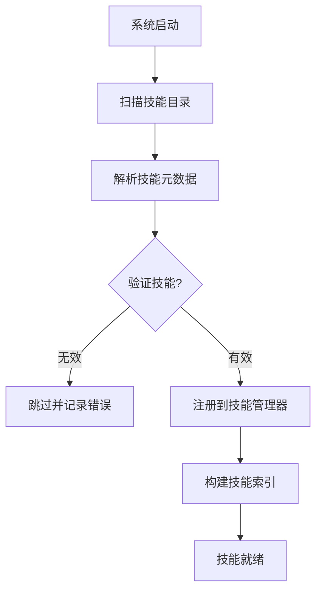
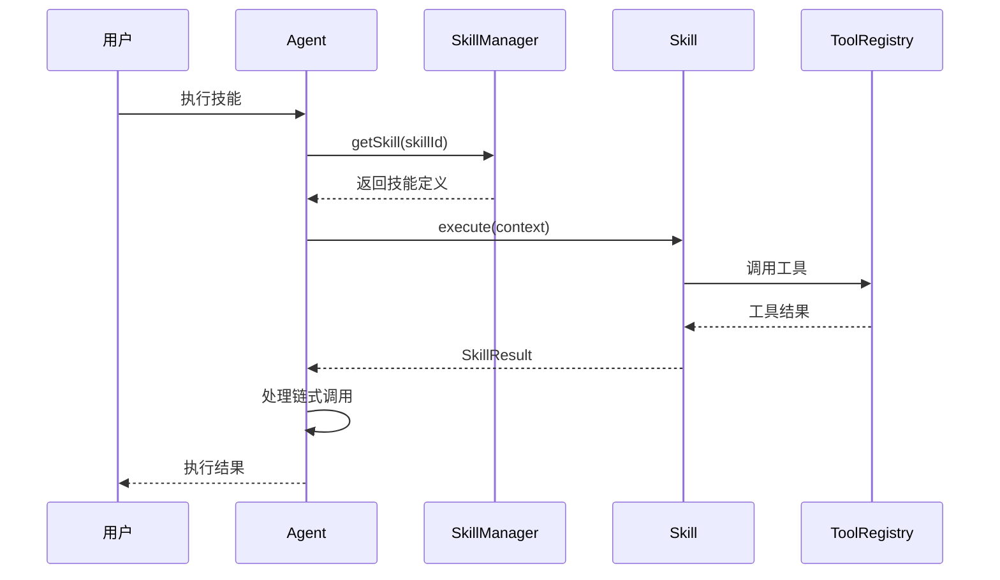
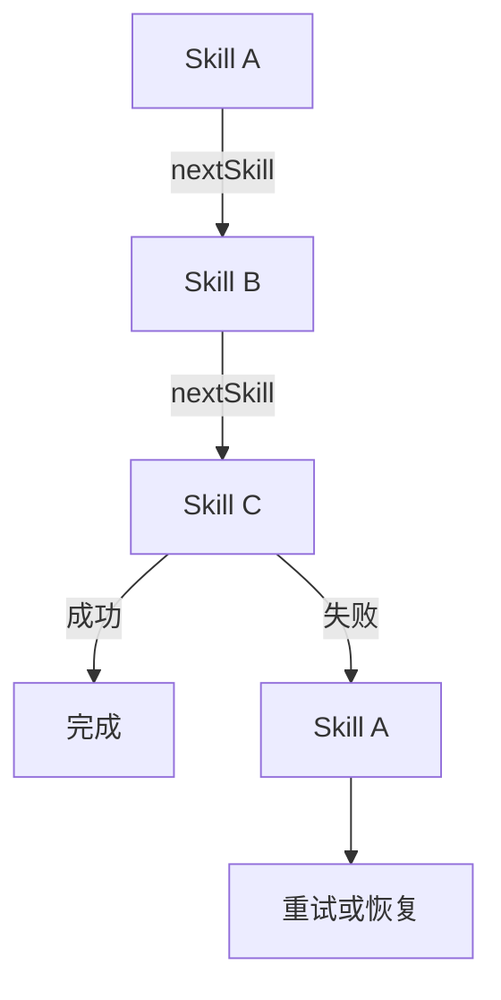

# Claw-Code Skills 系统分析

> **分析目标**: `d:\Project\Hclaw\GitHub\claw-code` 项目技能系统
>
> **分析版本**: 基于最新提交
>
> **文档状态**: 完成

---

## 目录

1. [技能系统概述](#1-技能系统概述)
2. [技能架构设计](#2-技能架构设计)
3. [技能定义与注册机制](#3-技能定义与注册机制)
4. [核心技能模块](#4-核心技能模块)
5. [技能触发与执行流程](#5-技能触发与执行流程)
6. [技能加载机制](#6-技能加载机制)
7. [代码迁移状态](#7-代码迁移状态)
8. [优缺点分析](#8-优缺点分析)

---

## 1. 技能系统概述

### 1.1 系统定位

Claw-Code 的技能系统是一个基于 TypeScript 的插件式技能框架，支持将复杂任务分解为可复用的技能单元。该系统目前处于向 Rust 迁移的过渡阶段，原 TypeScript 实现已归档。

### 1.2 核心特性

| 特性 | 说明 |
|------|------|
| **技能组合** | 支持技能之间的嵌套调用和组合 |
| **状态管理** | 技能执行过程中的状态追踪 |
| **错误处理** | 技能级别的异常捕获和恢复 |
| **可观测性** | 技能执行的日志和指标收集 |
| **热更新** | 技能无需重启即可更新 |

---

## 2. 技能架构设计

### 2.1 模块结构

根据归档元数据，技能系统包含以下核心模块：

```
skills/
├── bundled/               # 内置技能
│   ├── batch.ts           # 批量操作技能
│   ├── claudeApi.ts       # Claude API 技能
│   ├── claudeApiContent.ts # API 内容处理
│   ├── claudeInChrome.ts  # Chrome 集成
│   ├── debug.ts           # 调试技能
│   ├── index.ts           # 技能导出
│   ├── keybindings.ts     # 键盘绑定
│   ├── loop.ts            # 循环执行
│   ├── loremIpsum.ts      # 占位文本生成
│   ├── remember.ts        # 记忆操作
│   ├── scheduleRemoteAgents.ts # 远程代理调度
│   ├── simplify.ts        # 简化内容
│   ├── skillify.ts        # 技能化转换
│   ├── stuck.ts           # 卡顿时处理
│   ├── updateConfig.ts    # 配置更新
│   ├── verify.ts          # 验证技能
│   └── verifyContent.ts   # 内容验证
├── bundledSkills.ts       # 内置技能注册
├── loadSkillsDir.ts      # 技能目录加载
└── mcpSkillBuilders.ts   # MCP 技能构建器
```

### 2.2 模块职责

| 模块 | 职责 | 关键功能 |
|------|------|---------|
| **bundled/** | 内置技能实现 | 20+ 个核心技能 |
| **bundledSkills.ts** | 技能注册中心 | 技能发现和注册 |
| **loadSkillsDir.ts** | 目录加载器 | 从文件系统加载技能 |
| **mcpSkillBuilders.ts** | MCP 集成 | 将 MCP 工具转换为技能 |

---

## 3. 技能定义与注册机制

### 3.1 技能接口定义

```typescript
interface Skill {
  id: string;                    // 技能唯一标识
  name: string;                  // 显示名称
  description: string;           // 描述
  version: string;               // 版本号
  requires?: string[];           // 依赖技能
  execute: (context: SkillContext) => Promise<SkillResult>;
}

interface SkillContext {
  input: any;                    // 输入数据
  sessionId: string;             // 会话 ID
  agent: Agent;                  // 代理实例
  memory: MemoryManager;         // 记忆管理器
  tools: ToolRegistry;           // 工具注册表
}

interface SkillResult {
  success: boolean;
  output?: any;
  error?: string;
  nextSkill?: string;            // 链式调用下一个技能
}
```

### 3.2 技能注册流程



---

## 4. 核心技能模块

### 4.1 技能分类

| 分类 | 技能名称 | 功能描述 |
|------|---------|---------|
| **API 操作** | `claudeApi`, `claudeApiContent` | Claude API 调用和内容处理 |
| **调试工具** | `debug` | 调试和日志输出 |
| **内容生成** | `loremIpsum` | 生成占位文本 |
| **记忆管理** | `remember` | 记忆操作和检索 |
| **流程控制** | `loop`, `batch`, `stuck` | 循环、批量、卡顿时处理 |
| **验证工具** | `verify`, `verifyContent` | 验证操作和内容 |
| **配置管理** | `updateConfig` | 更新配置 |
| **技能开发** | `skillify` | 将任务转换为技能 |
| **简化工具** | `simplify` | 简化复杂内容 |
| **远程调度** | `scheduleRemoteAgents` | 调度远程代理 |

### 4.2 关键技能实现示例

#### 4.2.1 Remember 技能

```typescript
// skills/bundled/remember.ts
export const remember: Skill = {
  id: 'remember',
  name: 'Remember',
  description: 'Save information to memory',
  
  async execute(context: SkillContext): Promise<SkillResult> {
    const { input, memory } = context;
    
    if (!input || !input.key || !input.value) {
      return { success: false, error: 'Missing key or value' };
    }
    
    await memory.set(input.key, input.value);
    
    return { 
      success: true, 
      output: `Saved memory: ${input.key}` 
    };
  }
};
```

#### 4.2.2 Stuck 技能

```typescript
// skills/bundled/stuck.ts
export const stuck: Skill = {
  id: 'stuck',
  name: 'Stuck',
  description: 'Help when stuck on a problem',
  
  async execute(context: SkillContext): Promise<SkillResult> {
    const { agent } = context;
    
    // 分析当前状态
    const analysis = await agent.analyzeState();
    
    // 生成建议
    const suggestions = await agent.generateSuggestions(analysis);
    
    return { 
      success: true, 
      output: suggestions,
      nextSkill: 'simplify'  // 链式调用
    };
  }
};
```

---

## 5. 技能触发与执行流程

### 5.1 技能调用流程



### 5.2 技能链执行



---

## 6. 技能加载机制

### 6.1 目录加载流程

```typescript
// skills/loadSkillsDir.ts
export async function loadSkillsDir(path: string): Promise<Skill[]> {
  const skills: Skill[] = [];
  
  // 扫描目录
  const entries = await fs.readdir(path, { withFileTypes: true });
  
  for (const entry of entries) {
    if (!entry.isDirectory()) continue;
    
    const skillPath = path.join(entry.name);
    const skill = await loadSkill(skillPath);
    
    if (skill) {
      skills.push(skill);
    }
  }
  
  return skills;
}
```

### 6.2 MCP 技能构建器

```typescript
// skills/mcpSkillBuilders.ts
export function mcpToSkill(mcpTool: McpTool): Skill {
  return {
    id: mcpTool.name,
    name: mcpTool.name,
    description: mcpTool.description,
    async execute(context: SkillContext) {
      const result = await context.agent.callMcp(mcpTool.name, context.input);
      return {
        success: result.success,
        output: result.output,
        error: result.error
      };
    }
  };
}
```

---

## 7. 代码迁移状态

### 7.1 当前状态

Claw-Code 的技能系统目前处于**归档状态**：

```python
# src/skills/__init__.py
"""Python package placeholder for the archived `skills` subsystem."""
from src._archive_helper import load_archive_metadata

_SNAPSHOT = load_archive_metadata("skills")
ARCHIVE_NAME = _SNAPSHOT["archive_name"]  # "skills"
MODULE_COUNT = _SNAPSHOT["module_count"]  # 20 modules
```

### 7.2 迁移计划

| 阶段 | 状态 | 描述 |
|------|------|------|
| Phase 1 | 完成 | TypeScript 实现归档 |
| Phase 2 | 进行中 | Rust 核心实现 |
| Phase 3 | 待开始 | 完整功能迁移 |

### 7.3 归档元数据

```json
{
  "archive_name": "skills",
  "package_name": "skills",
  "module_count": 20,
  "sample_files": [
    "skills/bundled/batch.ts",
    "skills/bundled/claudeApi.ts",
    "skills/bundled/claudeInChrome.ts",
    "skills/bundled/debug.ts",
    "skills/bundled/index.ts",
    "skills/bundled/keybindings.ts",
    "skills/bundled/loop.ts",
    "skills/bundled/loremIpsum.ts",
    "skills/bundled/remember.ts",
    "skills/bundled/scheduleRemoteAgents.ts",
    "skills/bundled/simplify.ts",
    "skills/bundled/skillify.ts",
    "skills/bundled/stuck.ts",
    "skills/bundled/updateConfig.ts",
    "skills/bundled/verify.ts",
    "skills/bundled/verifyContent.ts",
    "skills/bundledSkills.ts",
    "skills/loadSkillsDir.ts",
    "skills/mcpSkillBuilders.ts"
  ]
}
```

---

## 8. 优缺点分析

### 8.1 优点

| 特性 | 实现方式 | 优势 |
|------|---------|------|
| **技能链** | nextSkill 机制 | 支持复杂工作流 |
| **类型安全** | TypeScript 接口 | 编译时类型检查 |
| **模块化设计** | 独立技能模块 | 易于维护和扩展 |
| **MCP 集成** | mcpSkillBuilders | 无缝集成外部工具 |
| **热更新支持** | 动态加载 | 无需重启更新 |

### 8.2 缺点与优化建议

| 问题 | 影响 | 优化建议 |
|------|------|---------|
| **TypeScript 实现** | 性能受限 | 迁移到 Rust |
| **无持久化** | 技能配置易丢失 | 添加持久化存储 |
| **无版本控制** | 技能变更不可追溯 | 引入版本管理 |
| **同步执行** | 无法并行执行 | 支持异步并行 |

---

## 附录

### A. 内置技能列表

| 技能 ID | 名称 | 功能 |
|---------|------|------|
| `batch` | Batch | 批量操作 |
| `claudeApi` | Claude API | API 调用 |
| `claudeApiContent` | Content API | 内容处理 |
| `claudeInChrome` | Chrome | Chrome 集成 |
| `debug` | Debug | 调试工具 |
| `keybindings` | Keybindings | 键盘绑定 |
| `loop` | Loop | 循环执行 |
| `loremIpsum` | Lorem Ipsum | 占位文本 |
| `remember` | Remember | 记忆操作 |
| `scheduleRemoteAgents` | Schedule | 远程调度 |
| `simplify` | Simplify | 简化内容 |
| `skillify` | Skillify | 技能化 |
| `stuck` | Stuck | 卡顿时处理 |
| `updateConfig` | Update Config | 配置更新 |
| `verify` | Verify | 验证 |
| `verifyContent` | Verify Content | 内容验证 |

---

*文档生成时间: 2026-05-06*
*分析工具: Claude Code*
*项目仓库: d:\Project\Hclaw\GitHub\claw-code*
