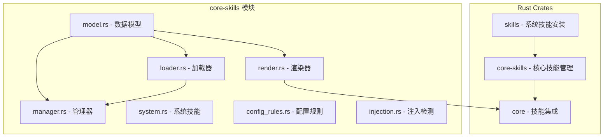
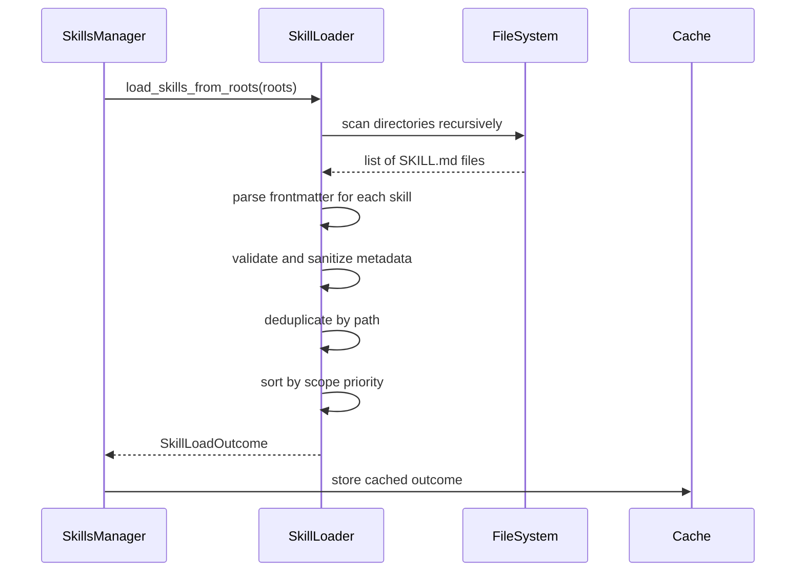
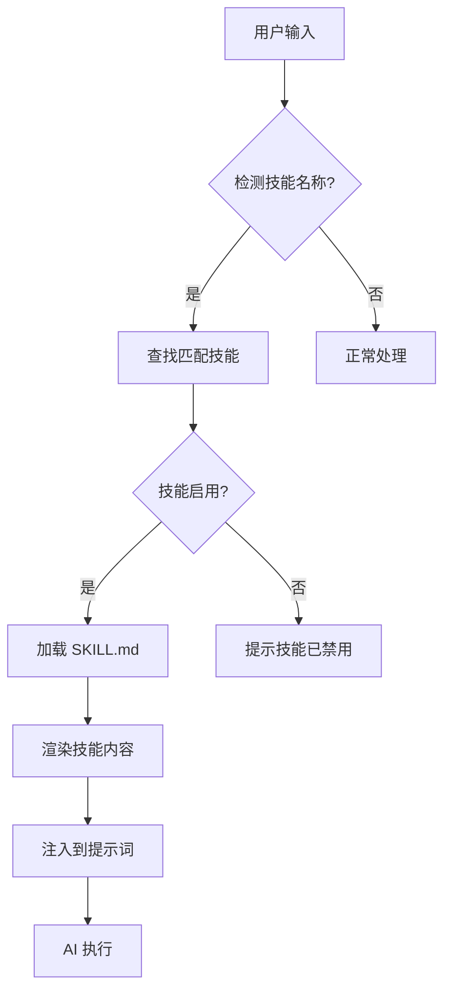

# Codex Skills 系统分析

> **分析目标**: `d:\Project\Hclaw\GitHub\codex` 项目技能系统
>
> **分析版本**: 基于最新提交
>
> **文档状态**: 完成

---

## 目录

1. [技能系统架构总览](#1-技能系统架构总览)
2. [技能定义与注册机制](#2-技能定义与注册机制)
3. [技能加载与管理](#3-技能加载与管理)
4. [技能触发与执行流程](#4-技能触发与执行流程)
5. [权限控制策略](#5-权限控制策略)
6. [配置管理方式](#6-配置管理方式)
7. [性能优化措施](#7-性能优化措施)
8. [技能渲染与预算管理](#8-技能渲染与预算管理)
9. [与其他系统的集成](#9-与其他系统的集成)
10. [优缺点分析](#10-优缺点分析)

---

## 1. 技能系统架构总览

### 1.1 整体架构

Codex 技能系统采用分层架构设计，包含以下核心组件：



### 1.2 组件职责

| 组件 | 职责 | 关键功能 |
|------|------|---------|
| **skills** | 系统技能安装 | 嵌入式技能缓存、指纹验证 |
| **core-skills/model** | 数据模型定义 | SkillMetadata、SkillPolicy、SkillLoadOutcome |
| **core-skills/loader** | 技能加载 | 多目录扫描、Frontmatter 解析、去重排序 |
| **core-skills/manager** | 技能管理 | 缓存管理、配置驱动加载 |
| **core-skills/render** | 技能渲染 | 预算控制、别名优化、渐进式披露 |
| **core-skills/system** | 系统技能 | 安装/卸载系统技能 |

---

## 2. 技能定义与注册机制

### 2.1 技能文件格式

技能定义通过 `SKILL.md` 文件实现，包含 YAML Frontmatter：

```markdown
---
name: skill-name
description: Brief description of the skill
metadata:
  short-description: Short summary
---

# Skill Content

Full skill instructions...
```

### 2.2 技能元数据结构

```rust
pub struct SkillMetadata {
    pub name: String,                           // 技能名称
    pub description: String,                    // 描述
    pub short_description: Option<String>,       // 简短描述
    pub interface: Option<SkillInterface>,      // 界面配置
    pub dependencies: Option<SkillDependencies>, // 依赖声明
    pub policy: Option<SkillPolicy>,            // 策略配置
    pub path_to_skills_md: AbsolutePathBuf,     // 技能文件路径
    pub scope: SkillScope,                      // 作用域
    pub plugin_id: Option<String>,              // 插件 ID
}
```

### 2.3 技能策略

```rust
pub struct SkillPolicy {
    pub allow_implicit_invocation: Option<bool>, // 是否允许隐式调用
    pub products: Vec<Product>,                  // 产品限制
}
```

### 2.4 技能作用域

| 作用域 | 优先级 | 路径位置 |
|--------|--------|---------|
| **Repo** | 0 | 仓库内 `.agents/skills/` |
| **User** | 1 | `$HOME/.agents/skills/` 或 `$CODEX_HOME/skills/` |
| **System** | 2 | `$CODEX_HOME/skills/.system/` |
| **Admin** | 3 | `/etc/codex/skills/` |

---

## 3. 技能加载与管理

### 3.1 加载流程



### 3.2 扫描深度控制

```rust
const MAX_SCAN_DEPTH: usize = 6;           // 最大扫描深度
const MAX_SKILLS_DIRS_PER_ROOT: usize = 2000; // 每根目录最大目录数
```

### 3.3 符号链接处理

```rust
// 用户/仓库/管理员技能跟随符号链接，系统技能不跟随
let follow_symlinks = matches!(
    scope,
    SkillScope::Repo | SkillScope::User | SkillScope::Admin
);
```

---

## 4. 技能触发与执行流程

### 4.1 隐式技能调用检测

```rust
// 根据脚本目录和文档路径建立索引
pub(crate) fn build_implicit_skill_path_indexes(skills: Vec<SkillMetadata>) 
    -> (HashMap<AbsolutePathBuf, SkillMetadata>, HashMap<AbsolutePathBuf, SkillMetadata>)
```

### 4.2 技能调用流程



---

## 5. 权限控制策略

### 5.1 产品限制

技能可以通过 `policy.products` 声明支持的产品：

```yaml
---
metadata:
  hermes:
    policy:
      products: [codex, hermes]
---
```

### 5.2 禁用技能管理

```rust
// 从配置层堆栈解析禁用的技能路径
pub fn resolve_disabled_skill_paths(
    skills: &[SkillMetadata],
    config_rules: &SkillConfigRules
) -> HashSet<AbsolutePathBuf>
```

### 5.3 隐式调用控制

```rust
pub fn is_skill_allowed_for_implicit_invocation(&self, skill: &SkillMetadata) -> bool {
    self.is_skill_enabled(skill) && skill.allow_implicit_invocation()
}
```

---

## 6. 配置管理方式

### 6.1 技能配置结构

```toml
[skills]
bundled.enabled = true  # 是否启用系统技能

[skills.disabled]
path = ["~/skills/old-skill"]
```

### 6.2 配置层优先级

| 优先级 | 配置层 | 说明 |
|--------|--------|------|
| 高 | SessionFlags | 会话级标志 |
| 中 | User | 用户配置 |
| 低 | System/Admin | 系统配置 |

---

## 7. 性能优化措施

### 7.1 缓存机制

```rust
pub struct SkillsManager {
    cache_by_cwd: RwLock<HashMap<AbsolutePathBuf, SkillLoadOutcome>>,
    cache_by_config: RwLock<HashMap<ConfigSkillsCacheKey, SkillLoadOutcome>>,
}
```

### 7.2 系统技能指纹验证

```rust
// 通过指纹避免重复安装
pub fn install_system_skills(codex_home: &AbsolutePathBuf) -> Result<(), SystemSkillsError> {
    let expected_fingerprint = embedded_system_skills_fingerprint();
    if marker_matches(expected_fingerprint) {
        return Ok(()); // 指纹匹配，跳过安装
    }
    // 执行安装...
}
```

### 7.3 去重策略

```rust
// 按作用域优先级去重，保留高优先级技能
outcome.skills.sort_by(|a, b| {
    scope_rank(a.scope).cmp(&scope_rank(b.scope))
        .then_with(|| a.name.cmp(&b.name))
        .then_with(|| a.path_to_skills_md.cmp(&b.path_to_skills_md))
});
```

---

## 8. 技能渲染与预算管理

### 8.1 预算控制机制

```rust
pub enum SkillMetadataBudget {
    Tokens(usize),      // 按 Token 数预算（上下文窗口的 2%）
    Characters(usize),  // 按字符数预算（默认 8000）
}
```

### 8.2 渐进式披露策略

| 预算状态 | 处理方式 |
|---------|---------|
| 充足 | 包含完整描述 |
| 紧张 | 截断描述，保留名称和路径 |
| 不足 | 省略部分技能 |

### 8.3 路径别名优化

当技能路径很长时，系统会自动生成别名：

```rust
// 将长路径转换为别名
// 原始: /Users/xl/.codex/plugins/cache/openai-curated/example/hash123/skills/skill-name/SKILL.md
// 优化: r0/skill-name/SKILL.md
// 别名表: r0 = /Users/xl/.codex/plugins/cache/openai-curated/example/hash123/skills
```

### 8.4 渲染报告

```rust
pub struct SkillRenderReport {
    pub total_count: usize,              // 技能总数
    pub included_count: usize,           // 包含数量
    pub omitted_count: usize,            // 省略数量
    pub truncated_description_chars: usize, // 截断字符数
    pub truncated_description_count: usize, // 截断技能数
}
```

---

## 9. 与其他系统的集成

### 9.1 插件系统集成

```rust
// 插件技能支持命名空间
async fn namespaced_skill_name(fs: &dyn ExecutorFileSystem, path: &AbsolutePathBuf, base_name: &str) -> String {
    plugin_namespace_for_skill_path(fs, path)
        .await
        .map(|namespace| format!("{namespace}:{base_name}"))
        .unwrap_or_else(|| base_name.to_string())
}
```

### 9.2 遥测集成

```rust
session_telemetry.histogram(THREAD_SKILLS_ENABLED_TOTAL_METRIC, count, &[]);
session_telemetry.histogram(THREAD_SKILLS_KEPT_TOTAL_METRIC, count, &[]);
session_telemetry.histogram(THREAD_SKILLS_TRUNCATED_METRIC, count, &[]);
```

---

## 10. 优缺点分析

### 10.1 优点

| 特性 | 实现方式 | 优势 |
|------|---------|------|
| **多作用域支持** | Repo/User/System/Admin | 灵活的技能管理层级 |
| **智能缓存** | 双缓存策略（CWD/Config） | 减少重复加载 |
| **预算控制** | Token/字符预算 | 优化上下文使用 |
| **路径别名** | 自动别名生成 | 节省 Token |
| **符号链接支持** | 选择性跟随 | 灵活的技能组织 |
| **指纹验证** | 嵌入式技能指纹 | 避免重复安装 |
| **去重机制** | 路径级去重 | 确保唯一性 |

### 10.2 缺点与优化建议

| 问题 | 影响 | 优化建议 |
|------|------|---------|
| **同步文件读取** | 大量技能时加载慢 | 异步并行扫描 |
| **内存缓存** | 进程重启后失效 | 磁盘缓存持久化 |
| **固定扫描深度** | 深层技能无法发现 | 可配置深度 |
| **单一缓存策略** | 无法精细控制 | 多级缓存策略 |

---

## 附录

### A. 技能文件结构

```
skills/
├── skill-name/
│   ├── SKILL.md              # 必需：技能定义
│   ├── agents/
│   │   └── openai.yaml       # 可选：元数据配置
│   ├── assets/               # 可选：图标资源
│   │   ├── icon-small.png
│   │   └── icon-large.png
│   ├── references/           # 可选：参考文档
│   ├── scripts/              # 可选：脚本文件
│   └── templates/            # 可选：模板文件
```

### B. 系统技能目录

```
$CODEX_HOME/skills/
├── .system/                  # 嵌入式系统技能缓存
│   ├── .codex-system-skills.marker  # 指纹标记
│   └── skill-creator/
│       └── SKILL.md
└── user-skill/               # 用户技能
    └── SKILL.md
```

---

*文档生成时间: 2026-05-06*
*分析工具: Claude Code*
*项目仓库: d:\Project\Hclaw\GitHub\codex*
