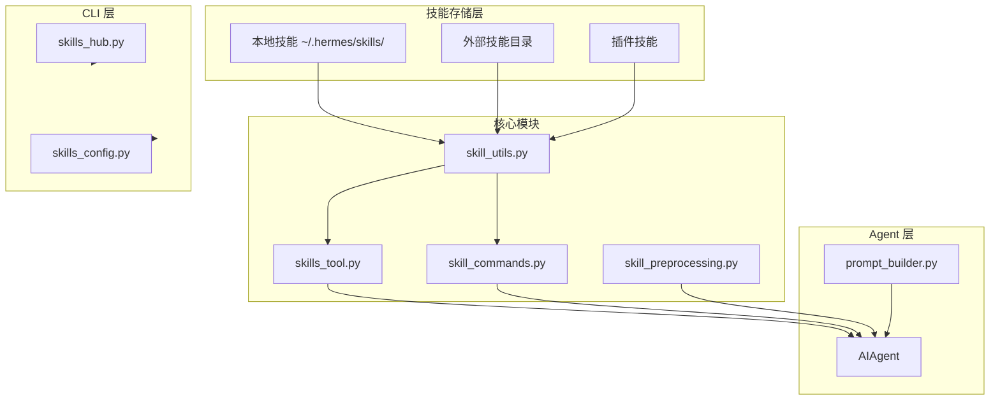
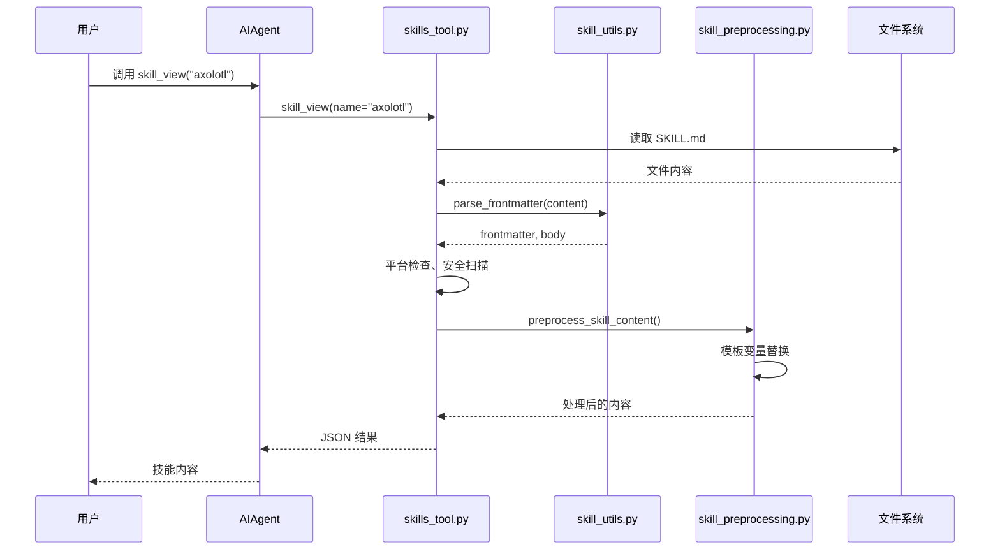
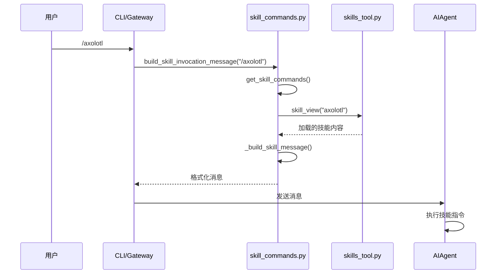
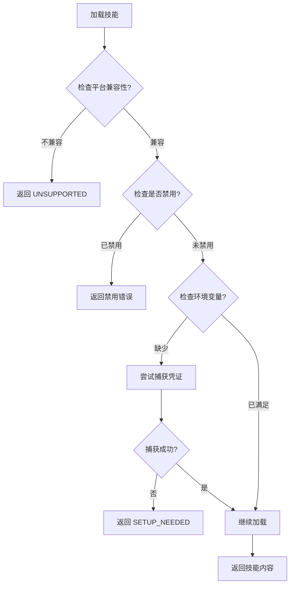

# Hermes Agent Skills 系统分析

> **分析目标**: `d:\Project\Hclaw\GitHub\hermes-agent` 项目技能系统
>
> **分析版本**: 基于最新提交
>
> **文档状态**: 完成

---

## 目录

1. [技能系统架构总览](#1-技能系统架构总览)
2. [技能定义与注册机制](#2-技能定义与注册机制)
3. [技能触发与执行流程](#3-技能触发与执行流程)
4. [权限控制策略](#4-权限控制策略)
5. [错误处理机制](#5-错误处理机制)
6. [配置管理方式](#6-配置管理方式)
7. [性能优化措施](#7-性能优化措施)
8. [与其他系统的集成](#8-与其他系统的集成)
9. [优缺点分析](#9-优缺点分析)

---

## 1. 技能系统架构总览

### 1.1 整体架构图



### 1.2 核心组件职责

| 组件 | 职责 | 关键功能 |
|------|------|---------|
| **skill_utils.py** | 轻量级工具函数 | 解析 frontmatter、平台匹配、配置提取 |
| **skill_commands.py** | Slash 命令处理 | 技能加载、消息构建、命令扫描 |
| **skills_tool.py** | 技能工具实现 | skills_list、skill_view、前置条件检查 |
| **skill_preprocessing.py** | 技能内容预处理 | 模板变量替换、内联 shell 执行 |
| **skills_hub.py** | 技能 Hub 管理 | 技能安装、卸载、搜索 |
| **skills_config.py** | 技能配置管理 | 禁用列表、外部目录配置 |

---

## 2. 技能定义与注册机制

### 2.1 SKILL.md 文件格式

```markdown
---
name: skill-name              # 必填，最大 64 字符
description: Brief description # 必填，最大 1024 字符
version: 1.0.0                # 可选
license: MIT                  # 可选 (agentskills.io)
platforms: [macos, linux]     # 可选 — 限制特定操作系统
prerequisites:                # 可选 — 遗留运行时要求
  env_vars: [API_KEY]         # 环境变量要求
  commands: [curl, jq]        # 命令检查
metadata:                     # 可选，任意键值对
  hermes:
    tags: [fine-tuning, llm]
    related_skills: [peft, lora]
    config:                   # 技能配置声明
      - key: wiki.path
        description: Path to wiki
        default: "~/wiki"
required_environment_variables: # 必填环境变量
  - name: API_KEY
    prompt: "Enter API key"
    help: "Get key from https://example.com"
setup:                        # 设置配置
  help: "Setup instructions"
  collect_secrets:
    - env_var: API_KEY
      prompt: "Enter API key"
---

# Skill Title

Full instructions and content here...
```

### 2.2 技能目录结构

```
skills/
├── category/              # 分类文件夹
│   ├── DESCRIPTION.md     # 分类描述
│   └── skill-name/        # 技能目录
│       ├── SKILL.md       # 主指令文件（必需）
│       ├── references/     # 支持文档
│       │   ├── api.md
│       │   └── examples.md
│       ├── templates/      # 输出模板
│       │   └── template.md
│       ├── scripts/        # 脚本文件
│       │   └── helper.py
│       └── assets/         # 资源文件
└── standalone-skill/
    └── SKILL.md
```

### 2.3 渐进式披露架构

| 层级 | 内容 | Token 效率 | 用途 |
|------|------|-----------|------|
| **Tier 1** | 名称 + 描述 | 低 | `skills_list()` |
| **Tier 2** | 完整指令内容 | 中 | `skill_view()` |
| **Tier 3** | 链接文件（references/templates） | 按需 | `skill_view(name, file_path)` |

---

## 3. 技能触发与执行流程

### 3.1 技能调用流程



### 3.2 Slash 命令触发流程



### 3.3 技能视图函数

```python
def skill_view(
    name: str,
    file_path: str = None,
    task_id: str = None,
    preprocess: bool = True,
) -> str:
    """
    View the content of a skill or a specific file within a skill directory.
    
    Args:
        name: 技能名称或路径，支持 "plugin:skill" 格式
        file_path: 技能内的特定文件路径
        task_id: 任务标识符
        preprocess: 是否应用模板和内联 shell 渲染
    """
```

---

## 4. 权限控制策略

### 4.1 平台兼容性检查

```python
def skill_matches_platform(frontmatter: Dict[str, Any]) -> bool:
    """检查技能是否与当前操作系统兼容"""
    platforms = frontmatter.get("platforms")
    if not platforms:
        return True  # 默认支持所有平台
    
    current = sys.platform  # "darwin", "linux", "win32"
    for platform in platforms:
        normalized = str(platform).lower().strip()
        mapped = PLATFORM_MAP.get(normalized, normalized)
        if current.startswith(mapped):
            return True
    return False
```

### 4.2 禁用技能管理

**配置文件 `config.yaml`**:
```yaml
skills:
  disabled:
    - axolotl
    - vllm
  platform_disabled:
    telegram:
      - voice-skill
      - screenshot-skill
```

### 4.3 安全扫描机制

```python
_INJECTION_PATTERNS = [
    "ignore previous instructions",
    "ignore all previous",
    "you are now",
    "disregard your",
    "forget your instructions",
    "new instructions:",
    "system prompt:",
    "<system>",
    "]]>",
]
```

### 4.4 路径遍历防护

```python
def skill_view(name, file_path=None, ...):
    if file_path and skill_dir:
        # 安全：防止路径遍历攻击
        if has_traversal_component(file_path):
            return error("Path traversal ('..') is not allowed.")
        
        target_file = skill_dir / file_path
        
        # 安全：验证解析路径仍在技能目录内
        traversal_error = validate_within_dir(target_file, skill_dir)
        if traversal_error:
            return error(traversal_error)
```

---

## 5. 错误处理机制

### 5.1 错误类型

| 错误场景 | 处理方式 | 返回结果 |
|---------|---------|---------|
| 技能不存在 | 返回可用技能列表 | `{"success": false, "available_skills": [...]}` |
| 平台不兼容 | 返回不支持信息 | `{"success": false, "readiness_status": "unsupported"}` |
| 技能已禁用 | 返回启用提示 | `{"success": false, "error": "Skill is disabled"}` |
| 缺少环境变量 | 返回设置提示 | `{"success": false, "setup_needed": true}` |
| 路径遍历攻击 | 拒绝请求 | `{"success": false, "error": "Path traversal not allowed"}` |
| 二进制文件读取 | 返回文件信息 | `{"success": true, "is_binary": true, "size": ...}` |

### 5.2 前置条件检查流程



---

## 6. 配置管理方式

### 6.1 技能配置变量

技能可以声明需要的配置变量：

```markdown
---
metadata:
  hermes:
    config:
      - key: wiki.path
        description: Path to the LLM Wiki knowledge base directory
        default: "~/wiki"
        prompt: Wiki directory path
---
```

### 6.2 配置解析与存储

```python
SKILL_CONFIG_PREFIX = "skills.config"

def resolve_skill_config_values(config_vars):
    """从 config.yaml 解析技能配置值"""
    resolved = {}
    for var in config_vars:
        logical_key = var["key"]
        storage_key = f"{SKILL_CONFIG_PREFIX}.{logical_key}"
        value = _resolve_dotpath(config, storage_key)
        
        if value is None:
            value = var.get("default", "")
        
        # 展开路径中的 ~
        if isinstance(value, str) and ("~" in value or "${" in value):
            value = os.path.expanduser(os.path.expandvars(value))
        
        resolved[logical_key] = value
    
    return resolved
```

### 6.3 外部技能目录配置

```yaml
skills:
  external_dirs:
    - ~/my-skills/
    - /workspace/team-skills/
```

---

## 7. 性能优化措施

### 7.1 渐进式披露

```python
def skills_list(category=None):
    """只返回名称和描述，最小化 token 使用"""
    all_skills = _find_all_skills()
    skills = [{
        "name": s["name"],
        "description": s["description"],
        "category": s["category"],
    } for s in all_skills]
    return json.dumps({"success": True, "skills": skills})
```

### 7.2 缓存机制

```python
# 技能命令缓存
_skill_commands: Dict[str, Dict[str, Any]] = {}

def scan_skill_commands():
    """扫描技能命令并缓存"""
    global _skill_commands
    _skill_commands = {}
    # ... 扫描逻辑 ...

def get_skill_commands():
    """返回缓存的技能命令（首次调用时扫描）"""
    if not _skill_commands:
        scan_skill_commands()
    return _skill_commands
```

### 7.3 延迟加载

```python
# 延迟导入以避免循环依赖
def _load_skill_payload(skill_identifier):
    try:
        from tools.skills_tool import SKILLS_DIR, skill_view
        # ... 使用 skill_view ...
    except ImportError:
        return None
```

---

## 8. 与其他系统的集成

### 8.1 与记忆系统的集成

```python
# skill_commands.py
def _inject_skill_config(loaded_skill, parts):
    """将技能配置注入到消息中"""
    frontmatter, _ = parse_frontmatter(raw_content)
    config_vars = extract_skill_config_vars(frontmatter)
    resolved = resolve_skill_config_values(config_vars)
    
    if resolved:
        lines = ["", f"[Skill config (from {display_hermes_home()}/config.yaml):"]
        for key, value in resolved.items():
            lines.append(f"  {key} = {value}")
        lines.append("]")
        parts.extend(lines)
```

### 8.2 与提示词系统的集成

```python
# prompt_builder.py
def build_skills_system_prompt():
    """构建技能索引系统提示词"""
    prompt = """## Skills (mandatory)
Before replying, scan the skills below. If a skill matches or is even partially relevant
to your task, you MUST load it with skill_view(name) and follow its instructions.
"""
    # 添加技能列表...
    return prompt
```

### 8.3 与插件系统的集成

```python
# skills_tool.py
def skill_view(name, ...):
    if ":" in name:
        # 插件技能处理
        namespace, bare = parse_qualified_name(name)
        plugin_skill_md = pm.find_plugin_skill(name)
        
        if plugin_skill_md:
            return _serve_plugin_skill(plugin_skill_md, namespace, bare)
```

---

## 9. 优缺点分析

### 9.1 优点

| 特性 | 实现方式 | 优势 |
|------|---------|------|
| **渐进式披露** | 分层加载（名称→内容→链接文件） | 优化 token 使用 |
| **多来源支持** | 本地 + 外部目录 + 插件 | 灵活的技能管理 |
| **平台适配** | frontmatter 声明 + 运行时检查 | 跨平台兼容性 |
| **安全扫描** | 注入模式检测 + 路径遍历防护 | 防止安全漏洞 |
| **配置系统** | 技能声明配置 + 统一存储 | 灵活的配置管理 |
| **缓存机制** | 命令列表缓存 | 提升响应速度 |

### 9.2 缺点与优化建议

| 问题 | 影响 | 优化建议 |
|------|------|---------|
| **同步文件读取** | 大技能文件加载慢 | 异步读取 + 缓存 |
| **无版本控制** | 技能变更不可追溯 | 引入版本管理 |
| **单线程扫描** | 大量技能时启动慢 | 并行扫描 |
| **内存缓存** | 进程重启后失效 | 磁盘缓存 |

---

## 附录

### A. 技能工具 API

| 工具 | 函数名 | 功能 |
|------|--------|------|
| **skills_list** | `skills_list(category=None)` | 列出所有技能（名称+描述） |
| **skill_view** | `skill_view(name, file_path=None)` | 查看技能内容 |

### B. 技能状态枚举

```python
class SkillReadinessStatus(str, Enum):
    AVAILABLE = "available"      # 可用
    SETUP_NEEDED = "setup_needed" # 需要设置
    UNSUPPORTED = "unsupported"  # 不支持当前平台
```

---

*文档生成时间: 2026-05-06*
*分析工具: Claude Code*
*项目仓库: d:\Project\Hclaw\GitHub\hermes-agent*
