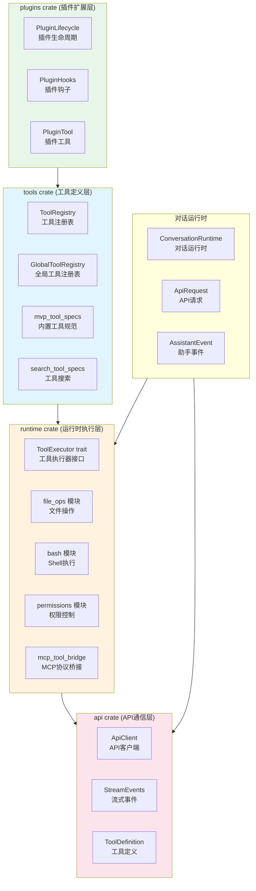
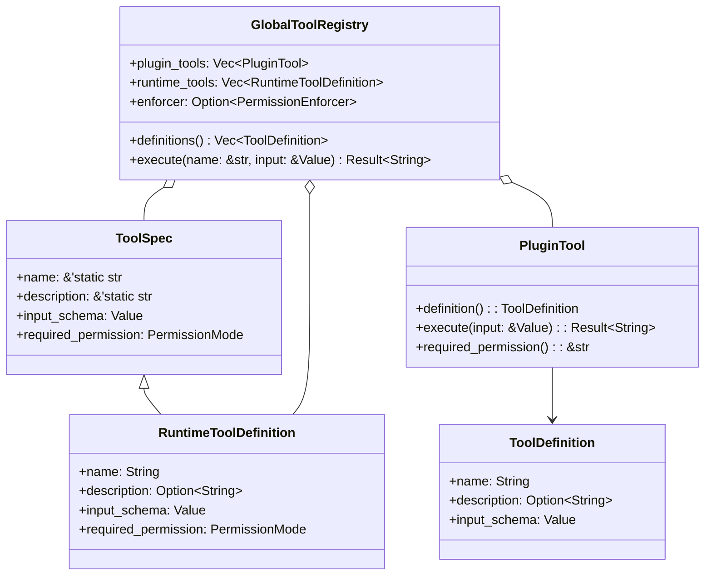
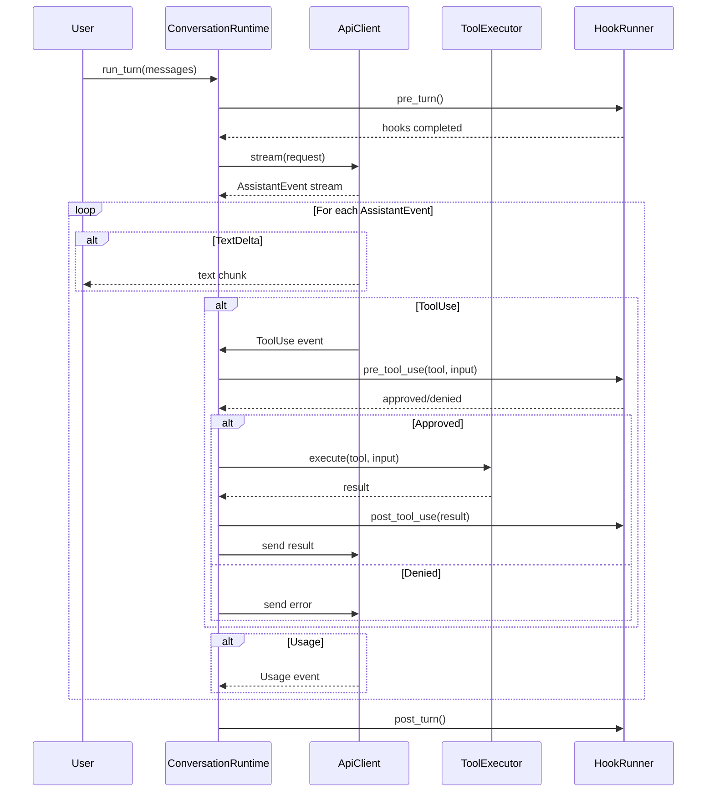
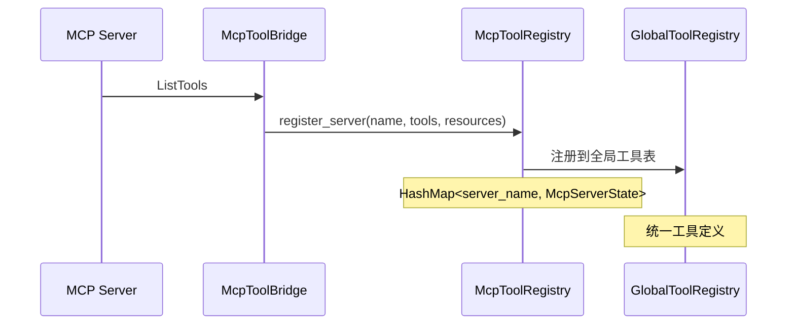
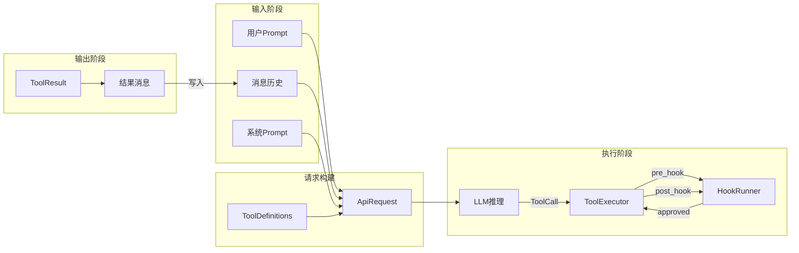
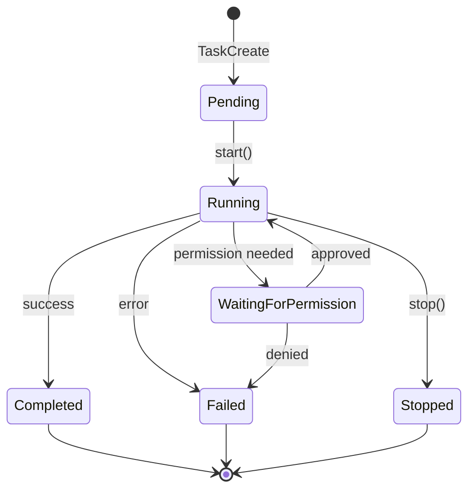
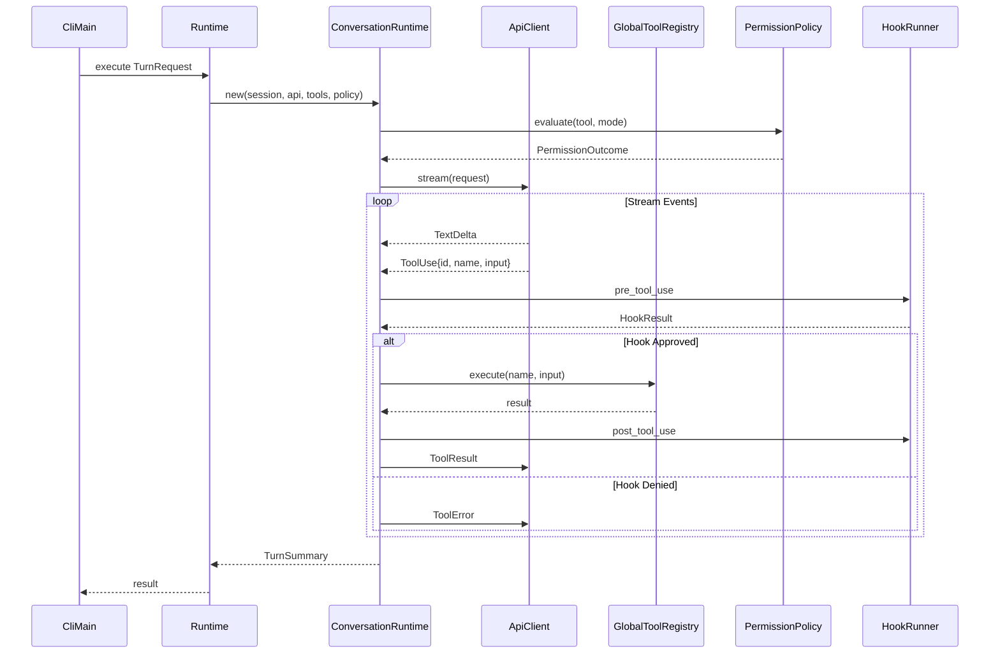
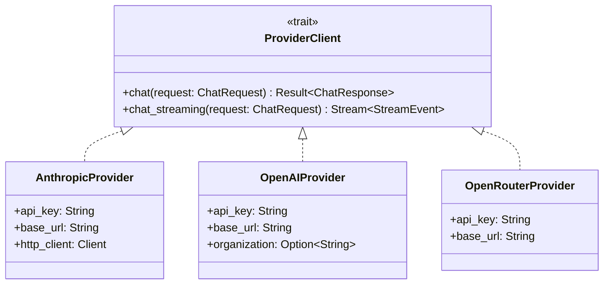
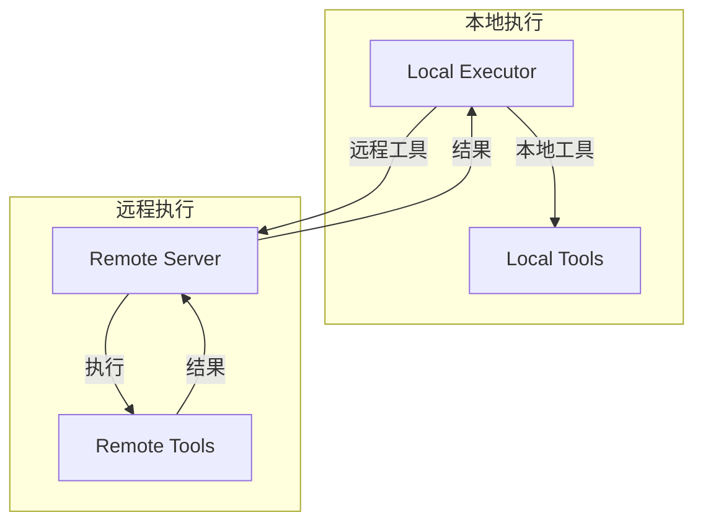

# Claw-Code 工具系统深度技术分析

> **分析目标**: `d:\Project\Hclaw\claw-code` 项目源码
>
> **分析版本**: 基于最新提交
>
> **文档状态**: 完成

---

## 目录

1. [系统概述与架构设计](#1-系统概述与架构设计)
2. [核心模块详细分析](#2-核心模块详细分析)
3. [数据流转机制](#3-数据流转机制)
4. [状态管理架构](#4-状态管理架构)
5. [组件交互关系](#5-组件交互关系)
6. [关键算法分析](#6-关键算法分析)
7. [技术实现优缺点](#7-技术实现优缺点)
8. [优化方向建议](#8-优化方向建议)

---

## 1. 系统概述与架构设计

### 1.1 系统定位

Claw-Code 的工具系统（Tools System）是其作为 AI 编程助手的能力核心，负责将大语言模型（LLM）的推理能力与实际代码操作能力连接起来。工具系统使得 LLM 能够执行文件读写、代码搜索、bash 命令执行等操作，从而完成复杂的软件工程任务。

### 1.2 整体架构图



### 1.3 Crate 依赖关系

```
┌─────────────────────────────────────────────────────────────────────────────┐
│                              tools crate                                    │
│  ┌─────────────────────────────────────────────────────────────────────┐    │
│  │ Core Components:                                                     │    │
│  │  - ToolRegistry: 工具注册表管理                                      │    │
│  │  - GlobalToolRegistry: 整合内置/插件/运行时工具                      │    │
│  │  - mvp_tool_specs(): 25+内置工具定义                                │    │
│  │  - lane_completion.rs: 泳道完成检测器                                │    │
│  │  - pdf_extract.rs: PDF文本提取                                      │    │
│  └─────────────────────────────────────────────────────────────────────┘    │
└─────────────────────────────────────────────────────────────────────────────┘
                                      │
                                      ▼ uses
┌─────────────────────────────────────────────────────────────────────────────┐
│                             runtime crate                                  │
│  ┌────────────────┐ ┌────────────────┐ ┌────────────────┐                  │
│  │   file_ops     │ │     bash       │ │  permissions   │                  │
│  │  - read_file   │ │ - execute_bash │ │ - PermissionMode│                 │
│  │  - write_file  │ │ - 沙箱执行     │ │ - PolicyEngine │                  │
│  │  - edit_file   │ │ - 超时控制     │ │ - Enforcer     │                  │
│  │  - glob_search │ │ - 后台任务     │ │                │                  │
│  │  - grep_search │ │                │ │                │                  │
│  └────────────────┘ └────────────────┘ └────────────────┘                  │
│  ┌────────────────┐ ┌────────────────┐ ┌────────────────┐                  │
│  │   conversation │ │ mcp_tool_bridge│ │  task_registry │                  │
│  │  - ToolExecutor│ │ - McpToolRegistry│ - TaskRegistry │                 │
│  │  - ToolError   │ │ - MCP服务器连接 │ │ - 后台任务管理 │                  │
│  │  - RuntimeError│ │                │ │                │                  │
│  └────────────────┘ └────────────────┘ └────────────────┘                  │
└─────────────────────────────────────────────────────────────────────────────┘
                                      │
                                      ▼ uses
┌─────────────────────────────────────────────────────────────────────────────┐
│                               api crate                                     │
│  ┌────────────────┐ ┌────────────────┐ ┌────────────────┐                  │
│  │    client      │ │   providers    │ │     sse       │                  │
│  │ - ApiClient    │ │ - Anthropic    │ │ - parse_sse   │                  │
│  │ - stream()     │ │ - OpenAI       │ │ - StreamEvents│                  │
│  │ - chat()       │ │ - OpenRouter   │ │               │                  │
│  └────────────────┘ └────────────────┘ └────────────────┘                  │
└─────────────────────────────────────────────────────────────────────────────┘
```

### 1.4 工具分类体系



---

## 2. 核心模块详细分析

### 2.1 tools crate - 工具注册与定义

#### 2.1.1 ToolRegistry 结构

**文件位置**: `rust/crates/tools/src/lib.rs:84-98`

```rust
#[derive(Debug, Clone, Default, PartialEq, Eq)]
pub struct ToolRegistry {
    entries: Vec<ToolManifestEntry>,
}

#[derive(Debug, Clone, PartialEq, Eq)]
pub struct ToolManifestEntry {
    pub name: String,
    pub source: ToolSource,
}

#[derive(Debug, Clone, Copy, PartialEq, Eq)]
pub enum ToolSource {
    Base,
    Conditional,
}
```

**功能说明**:
- `ToolRegistry` 是一个简单的工具清单管理器
- `ToolManifestEntry` 记录每个工具的名称和来源
- `ToolSource` 区分工具是内置（Base）还是条件性（Conditional）启用

#### 2.1.2 GlobalToolRegistry 结构

**文件位置**: `rust/crates/tools/src/lib.rs:108-113, 123-184`

```rust
#[derive(Debug, Clone)]
pub struct GlobalToolRegistry {
    plugin_tools: Vec<PluginTool>,
    runtime_tools: Vec<RuntimeToolDefinition>,
    enforcer: Option<PermissionEnforcer>,
}

#[derive(Debug, Clone, PartialEq)]
pub struct RuntimeToolDefinition {
    pub name: String,
    pub description: Option<String>,
    pub input_schema: Value,
    pub required_permission: PermissionMode,
}
```

**核心方法**:

| 方法 | 功能 | 时间复杂度 |
|------|------|------------|
| `with_plugin_tools()` | 添加插件工具，自动检测命名冲突 | O(n) |
| `with_runtime_tools()` | 添加运行时工具，验证无命名冲突 | O(n) |
| `definitions()` | 获取所有工具定义，支持过滤 | O(n) |
| `permission_specs()` | 获取工具权限规格 | O(n) |
| `execute()` | 执行指定工具 | O(1) 查找 + O(tool执行时间) |
| `normalize_allowed_tools()` | 规范化工具名称列表 | O(n log n) |

#### 2.1.3 MVP 内置工具规范

**文件位置**: `rust/crates/tools/src/lib.rs:390-1000+`

系统定义了 **25+ 种内置工具**，核心工具包括：

| 工具名称 | 描述 | 权限级别 | 输入模式 |
|---------|------|---------|---------|
| `bash` | 执行shell命令 | `DangerFullAccess` | `{command, timeout, sandbox_opts}` |
| `read_file` | 读取文件 | `ReadOnly` | `{path, offset, limit}` |
| `write_file` | 写入文件 | `WorkspaceWrite` | `{path, content}` |
| `edit_file` | 编辑文件 | `WorkspaceWrite` | `{path, old_string, new_string}` |
| `glob_search` | glob模式搜索 | `ReadOnly` | `{pattern, path}` |
| `grep_search` | 正则搜索 | `ReadOnly` | `{pattern, path, glob, ...}` |
| `WebFetch` | 抓取URL | `ReadOnly` | `{url, prompt}` |
| `WebSearch` | 网络搜索 | `ReadOnly` | `{query, allowed_domains}` |
| `TodoWrite` | 更新任务列表 | `WorkspaceWrite` | `{todos}` |
| `Agent` | 启动子Agent | `DangerFullAccess` | `{description, prompt, model}` |
| `TaskCreate` | 创建后台任务 | `DangerFullAccess` | `{prompt, description}` |
| `REPL` | 执行REPL代码 | `DangerFullAccess` | `{code, language, timeout_ms}` |

**权限级别层次结构**:
```
PermissionMode::ReadOnly < PermissionMode::WorkspaceWrite < PermissionMode::DangerFullAccess
         │                     │                        │
         ▼                     ▼                        ▼
     文件读取              文件读写                 完全访问
     glob/grep            edit/write              bash/Agent/Task
     WebFetch             TodoWrite               REPL/PowerShell
     WebSearch            NotebookEdit            Worker*
```

### 2.2 runtime crate - 执行引擎

#### 2.2.1 ToolExecutor Trait

**文件位置**: `rust/crates/runtime/src/conversation.rs:58-60`

```rust
pub trait ToolExecutor {
    fn execute(&mut self, tool_name: &str, input: &str) -> Result<String, ToolError>;
}
```

**设计意图**:
- 简洁的trait定义，解耦工具执行逻辑
- `tool_name`: 要执行的工具名称
- `input`: JSON字符串格式的输入参数
- 返回 `Result<String, ToolError>`: 执行结果或错误

#### 2.2.2 静态工具执行器

**文件位置**: `rust/crates/runtime/src/conversation.rs`

```rust
pub struct StaticToolExecutor {
    tools: GlobalToolRegistry,
}

impl ToolExecutor for StaticToolExecutor {
    fn execute(&mut self, tool_name: &str, input: &str) -> Result<String, ToolError> {
        let parsed: Value = serde_json::from_str(input)
            .map_err(|e| ToolError::new(format!("invalid JSON: {e}")))?;

        self.tools
            .execute(tool_name, &parsed)
            .map_err(|e| ToolError::new(e.to_string()))
    }
}
```

#### 2.2.3 ConversationRuntime 协调器

**文件位置**: `rust/crates/runtime/src/conversation.rs:126-139`

```rust
pub struct ConversationRuntime<C, T> {
    session: Session,
    api_client: C,
    tool_executor: T,
    permission_policy: PermissionPolicy,
    system_prompt: Vec<String>,
    max_iterations: usize,
    usage_tracker: UsageTracker,
    hook_runner: HookRunner,
    auto_compaction_input_tokens_threshold: u32,
    hook_abort_signal: HookAbortSignal,
    hook_progress_reporter: Option<Box<dyn HookProgressReporter>>,
    session_tracer: Option<SessionTracer>,
}
```

**执行流程**:



### 2.3 file_ops 模块 - 文件操作

**文件位置**: `rust/crates/runtime/src/file_ops.rs`

#### 2.3.1 核心数据结构

```rust
// 读取文件输出
pub struct ReadFileOutput {
    pub kind: String,           // "text"
    pub file: TextFilePayload,
}

pub struct TextFilePayload {
    pub file_path: String,
    pub content: String,
    pub num_lines: usize,
    pub start_line: usize,
    pub total_lines: usize,
}

// 写入文件输出
pub struct WriteFileOutput {
    pub kind: String,
    pub file_path: String,
    pub content: String,
    pub structured_patch: Vec<StructuredPatchHunk>,
    pub original_file: Option<String>,
    pub git_diff: Option<serde_json::Value>,
}

// 编辑文件输出
pub struct EditFileOutput {
    pub file_path: String,
    pub old_string: String,
    pub new_string: String,
    pub original_file: String,
    pub structured_patch: Vec<StructuredPatchHunk>,
    pub user_modified: bool,
    pub replace_all: bool,
    pub git_diff: Option<serde_json::Value>,
}

// Grep搜索输入
pub struct GrepSearchInput {
    pub pattern: String,
    pub path: Option<String>,
    pub glob: Option<String>,
    pub output_mode: Option<String>,
    pub before: Option<usize>,
    pub after: Option<usize>,
    pub case_insensitive: Option<bool>,
    pub file_type: Option<String>,
    pub head_limit: Option<usize>,
    pub multiline: Option<bool>,
    // ... 更多字段
}
```

#### 2.3.2 安全限制

**文件位置**: `rust/crates/runtime/src/file_ops.rs:12-16`

```rust
/// Maximum file size that can be read (10 MB).
const MAX_READ_SIZE: u64 = 10 * 1024 * 1024;

/// Maximum file size that can be written (10 MB).
const MAX_WRITE_SIZE: usize = 10 * 1024 * 1024;
```

**安全措施**:
1. **文件大小限制**: 读取和写入最大 10MB
2. **二进制检测**: `is_binary_file()` 函数检测 NUL 字节
3. **路径规范**: `normalize_path()` 处理相对路径
4. **Workspace边界验证**: `validate_workspace_boundary()` 防止路径穿越

#### 2.3.3 读取文件算法

**文件位置**: `rust/crates/runtime/src/file_ops.rs:175-200`

```rust
pub fn read_file(
    path: &str,
    offset: Option<usize>,
    limit: Option<usize>,
) -> io::Result<ReadFileOutput> {
    let absolute_path = normalize_path(path)?;

    // 1. 检查文件大小
    let metadata = fs::metadata(&absolute_path)?;
    if metadata.len() > MAX_READ_SIZE {
        return Err(io::Error::new(
            io::ErrorKind::InvalidData,
            format!("file is too large ({} bytes)", metadata.len()),
        ));
    }

    // 2. 检测二进制文件
    if is_binary_file(&absolute_path)? {
        return Err(io::Error::new(
            io::ErrorKind::InvalidData,
            "file appears to be binary",
        ));
    }

    // 3. 读取内容并返回
    let content = fs::read_to_string(&absolute_path)?;
    // ... 处理 offset/limit
}
```

**时间复杂度**: O(n)，其中 n 为文件大小

### 2.4 bash 模块 - Shell执行

**文件位置**: `rust/crates/runtime/src/bash.rs`

#### 2.4.1 输入输出结构

```rust
#[derive(Debug, Clone, Serialize, Deserialize, PartialEq, Eq)]
pub struct BashCommandInput {
    pub command: String,
    pub timeout: Option<u64>,
    pub description: Option<String>,
    #[serde(rename = "run_in_background")]
    pub run_in_background: Option<bool>,
    #[serde(rename = "dangerouslyDisableSandbox")]
    pub dangerously_disable_sandbox: Option<bool>,
    #[serde(rename = "namespaceRestrictions")]
    pub namespace_restrictions: Option<bool>,
    #[serde(rename = "isolateNetwork")]
    pub isolate_network: Option<bool>,
    #[serde(rename = "filesystemMode")]
    pub filesystem_mode: Option<FilesystemIsolationMode>,
    #[serde(rename = "allowedMounts")]
    pub allowed_mounts: Option<Vec<String>>,
}

#[derive(Debug, Clone, Serialize, Deserialize, PartialEq)]
pub struct BashCommandOutput {
    pub stdout: String,
    pub stderr: String,
    pub raw_output_path: Option<String>,
    pub interrupted: bool,
    pub is_image: Option<bool>,
    pub background_task_id: Option<String>,
    pub sandbox_status: Option<SandboxStatus>,
    // ... 更多字段
}
```

#### 2.4.2 执行流程

**文件位置**: `rust/crates/runtime/src/bash.rs:71-104`

```rust
pub fn execute_bash(input: BashCommandInput) -> io::Result<BashCommandOutput> {
    let cwd = env::current_dir()?;
    let sandbox_status = sandbox_status_for_input(&input, &cwd);

    // 后台任务处理
    if input.run_in_background.unwrap_or(false) {
        let mut child = prepare_command(/* ... */).spawn()?;
        return Ok(BashCommandOutput {
            background_task_id: Some(child.id().to_string()),
            // ...
        });
    }

    // 同步执行
    let runtime = Builder::new_current_thread().enable_all().build()?;
    runtime.block_on(execute_bash_async(input, sandbox_status, cwd))
}
```

### 2.5 permissions 模块 - 权限控制

**文件位置**: `rust/crates/runtime/src/permissions.rs`

#### 2.5.1 权限模式枚举

```rust
#[derive(Debug, Clone, Copy, PartialEq, Eq, PartialOrd, Ord)]
pub enum PermissionMode {
    ReadOnly,          // 只读访问
    WorkspaceWrite,    // 工作区写入
    DangerFullAccess,  // 完全访问（危险）
    Prompt,            // 需要提示
    Allow,             // 允许
}
```

**权限层次**: `ReadOnly < WorkspaceWrite < DangerFullAccess`

#### 2.5.2 权限策略引擎

```rust
pub struct PermissionPolicy {
    active_mode: PermissionMode,
    // ... 规则配置
}

impl PermissionPolicy {
    pub fn evaluate(
        &self,
        required: PermissionMode,
        context: &PermissionContext,
    ) -> PermissionOutcome {
        // 1. 检查hook覆盖
        if let Some(override_) = context.override_decision() {
            return match override_ {
                PermissionOverride::Allow => PermissionOutcome::Allow,
                PermissionOverride::Deny => {
                    PermissionOutcome::Deny { reason: context.override_reason().unwrap_or("hook denied").to_string() }
                }
                PermissionOverride::Ask => self.prompt_user(required),
            };
        }

        // 2. 比较权限级别
        if self.active_mode >= required {
            PermissionOutcome::Allow
        } else {
            self.prompt_user(required)
        }
    }
}
```

### 2.6 mcp_tool_bridge 模块 - MCP协议桥接

**文件位置**: `rust/crates/runtime/src/mcp_tool_bridge.rs`

#### 2.6.1 MCP工具注册表

```rust
#[derive(Debug, Clone, Default)]
pub struct McpToolRegistry {
    inner: Arc<Mutex<HashMap<String, McpServerState>>>,
    manager: Arc<OnceLock<Arc<Mutex<McpServerManager>>>>,
}

#[derive(Debug, Clone, Serialize, Deserialize)]
pub struct McpServerState {
    pub server_name: String,
    pub status: McpConnectionStatus,
    pub tools: Vec<McpToolInfo>,
    pub resources: Vec<McpResourceInfo>,
    pub server_info: Option<String>,
    pub error_message: Option<String>,
}

#[derive(Debug, Clone, Copy, PartialEq, Eq, Serialize, Deserialize)]
pub enum McpConnectionStatus {
    Disconnected,
    Connecting,
    Connected,
    AuthRequired,
    Error,
}
```

#### 2.6.2 工具注册流程



### 2.7 PDF 文本提取模块

**文件位置**: `rust/crates/tools/src/pdf_extract.rs`

#### 2.7.1 提取算法流程

```mermaid
flowchart TD
    A[开始: PDF文件字节流] --> B{查找 stream 标记}
    B -->|找到| C[跳过 EOL]
    B -->|未找到| Z[结束]
    C --> D{查找 endstream}
    D -->|找到| E[检查 FlateDecode]
    D -->|未找到| B
    E -->|是压缩| F[inflate解压]
    E -->|未压缩| G[直接使用原始数据]
    F --> H[提取 BT/ET 文本]
    G --> H
    H --> I[解析 Tj/TJ/' /  " 操作符]
    I --> J{还有更多stream?|    
    J -->|是| B
    J -->|否| K[返回提取文本]
```

#### 2.7.2 核心实现

**文件位置**: `rust/crates/tools/src/pdf_extract.rs:22-75`

```rust
pub(crate) fn extract_text_from_bytes(data: &[u8]) -> String {
    let mut all_text = String::new();
    let mut offset = 0;

    while offset < data.len() {
        // 1. 查找 stream 标记
        let Some(stream_start) = find_subsequence(&data[offset..], b"stream") else {
            break;
        };

        // 2. 跳过行尾
        let content_start = skip_stream_eol(data, abs_start + b"stream".len());

        // 3. 查找 endstream
        let Some(end_rel) = find_subsequence(&data[content_start..], b"endstream") else {
            break;
        };

        // 4. 检查 FlateDecode 压缩
        let is_flate = find_subsequence(dict_window, b"FlateDecode").is_some();

        // 5. 解压（如需要）
        let stream_bytes: &[u8] = if is_flate {
            if let Ok(buf) = inflate(raw)? { &buf } else { continue; }
        } else { raw };

        // 6. 提取 BT/ET 文本
        let text = extract_bt_et_text(stream_bytes);
        all_text.push_str(&text);

        offset = content_end;
    }
    all_text
}
```

**时间复杂度**: O(n * m)，其中 n 为 PDF 大小，m 为平均 stream 大小

### 2.8 Lane Completion 检测器

**文件位置**: `rust/crates/tools/src/lane_completion.rs`

#### 2.8.1 完成条件判断

```rust
pub(crate) fn detect_lane_completion(
    output: &AgentOutput,
    test_green: bool,
    has_pushed: bool,
) -> Option<LaneContext> {
    // 1. 必须无错误
    if output.error.is_some() {
        return None;
    }

    // 2. 必须是完成状态
    if !output.status.eq_ignore_ascii_case("completed")
        && !output.status.eq_ignore_ascii_case("finished")
    {
        return None;
    }

    // 3. 必须无当前阻塞
    if output.current_blocker.is_some() {
        return None;
    }

    // 4. 测试必须通过
    if !test_green {
        return None;
    }

    // 5. 代码必须已推送
    if !has_pushed {
        return None;
    }

    // 所有条件满足
    Some(LaneContext {
        lane_id: output.agent_id.clone(),
        green_level: 3,
        blocker: LaneBlocker::None,
        review_status: ReviewStatus::Approved,
        completed: true,
        // ...
    })
}
```

---

## 3. 数据流转机制

### 3.1 工具调用数据流



### 3.2 工具执行数据格式

#### 3.2.1 工具调用请求（LLM → Executor）

```json
{
  "id": "toolu_01A2B3C4D5",
  "name": "read_file",
  "input": {
    "path": "/workspace/src/main.rs",
    "offset": 0,
    "limit": 100
  }
}
```

#### 3.2.2 工具执行结果（Executor → LLM）

```json
{
  "tool_use_id": "toolu_01A2B3C4D5",
  "content": [
    {
      "type": "text",
      "text": "File: src/main.rs\nLines: 100\nContent:\npub fn main() {\n    println!(\"Hello, world!\");\n}"
    }
  ]
}
```

#### 3.2.3 工具定义格式（用于 API 请求）

```json
{
  "name": "read_file",
  "description": "Read a text file from the workspace.",
  "input_schema": {
    "type": "object",
    "properties": {
      "path": { "type": "string" },
      "offset": { "type": "integer", "minimum": 0 },
      "limit": { "type": "integer", "minimum": 1 }
    },
    "required": ["path"]
  }
}
```

### 3.3 API 流式事件

**文件位置**: `rust/crates/api/src/types.rs`

```rust
#[derive(Debug, Clone, PartialEq, Eq)]
pub enum StreamEvent {
    TextDelta(String),
    ToolUse {
        id: String,
        name: String,
        input: String,
    },
    Usage(TokenUsage),
    PromptCache(PromptCacheEvent),
    MessageStop,
}
```

---

## 4. 状态管理架构

### 4.1 全局注册表单例模式

**文件位置**: `rust/crates/tools/src/lib.rs:34-69`

```rust
fn global_lsp_registry() -> &'static LspRegistry {
    static REGISTRY: OnceLock<LspRegistry> = OnceLock::new();
    REGISTRY.get_or_init(LspRegistry::new)
}

fn global_mcp_registry() -> &'static McpToolRegistry {
    static REGISTRY: OnceLock<McpToolRegistry> = OnceLock::new();
    REGISTRY.get_or_init(McpToolRegistry::new)
}

fn global_team_registry() -> &'static TeamRegistry {
    static REGISTRY: OnceLock<TeamRegistry> = OnceLock::new();
    REGISTRY.get_or_init(TeamRegistry::new)
}
```

**设计模式**: `OnceLock` 单例模式
- 线程安全
- 延迟初始化
- 全局访问点

### 4.2 会话状态管理

**文件位置**: `rust/crates/runtime/src/session.rs`

```rust
pub struct Session {
    id: String,
    messages: Vec<ConversationMessage>,
    current_agent_id: Option<String>,
    task_history: Vec<TaskPacket>,
    // ...
}

impl Session {
    pub fn add_message(&mut self, role: MessageRole, content: String) {
        self.messages.push(ConversationMessage {
            role,
            content,
            // ...
        });
    }
}
```

### 4.3 MCP 连接状态

```rust
#[derive(Debug, Clone, Copy, PartialEq, Eq, Serialize, Deserialize)]
pub enum McpConnectionStatus {
    Disconnected,   // 未连接
    Connecting,     // 连接中
    Connected,      // 已连接
    AuthRequired,   // 需要认证
    Error,          // 连接错误
}
```

### 4.4 任务状态机



---

## 5. 组件交互关系

### 5.1 核心交互时序图



### 5.2 插件钩子系统

**文件位置**: `rust/crates/plugins/src/hooks.rs`

```rust
#[derive(Debug, Clone, Default, PartialEq, Eq, Serialize, Deserialize)]
pub struct PluginHooks {
    #[serde(rename = "PreToolUse", default)]
    pub pre_tool_use: Vec<String>,
    #[serde(rename = "PostToolUse", default)]
    pub post_tool_use: Vec<String>,
    #[serde(rename = "PostToolUseFailure", default)]
    pub post_tool_use_failure: Vec<String>,
}

pub enum HookEvent {
    PreToolUse { tool: String, input: Value },
    PostToolUse { tool: String, result: Value },
    PostToolUseFailure { tool: String, error: String },
}
```

### 5.3 API Provider 抽象



---

## 6. 关键算法分析

### 6.1 工具搜索算法

**文件位置**: `rust/crates/tools/src/lib.rs`

```rust
fn search_tool_specs(query: &str, max_results: usize) -> Vec<ToolSearchMatch> {
    let query_lower = query.to_lowercase();
    let query_words: Vec<&str> = query_lower.split_whitespace().collect();

    let mut scored: Vec<(usize, ToolSearchMatch)> = mvp_tool_specs()
        .iter()
        .filter_map(|spec| {
            let name_lower = spec.name.to_lowercase();
            let desc_lower = spec.description.to_lowercase();

            // 精确匹配
            if name_lower == query_lower {
                Some((100, ToolSearchMatch { score: 100, spec }))
            }
            // 名称前缀匹配
            else if name_lower.starts_with(&query_lower) {
                Some((90, ToolSearchMatch { score: 90, spec }))
            }
            // 描述包含
            else if desc_lower.contains(&query_lower) {
                Some((50, ToolSearchMatch { score: 50, spec }))
            }
            // 关键词匹配
            else if query_words.iter().all(|w| desc_lower.contains(w)) {
                Some((30, ToolSearchMatch { score: 30, spec }))
            }
            else {
                None
            }
        })
        .collect();

    scored.sort_by_key(|(score, _)| Reverse(*score));
    scored.into_iter().take(max_results).map(|(_, m)| m).collect()
}
```

**时间复杂度**: O(n * m)，其中 n 为工具数量，m 为平均描述长度

### 6.2 权限评估算法

**文件位置**: `rust/crates/runtime/src/permission_enforcer.rs`

```rust
impl PermissionEnforcer {
    pub fn evaluate(
        &self,
        tool: &str,
        required: PermissionMode,
        context: &PermissionContext,
    ) -> EnforcementResult {
        // 1. 检查规则覆盖
        if let Some(rule) = self.find_matching_rule(tool) {
            match rule.action {
                RuleAction::Allow => return EnforcementResult::Allowed,
                RuleAction::Deny => return EnforcementResult::Denied("rule denied".into()),
                RuleAction::Ask => {}
            }
        }

        // 2. 检查hook覆盖
        if let Some(override_) = context.override_decision {
            return match override_ {
                PermissionOverride::Allow => EnforcementResult::Allowed,
                PermissionOverride::Deny => {
                    EnforcementResult::Denied(context.override_reason.clone().unwrap_or_default())
                }
                PermissionOverride::Ask => EnforcementResult::NeedsPrompt,
            };
        }

        // 3. 比较权限级别
        if self.current_mode >= required {
            EnforcementResult::Allowed
        } else {
            EnforcementResult::NeedsPrompt
        }
    }
}
```

### 6.3 文件路径规范化

**文件位置**: `rust/crates/runtime/src/file_ops.rs`

```rust
fn normalize_path(path: &str) -> io::Result<PathBuf> {
    let p = Path::new(path);

    // 处理相对路径
    if p.is_relative() {
        let cwd = env::current_dir()?;
        return Ok(cwd.join(p).canonicalize()?);
    }

    // 处理绝对路径
    p.canonicalize()
}
```

### 6.4 工具名称规范化

**文件位置**: `rust/crates/tools/src/lib.rs:377-379`

```rust
fn normalize_tool_name(value: &str) -> String {
    value.trim().replace('-', "_").to_ascii_lowercase()
}
```

**示例**:
- `read-file` → `read_file`
- `Read-File` → `read_file`
- ` read_file ` → `read_file`

---

## 7. 技术实现优缺点

### 7.1 优点

#### 7.1.1 模块化设计

| 方面 | 说明 |
|------|------|
| **Crate 分离** | `tools`、`runtime`、`plugins`、`api` 职责清晰 |
| **Trait 抽象** | `ToolExecutor`、`ApiClient` 等 trait 便于扩展 |
| **单例模式** | `OnceLock` 全局注册表简化访问 |

#### 7.1.2 安全性

1. **权限层级控制**: `PermissionMode` 枚举实现细粒度权限控制
2. **沙箱执行**: Bash 命令支持 Linux 命名空间隔离
3. **文件大小限制**: 10MB 读写限制防止资源耗尽
4. **二进制检测**: 拒绝读取二进制文件
5. **Workspace 边界**: 防止路径穿越攻击

#### 7.1.3 可扩展性

1. **插件系统**: 支持外部插件扩展工具集
2. **MCP 集成**: 通过 MCP 协议连接外部工具服务器
3. **运行时工具**: 动态注册新工具
4. **Hook 系统**: 预置/后置钩子支持自定义逻辑

#### 7.1.4 类型安全

```rust
// 使用 serde_json::Value 提供运行时类型检查
pub fn execute(&self, name: &str, input: &Value) -> Result<String, String> {
    // input 会在执行时验证
}

// 静态类型定义
pub struct BashCommandInput {
    pub command: String,
    pub timeout: Option<u64>,
    // ...
}
```

### 7.2 缺点与不足

#### 7.2.1 错误处理

| 问题 | 描述 |
|------|------|
| 错误类型单一 | `ToolError` 仅包含 `message: String`，缺少错误分类 |
| 无错误码 | 缺少结构化的错误码体系 |
| 错误链丢失 | 底层错误信息丢失，只保留字符串 |

```rust
// 当前实现
pub struct ToolError {
    message: String,
}

// 更好的设计
pub enum ToolError {
    NotFound(String),
    InvalidInput { tool: String, reason: String },
    PermissionDenied { tool: String, required: PermissionMode },
    ExecutionFailed { tool: String, cause: io::Error },
    Timeout { tool: String, duration: Duration },
}
```

#### 7.2.2 性能考量

| 问题 | 描述 | 影响 |
|------|------|------|
| 同步阻塞 | `execute_bash` 使用 `block_on` | 高延迟操作可能阻塞 |
| 无连接池 | API Client 每次创建新连接 | HTTP 开销大 |
| 重复解析 | JSON 输入反复解析 | CPU 浪费 |

#### 7.2.3 测试覆盖

```rust
// 当前测试覆盖率（基于文件分析）
- pdf_extract.rs: 11 个单元测试 ✓
- lane_completion.rs: 6 个单元测试 ✓
- conversation.rs: 部分集成测试
- file_ops.rs: 缺少独立测试文件
```

#### 7.2.4 文档缺失

- 缺少 API 文档注释
- 工具输入/输出格式无规范文档
- 配置项无说明

---

## 8. 优化方向建议

### 8.1 短期优化

#### 8.1.1 错误处理增强

```rust
// 建议: 使用 thiserror 派生错误枚举
#[derive(Debug, Error)]
pub enum ToolError {
    #[error("tool not found: {0}")]
    NotFound(String),

    #[error("invalid input for {tool}: {reason}")]
    InvalidInput { tool: String, reason: String },

    #[error("permission denied: {tool} requires {required}")]
    PermissionDenied { tool: String, required: PermissionMode },

    #[error("execution failed: {tool} - {cause}")]
    ExecutionFailed { tool: String, #[from] cause: io::Error },

    #[error("timeout: {tool} exceeded {timeout:?}")]
    Timeout { tool: String, timeout: Duration },
}
```

#### 8.1.2 连接池复用

```rust
// 建议: 在 ApiClient 中实现连接池
pub struct ApiClient {
    http_client: reqwest::Client,  // 持久化复用
    base_url: String,
    // ...
}

impl ApiClient {
    pub fn new(config: &ApiConfig) -> Self {
        Self {
            http_client: reqwest::Client::builder()
                .pool_max_idle_per_host(10)
                .build()
                .unwrap(),
            // ...
        }
    }
}
```

### 8.2 中期优化

#### 8.2.1 工具执行并行化

```rust
// 当前: 串行执行
for tool_call in tool_calls {
    let result = executor.execute(tool_call).await?;
}

// 建议: 支持工具并行执行
pub async fn execute_parallel(
    &self,
    tool_calls: Vec<ToolCall>,
    max_concurrent: usize,
) -> Vec<Result<String, ToolError>> {
    let semaphore = Arc::new(Semaphore::new(max_concurrent));
    let futures = tool_calls.into_iter().map(|call| {
        let permit = semaphore.clone().acquire().await;
        async move {
            let result = self.execute(call.name, &call.input).await;
            drop(permit);
            result
        }
    });
    futures::future::join_all(futures).await
}
```

#### 8.2.2 工具缓存机制

```rust
// 建议: 实现工具结果缓存
pub struct ToolCache {
    cache: Arc<TimedCache<String, CachedResult>>,
    ttl: Duration,
}

impl ToolCache {
    pub fn cache_key(tool: &str, input: &Value) -> String {
        format!("{}:{}", tool, serde_json::to_string(input).unwrap())
    }

    pub fn get(&self, tool: &str, input: &Value) -> Option<String> {
        self.cache.get(&Self::cache_key(tool, input))
    }

    pub fn insert(&self, tool: &str, input: &Value, result: String) {
        let key = Self::cache_key(tool, input);
        self.cache.insert(key, CachedResult { result, timestamp: Instant::now() });
    }
}
```

### 8.3 长期优化

#### 8.3.1 工具版本管理

```rust
// 建议: 支持工具版本
pub struct ToolVersion {
    pub version: semver::Version,
    pub input_schema: Value,
    pub output_schema: Value,
    pub deprecation_warning: Option<String>,
}

pub struct VersionedToolRegistry {
    tools: HashMap<String, Vec<ToolVersion>>,
}

impl VersionedToolRegistry {
    pub fn register(&mut self, name: &str, version: ToolVersion) {
        self.tools.entry(name.to_string())
            .or_default()
            .push(version);
    }

    pub fn get(&self, name: &str, version: &str) -> Option<&ToolVersion> {
        self.tools.get(name)?
            .iter()
            .find(|v| v.version.to_string() == version)
    }
}
```

#### 8.3.2 分布式工具执行



#### 8.3.3 工具调用追踪

```rust
// 建议: 完整的分布式追踪
pub struct ToolSpan {
    pub trace_id: u128,
    pub span_id: u64,
    pub tool_name: String,
    pub input_hash: String,
    pub start_time: Instant,
    pub end_time: Option<Instant>,
    pub result: Option<String>,
    pub error: Option<String>,
    pub sub_spans: Vec<ToolSpan>,
}
```

---

## 附录

### A. 工具清单

| 工具名 | 权限 | 来源 | 描述 |
|--------|------|------|------|
| `bash` | DangerFullAccess | 内置 | Shell命令执行 |
| `read_file` | ReadOnly | 内置 | 文件读取 |
| `write_file` | WorkspaceWrite | 内置 | 文件写入 |
| `edit_file` | WorkspaceWrite | 内置 | 文件编辑 |
| `glob_search` | ReadOnly | 内置 | Glob搜索 |
| `grep_search` | ReadOnly | 内置 | Grep搜索 |
| `WebFetch` | ReadOnly | 内置 | URL抓取 |
| `WebSearch` | ReadOnly | 内置 | 网络搜索 |
| `TodoWrite` | WorkspaceWrite | 内置 | 任务列表 |
| `Agent` | DangerFullAccess | 内置 | 子Agent |
| `TaskCreate` | DangerFullAccess | 内置 | 后台任务 |
| `REPL` | DangerFullAccess | 内置 | REPL执行 |
| `PowerShell` | DangerFullAccess | 内置 | PowerShell |
| `*_mcp_*` | 可变 | MCP | MCP服务器工具 |
| `*_plugin_*` | 可变 | 插件 | 插件提供工具 |

### B. 文件索引

| 文件路径 | 主要内容 |
|----------|----------|
| `rust/crates/tools/src/lib.rs` | 工具注册表、全局工具注册表、内置工具规范 |
| `rust/crates/tools/src/lane_completion.rs` | 泳道完成检测器 |
| `rust/crates/tools/src/pdf_extract.rs` | PDF文本提取 |
| `rust/crates/runtime/src/conversation.rs` | 对话运行时、ToolExecutor trait |
| `rust/crates/runtime/src/file_ops.rs` | 文件操作工具实现 |
| `rust/crates/runtime/src/bash.rs` | Bash命令执行 |
| `rust/crates/runtime/src/permissions.rs` | 权限模式定义 |
| `rust/crates/runtime/src/mcp_tool_bridge.rs` | MCP工具桥接 |
| `rust/crates/runtime/src/session.rs` | 会话管理 |
| `rust/crates/plugins/src/lib.rs` | 插件生命周期 |
| `rust/crates/plugins/src/hooks.rs` | 插件钩子 |
| `rust/crates/api/src/client.rs` | API客户端 |
| `rust/crates/api/src/providers/*.rs` | 各Provider实现 |

---

*文档生成时间: 2026-05-06*
*分析工具: Claude Code*
*项目仓库: d:\Project\Hclaw\claw-code*
