# Codex-Code 工具系统深度技术分析

> **分析目标**: `d:\Project\Hclaw\codex\codex-rs` 项目源码
>
> **分析版本**: 基于最新提交
>
> **文档状态**: 完成

---

## 目录

1. [系统概述与架构设计](#1-系统概述与架构设计)
2. [核心模块详细分析](#2-核心模块详细分析)
3. [数据流转机制](#3-数据流转机制)
4. [状态管理架构](#4-状态管理架构)
5. [组件交互关系](#5-组件交互关系)
6. [关键算法分析](#6-关键算法分析)
7. [技术实现优缺点](#7-技术实现优缺点)
8. [优化方向建议](#8-优化方向建议)

---

## 1. 系统概述与架构设计

### 1.1 系统定位

Codex 的工具系统是构建在 **protocol** 协议层之上的高级抽象层，提供了统一的工具注册、发现、执行、沙箱化和权限管理能力。与 Claw-Code 不同，Codex 采用更模块化的设计，将工具定义、执行、权限、钩子等关注点分离到独立的 crate 中。

### 1.2 整体架构图

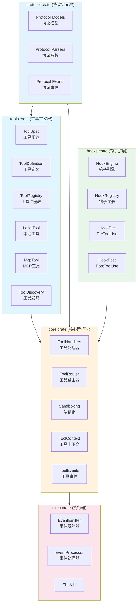

### 1.3 Crate 依赖关系

```
┌─────────────────────────────────────────────────────────────────────────────┐
│                              protocol crate                                 │
│  ┌─────────────────────────────────────────────────────────────────────┐   │
│  │ 定义协议数据类型、事件、解析器：                                       │   │
│  │  - Protocol models (ToolSpec, ToolDefinition)                       │   │
│  │  - Protocol events (ExecCommandBegin/End)                           │   │
│  │  - Protocol parsers (Command, Patch)                                │   │
│  └─────────────────────────────────────────────────────────────────────┘   │
└─────────────────────────────────────────────────────────────────────────────┘
                                      │
              ┌───────────────────────┴───────────────────────┐
              ▼                                               ▼
┌─────────────────────────────────────┐   ┌─────────────────────────────────────┐
│           tools crate               │   │          core crate                 │
│  ┌───────────────────────────────┐   │   │  ┌───────────────────────────────┐  │
│  │ 工具定义层                     │   │   │  │ 工具运行时                     │  │
│  │  - ToolSpec: 工具规范          │   │   │  │  - ToolHandlers: 处理器        │  │
│  │  - ToolDefinition: 定义        │   │   │  │  - ToolRouter: 路由            │  │
│  │  - ToolRegistry: 注册表        │   │   │  │  - Sandboxing: 沙箱            │  │
│  │  - LocalTool: 本地工具实现    │   │   │  │  - ToolContext: 上下文          │  │
│  │  - McpTool: MCP工具          │   │   │  │  - FunctionTool: 函数工具      │  │
│  │  - ToolDiscovery: 工具发现    │   │   │  │  - Approvals: 审批              │  │
│  │  - ResponsesApi: API          │   │   │  │                                │  │
│  └───────────────────────────────┘   │   │  └───────────────────────────────┘  │
└─────────────────────────────────────┘   └─────────────────────────────────────┘
              │                                               │
              ▼                                               ▼
┌─────────────────────────────────────┐   ┌─────────────────────────────────────┐
│          hooks crate                 │   │           exec crate                │
│  ┌───────────────────────────────┐   │   │  ┌───────────────────────────────┐  │
│  │ 钩子系统                        │   │   │  │ 执行器                         │  │
│  │  - HookEngine: 钩子引擎         │   │   │  │  - EventEmitter: 事件发射      │  │
│  │  - HookRegistry: 钩子注册       │   │   │  │  - EventProcessor: 事件处理    │  │
│  │  - HookList: 钩子列表          │   │   │  │  - CLI: 命令行入口             │  │
│  │  - ConfigRules: 规则配置        │   │   │  │  - EventProcessorWithHuman    │  │
│  │                                │   │   │  │  - EventProcessorWithJsonl   │  │
│  └───────────────────────────────┘   │   │  └───────────────────────────────┘  │
└─────────────────────────────────────┘   └─────────────────────────────────────┘
```

### 1.4 工具类型层次

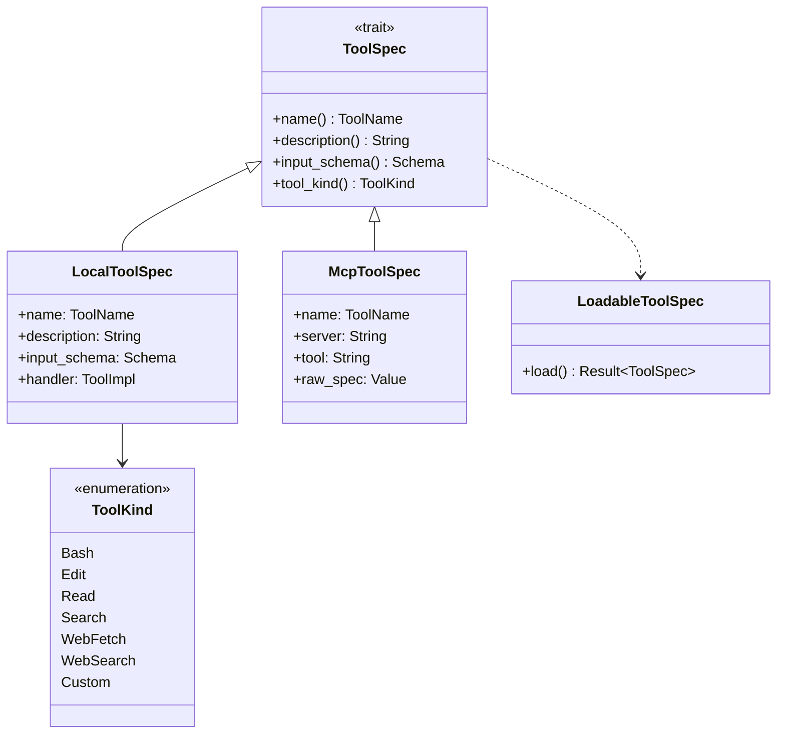

---

## 2. 核心模块详细分析

### 2.1 tools crate - 工具定义层

#### 2.1.1 工具规范Trait

**文件位置**: `codex-rs/tools/src/tool_spec.rs`

```rust
pub trait ToolSpec: Send + Sync {
    fn name(&self) -> ToolName;
    fn description(&self) -> String;
    fn input_schema(&self) -> Schema;
    fn tool_kind(&self) -> ToolKind;
    fn required_permissions(&self) -> Vec<Permission>;
    fn is_internal(&self) -> bool { false }
}
```

**设计意图**:
- `ToolSpec` 是所有工具的抽象接口
- `Send + Sync`: 表明工具可以在多线程环境执行
- 统一的元数据访问接口
- 权限和内部工具标记支持

#### 2.1.2 工具定义结构

**文件位置**: `codex-rs/tools/src/tool_definition.rs`

```rust
#[derive(Debug, Clone, PartialEq, Eq, Hash)]
pub struct ToolDefinition {
    pub name: ToolName,
    pub description: Option<String>,
    pub input_schema: Schema,
    pub output_schema: Option<Schema>,
    pub annotation: Option<ToolAnnotation>,
}

#[derive(Debug, Clone, PartialEq, Eq, Hash)]
pub struct ToolAnnotation {
    pub read_only_hint: Option<bool>,
    pub destructive_hint: Option<bool>,
    pub idempotent_hint: Option<bool>,
    pub open_world_hint: Option<bool>,
}
```

**关键字段**:

| 字段 | 类型 | 说明 |
|------|------|------|
| `name` | `ToolName` | 工具唯一标识符 |
| `description` | `Option<String>` | 工具描述 |
| `input_schema` | `Schema` | JSON Schema 格式的输入规范 |
| `output_schema` | `Option<Schema>` | JSON Schema 格式的输出规范 |
| `annotation` | `Option<ToolAnnotation>` | 工具特性注解 |

#### 2.1.3 工具注册表计划

**文件位置**: `codex-rs/tools/src/tool_registry_plan.rs`

```rust
pub struct ToolRegistryPlan {
    pub(super) tool_definitions: Vec<ToolDefinition>,
    pub(super) auths: Vec<ToolAuth>,
    pub(super) tool_implementations: ToolImplementations,
    pub(super) hooks: HookConfig,
    pub(super) hook_tool_names: Vec<ToolName>,
}

pub(super) enum ToolImplementations {
    Unimplemented,
    Builtin(Vec<ToolBuiltin>),
    Custom(Vec<CustomTool>),
}

pub(super) enum ToolBuiltin {
    FileOps(FileOpsTool),
    Search(SearchTool),
    Shell(ShellTool),
    Web(WebTool),
}
```

**注册流程**:

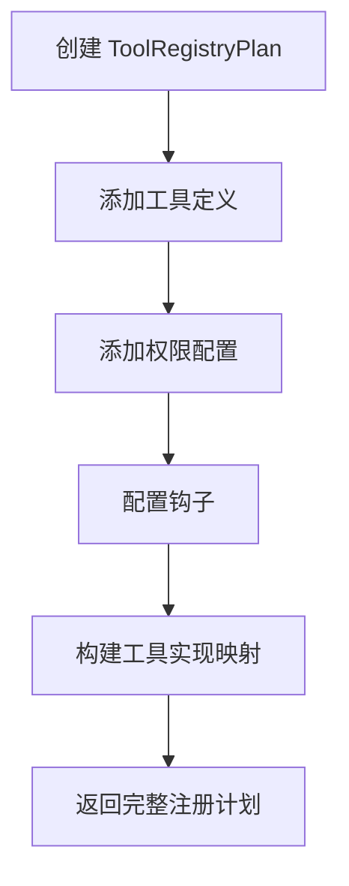

#### 2.1.4 工具发现机制

**文件位置**: `codex-rs/tools/src/tool_discovery.rs`

```rust
pub struct ToolDiscovery {
    tool_specs: Vec<LoadableToolSpec>,
    builtin_resolver: BuiltinToolResolver,
    custom_resolver: CustomToolResolver,
}

impl ToolDiscovery {
    pub fn from_config(
        config: &ToolsConfig,
        plugin_store: Option<&PluginStore>,
        mcp_registry: Option<&McpToolRegistry>,
    ) -> Result<Self, ToolDiscoveryError> {
        // 1. 发现内置工具
        let builtin = Self::discover_builtin_tools(config)?;

        // 2. 发现 MCP 工具
        let mcp_tools = Self::discover_mcp_tools(mcp_registry)?;

        // 3. 发现自定义工具
        let custom = Self::discover_custom_tools(config)?;

        Ok(Self { tool_specs, builtin_resolver, custom_resolver })
    }
}
```

**发现策略**:

| 策略 | 来源 | 优先级 |
|------|------|--------|
| 内置工具 | `builtin_resolver` | 1 |
| MCP 工具 | `mcp_registry` | 2 |
| 自定义工具 | `custom_resolver` | 3 |

### 2.2 core crate - 工具运行时

#### 2.2.1 工具处理器 Trait

**文件位置**: `codex-rs/core/src/tools/mod.rs`

```rust
pub trait ToolHandler: Send + Sync {
    fn name(&self) -> ToolName;
    fn tool_kind(&self) -> ToolKind;

    async fn handle(
        &self,
        ctx: ToolInvocation,
        services: &SessionServices,
    ) -> Result<ToolOutcome, ToolError>;

    fn preview_operation(&self, args: &str) -> Option<String> { None }
    fn human_readable_name(&self) -> String;
}
```

**核心方法分析**:

| 方法 | 返回类型 | 功能 |
|------|----------|------|
| `name()` | `ToolName` | 工具名称 |
| `tool_kind()` | `ToolKind` | 工具类别 |
| `handle()` | `Result<ToolOutcome, ToolError>` | 异步执行工具 |
| `preview_operation()` | `Option<String>` | 操作预览 |

#### 2.2.2 工具路由器

**文件位置**: `codex-rs/core/src/tools/router.rs`

```rust
pub struct ToolRouter {
    handlers: HashMap<ToolName, Arc<dyn ToolHandler>>,
    by_kind: HashMap<ToolKind, Vec<Arc<dyn ToolHandler>>>,
}

impl ToolRouter {
    pub fn route(
        &self,
        tool_name: &ToolName,
    ) -> Result<Arc<dyn ToolHandler>, ToolRouterError> {
        self.handlers
            .get(tool_name)
            .cloned()
            .ok_or_else(|| ToolRouterError::NotFound(tool_name.clone()))
    }

    pub fn route_by_kind(
        &self,
        kind: ToolKind,
    ) -> Result<Vec<Arc<dyn ToolHandler>>, ToolRouterError> {
        self.by_kind
            .get(&kind)
            .cloned()
            .ok_or_else(|| ToolRouterError::KindNotFound(kind))
    }
}
```

**路由查找算法**:

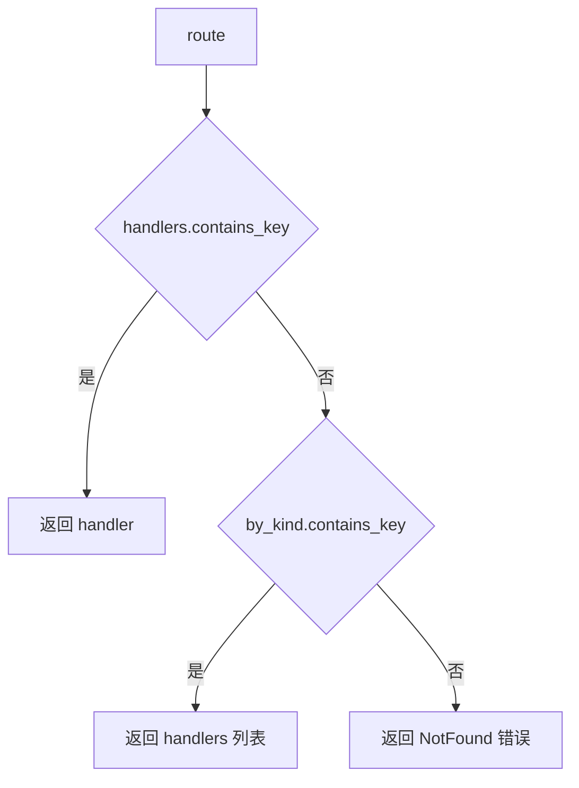

**时间复杂度**: O(1) 平均情况，最坏 O(n) 当发生哈希冲突

#### 2.2.3 工具上下文

**文件位置**: `codex-rs/core/src/tools/context.rs`

```rust
#[derive(Clone)]
pub struct ToolInvocation {
    pub session: Arc<Session>,
    pub turn: Arc<TurnContext>,
    pub cancellation_token: CancellationToken,
    pub tracker: SharedTurnDiffTracker,
    pub call_id: String,
    pub tool_name: ToolName,
    pub source: ToolCallSource,
    pub payload: ToolPayload,
}

#[derive(Clone, Debug)]
pub enum ToolPayload {
    Function { arguments: String },
    ToolSearch { arguments: SearchToolCallParams },
    Custom { input: String },
    LocalShell { params: ShellToolCallParams },
    Mcp { server: String, tool: String, raw_arguments: String },
}
```

**工具调用源**:

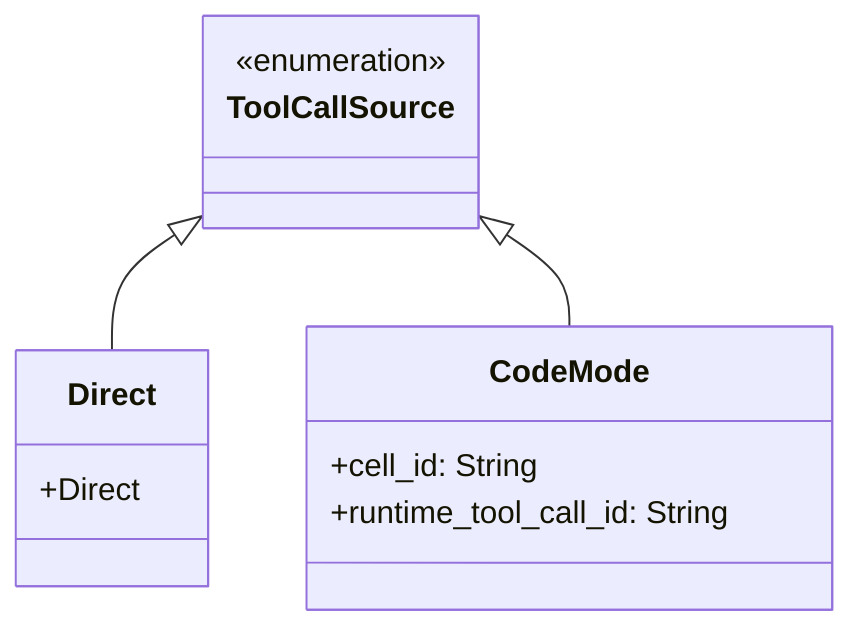

#### 2.2.4 沙箱化模块

**文件位置**: `codex-rs/core/src/tools/sandboxing.rs`

```rust
pub(crate) struct ApprovalStore {
    map: HashMap<String, ReviewDecision>,
}

impl ApprovalStore {
    pub fn get<K>(&self, key: &K) -> Option<ReviewDecision>
    where K: Serialize { /* ... */ }

    pub fn put<K>(&mut self, key: K, value: ReviewDecision)
    where K: Serialize { /* ... */ }
}

pub(crate) async fn with_cached_approval<K, F, Fut>(
    services: &SessionServices,
    tool_name: &str,
    keys: Vec<K>,
    fetch: F,
) -> ReviewDecision
where
    K: Serialize,
    F: FnOnce() -> Fut,
    Fut: Future<Output = ReviewDecision>,
{
    // 1. 检查缓存
    let already_approved = {
        let store = services.tool_approvals.lock().await;
        keys.iter().all(|key| matches!(store.get(key), Some(ReviewDecision::ApprovedForSession)))
    };

    if already_approved {
        return ReviewDecision::ApprovedForSession;
    }

    // 2. 获取用户决策
    let decision = fetch().await;

    // 3. 缓存决策
    if matches!(decision, ReviewDecision::ApprovedForSession) {
        let mut store = services.tool_approvals.lock().await;
        for key in keys {
            store.put(key, ReviewDecision::ApprovedForSession);
        }
    }

    decision
}
```

**审批缓存算法**:

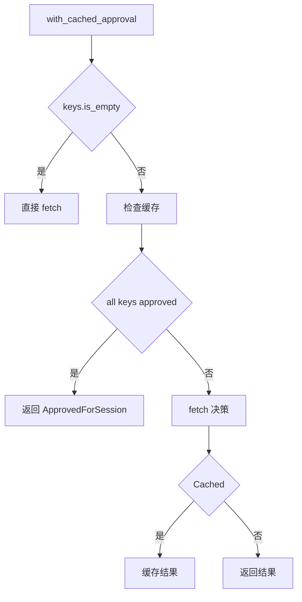

#### 2.2.5 工具错误类型

**文件位置**: `codex-rs/core/src/tools/mod.rs`

```rust
#[derive(Debug, Error)]
pub enum ToolError {
    #[error("tool not found: {0}")]
    NotFound(ToolName),

    #[error("invalid input for {tool}: {reason}")]
    InvalidInput { tool: ToolName, reason: String },

    #[error("permission denied: {tool} requires {required}")]
    PermissionDenied { tool: ToolName, required: String },

    #[error("execution failed: {tool} - {cause}")]
    ExecutionFailed { tool: ToolName, #[source] cause: String },

    #[error("timeout: {tool} exceeded {timeout:?}")]
    Timeout { tool: ToolName, timeout: Duration },

    #[error("cancelled: {tool}")]
    Cancelled(ToolName),

    #[error("sandbox error: {0}")]
    SandboxError(#[from] SandboxErr),
}
```

### 2.3 hooks crate - 钩子系统

#### 2.3.1 钩子事件定义

**文件位置**: `codex-rs/hooks/src/lib.rs`

```rust
pub const HOOK_EVENT_NAMES: [&str; 6] = [
    "PreToolUse",
    "PermissionRequest",
    "PostToolUse",
    "SessionStart",
    "UserPromptSubmit",
    "Stop",
];

pub const HOOK_EVENT_NAMES_WITH_MATCHERS: [&str; 4] = [
    "PreToolUse",
    "PermissionRequest",
    "PostToolUse",
    "SessionStart",
];
```

**钩子类型体系**:

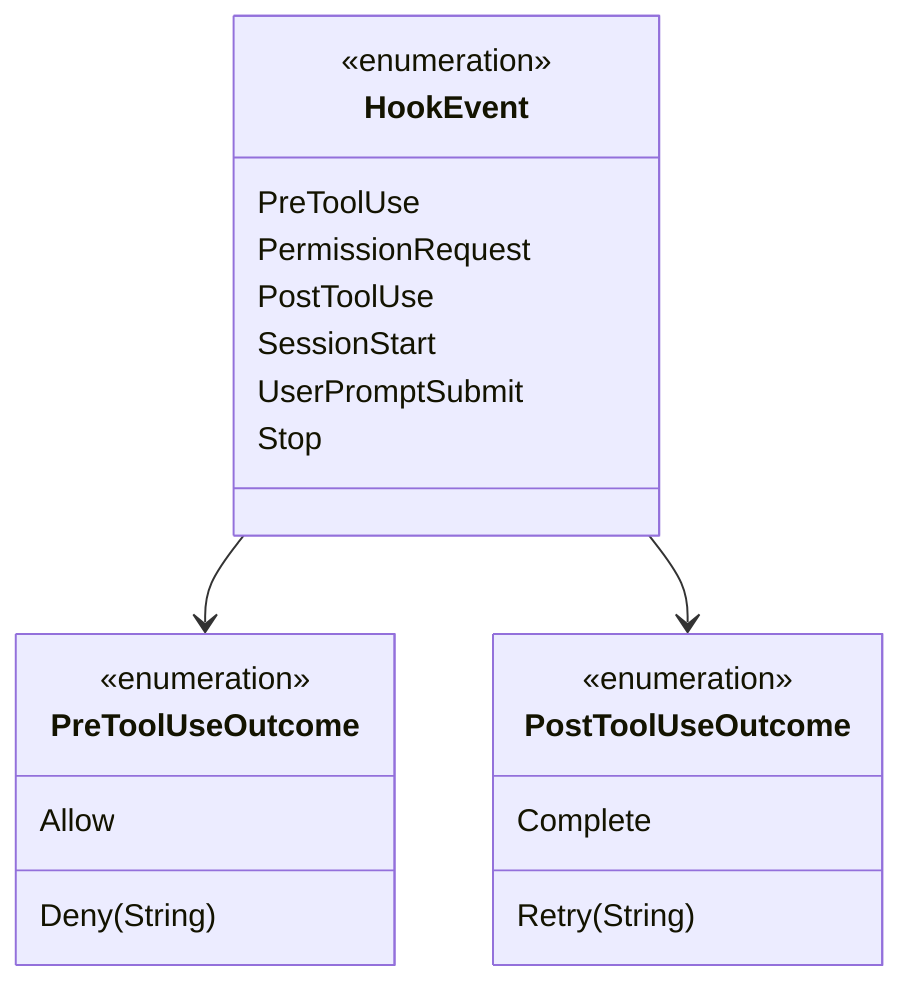

#### 2.3.2 钩子配置结构

```rust
#[derive(Debug, Clone, Default, PartialEq, Eq, Serialize, Deserialize)]
pub struct HooksConfig {
    #[serde(rename = "PreToolUse", default)]
    pub pre_tool_use: Vec<HookConfig>,

    #[serde(rename = "PostToolUse", default)]
    pub post_tool_use: Vec<HookConfig>,

    #[serde(rename = "PermissionRequest", default)]
    pub permission_request: Vec<HookConfig>,

    #[serde(rename = "SessionStart", default)]
    pub session_start: Vec<HookConfig>,
}

#[derive(Debug, Clone, PartialEq, Eq, Serialize, Deserialize)]
pub struct HookConfig {
    pub command: String,
    #[serde(default)]
    pub args: Vec<String>,
    pub matcher: Option<HookMatcher>,
}
```

#### 2.3.3 钩子匹配器

```rust
#[derive(Debug, Clone, Default, PartialEq, Eq, Serialize, Deserialize)]
pub struct HookMatcher {
    #[serde(rename = "tool", default)]
    pub tool: Option<String>,

    #[serde(rename = "command", default)]
    pub command: Option<String>,

    #[serde(rename = "path", default)]
    pub path: Option<String>,
}
```

### 2.4 exec crate - 执行器

#### 2.4.1 执行命令事件

**文件位置**: `codex-rs/exec/src/lib.rs`

```rust
pub enum ToolEmitter {
    Shell {
        command: Vec<String>,
        cwd: AbsolutePathBuf,
        source: ExecCommandSource,
        parsed_cmd: Vec<ParsedCommand>,
        freeform: bool,
    },
    ApplyPatch {
        changes: HashMap<PathBuf, FileChange>,
        auto_approved: bool,
    },
    UnifiedExec {
        command: Vec<String>,
        cwd: AbsolutePathBuf,
        source: ExecCommandSource,
        parsed_cmd: Vec<ParsedCommand>,
        process_id: Option<String>,
    },
}

impl ToolEmitter {
    pub fn shell(
        command: Vec<String>,
        cwd: AbsolutePathBuf,
        source: ExecCommandSource,
        freeform: bool,
    ) -> Self {
        let parsed_cmd = parse_command(&command);
        Self::Shell { command, cwd, source, parsed_cmd, freeform }
    }

    pub fn apply_patch(changes: HashMap<PathBuf, FileChange>, auto_approved: bool) -> Self {
        Self::ApplyPatch { changes, auto_approved }
    }
}
```

#### 2.4.2 事件处理器

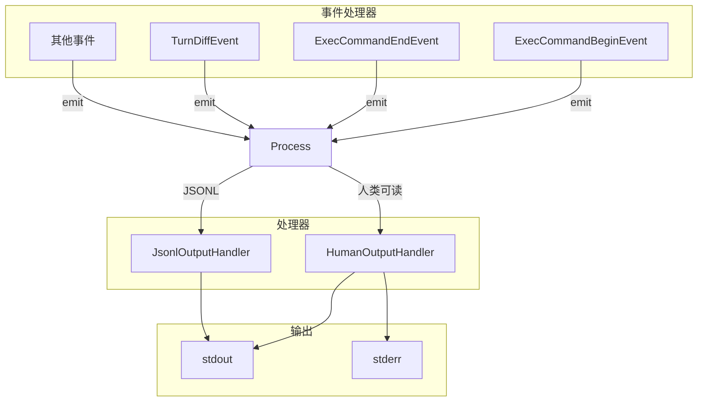

### 2.5 工具输出抽象

**文件位置**: `codex-rs/core/src/tools/context.rs`

```rust
pub trait ToolOutput: Send {
    fn log_preview(&self) -> String;
    fn success_for_logging(&self) -> bool;
    fn to_response_item(&self, call_id: &str, payload: &ToolPayload) -> ResponseInputItem;
    fn post_tool_use_response(&self, call_id: &str, payload: &ToolPayload) -> Option<JsonValue>;
    fn code_mode_result(&self, payload: &ToolPayload) -> JsonValue;
}
```

**实现示例**:

```rust
impl ToolOutput for CallToolResult {
    fn log_preview(&self) -> String {
        let output = self.as_function_call_output_payload();
        let preview = output.body.to_text().unwrap_or_else(|| output.to_string());
        telemetry_preview(&preview)
    }

    fn success_for_logging(&self) -> bool {
        self.success()
    }

    fn to_response_item(&self, call_id: &str, _payload: &ToolPayload) -> ResponseInputItem {
        ResponseInputItem::McpToolCallOutput {
            call_id: call_id.to_string(),
            output: self.clone(),
        }
    }
}
```

---

## 3. 数据流转机制

### 3.1 工具调用数据流

```mermaid
flowchart LR
    subgraph Request["LLM 请求"]
        LLM[LLM Decision]
        TC[ToolCall{name, input}]
    end

    subgraph Routing["路由层"]
        TR[ToolRouter]
        TH[ToolHandler]
    end

    subgraph Execution["执行层"]
        SA[Sandbox/Approval]
        EX[Actual Execution]
    end

    subgraph Response["响应层"]
        TO[ToolOutcome]
        RI[ResponseItem]
    end

    LLM -->|决定| TC
    TC --> TR
    TR -->|查找| TH
    TH -->|检查权限| SA
    SA -->|批准| EX
    EX -->|结果| TO
    TO -->|转换| RI
    RI -->|发送给| LLM
```

### 3.2 工具执行详细流程

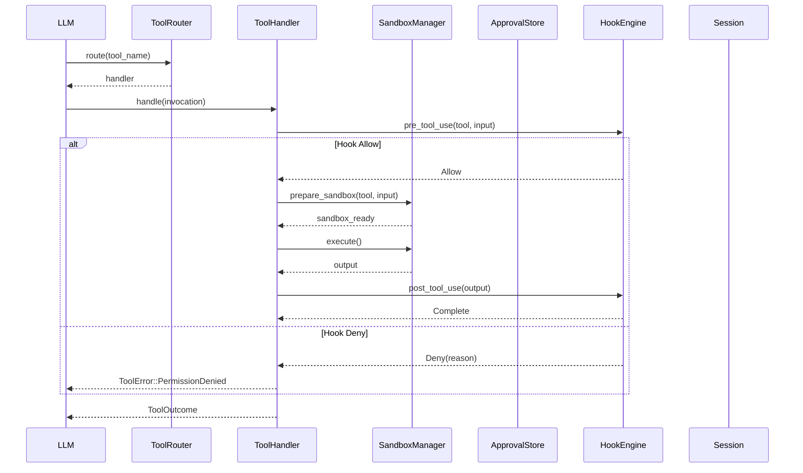

### 3.3 数据格式定义

#### 3.3.1 工具调用请求

```rust
pub struct ToolInvocation {
    pub session: Arc<Session>,
    pub turn: Arc<TurnContext>,
    pub cancellation_token: CancellationToken,
    pub tracker: SharedTurnDiffTracker,
    pub call_id: String,
    pub tool_name: ToolName,
    pub source: ToolCallSource,
    pub payload: ToolPayload,
}

pub enum ToolPayload {
    Function { arguments: String },
    ToolSearch { arguments: SearchToolCallParams },
    Custom { input: String },
    LocalShell { params: ShellToolCallParams },
    Mcp { server: String, tool: String, raw_arguments: String },
}
```

#### 3.3.2 Shell 工具参数

```rust
pub struct ShellToolCallParams {
    pub command: Vec<String>,
    pub description: Option<String>,
    pub current_dir: Option<AbsolutePathBuf>,
    pub timeout_secs: Option<u64>,
    pub sandbox: Option<SandboxMode>,
    pub environment_variables: HashMap<String, String>,
}
```

#### 3.3.3 工具输出结果

```rust
pub enum ToolOutcome {
    Success(FunctionCallOutputPayload),
    Error(ToolError),
    Cancelled,
}

pub struct FunctionCallOutputPayload {
    pub body: FunctionCallOutputBody,
    pub version: String,
}
```

---

## 4. 状态管理架构

### 4.1 审批存储状态

**文件位置**: `codex-rs/core/src/tools/sandboxing.rs`

```rust
#[derive(Clone, Default, Debug)]
pub(crate) struct ApprovalStore {
    map: HashMap<String, ReviewDecision>,
}

#[derive(Clone, Debug, PartialEq, Eq)]
pub enum ReviewDecision {
    Undecided,
    ApprovedForSession,
    ApprovedForThisTask,
    Denied(String),
}
```

**状态转换图**:

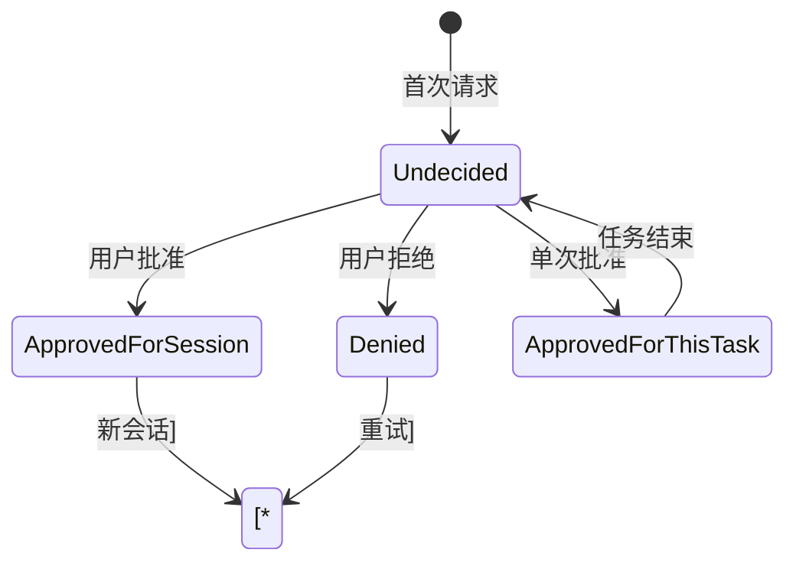

### 4.2 会话工具审批

```rust
pub struct SessionServices {
    pub tool_approvals: Arc<Mutex<ApprovalStore>>,
    pub session_telemetry: SessionTelemetry,
    // ... 其他服务
}
```

**审批缓存键生成**:

```rust
impl ApprovalStore {
    pub fn get<K>(&self, key: &K) -> Option<ReviewDecision>
    where K: Serialize {
        let s = serde_json::to_string(key).ok()?;
        self.map.get(&s).cloned()
    }

    pub fn put<K>(&mut self, key: K, value: ReviewDecision)
    where K: Serialize {
        if let Ok(s) = serde_json::to_string(&key) {
            self.map.insert(s, value);
        }
    }
}
```

### 4.3 MCP 工具状态

```rust
#[derive(Debug, Clone, Copy, PartialEq, Eq, Serialize, Deserialize)]
pub enum McpConnectionStatus {
    Disconnected,
    Connecting,
    Connected,
    AuthRequired,
    Error,
}
```

### 4.4 工具生命周期

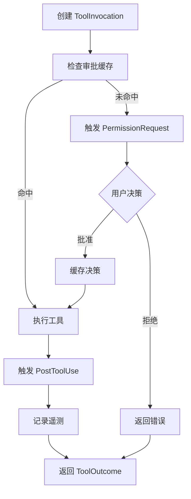

---

## 5. 组件交互关系

### 5.1 核心交互时序图

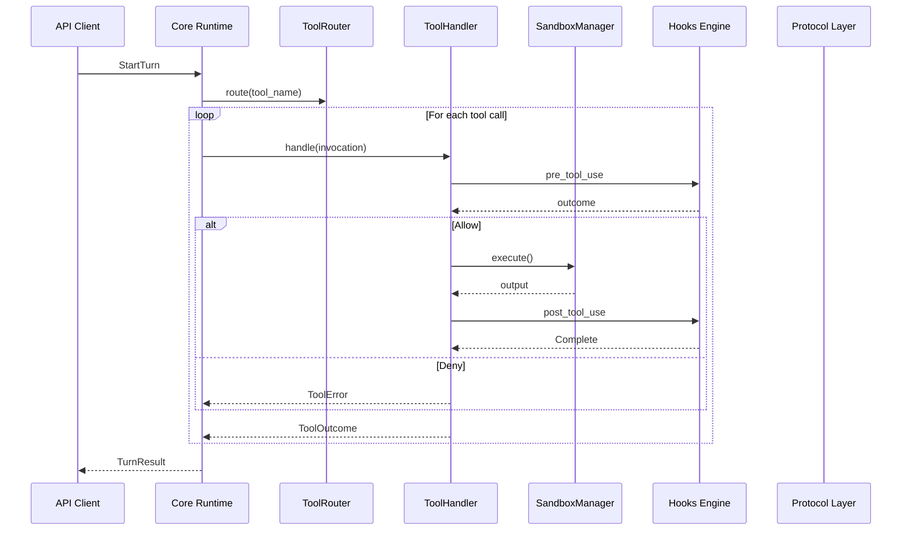

### 5.2 工具注册与发现

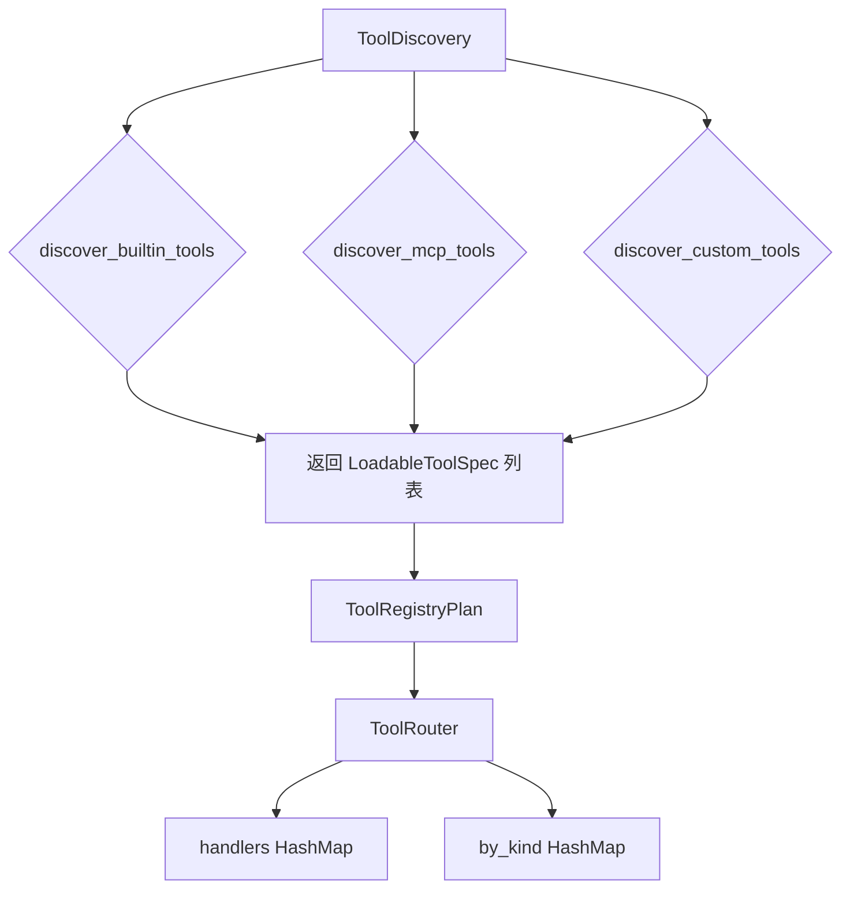

### 5.3 权限审批流程

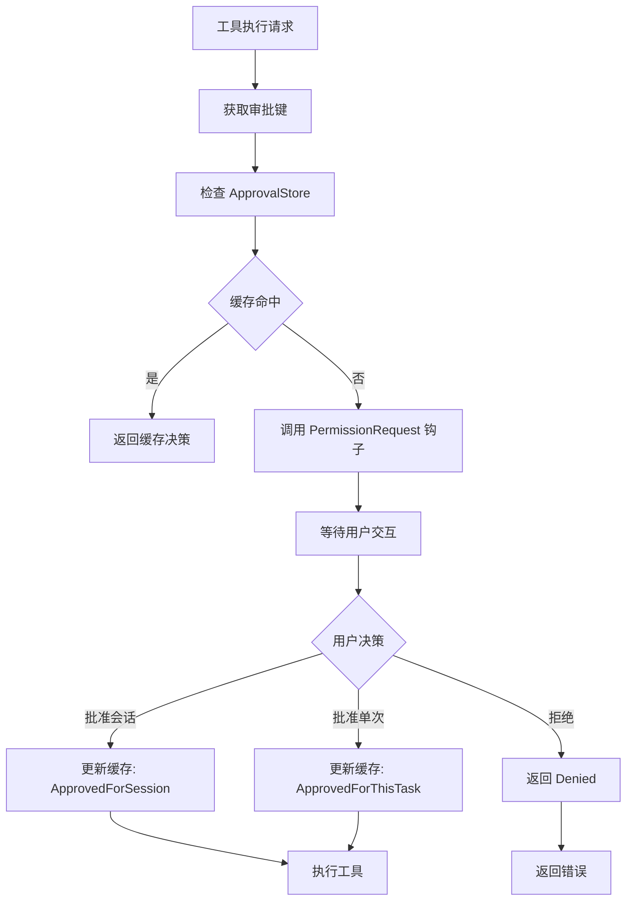

### 5.4 事件发射机制

```rust
pub enum ToolEmitter {
    Shell { /* shell 参数 */ },
    ApplyPatch { /* patch 参数 */ },
    UnifiedExec { /* unified exec 参数 */ },
}

impl ToolEmitter {
    pub fn shell(/* ... */) -> Self {
        let parsed_cmd = parse_command(&command);
        Self::Shell { /* ... */ }
    }
}
```

---

## 6. 关键算法分析

### 6.1 工具路由算法

**文件位置**: `codex-rs/core/src/tools/router.rs`

```rust
pub fn route(
    &self,
    tool_name: &ToolName,
) -> Result<Arc<dyn ToolHandler>, ToolRouterError> {
    self.handlers
        .get(tool_name)
        .cloned()
        .ok_or_else(|| ToolRouterError::NotFound(tool_name.clone()))
}
```

**时间复杂度**:
- 平均: O(1)
- 最坏: O(n) 当发生大量哈希冲突

**空间复杂度**: O(n)，n 为已注册工具数量

### 6.2 审批缓存算法

**文件位置**: `codex-rs/core/src/tools/sandboxing.rs`

```rust
pub async fn with_cached_approval<K, F, Fut>(
    services: &SessionServices,
    tool_name: &str,
    keys: Vec<K>,
    fetch: F,
) -> ReviewDecision
where
    K: Serialize,
    F: FnOnce() -> Fut,
    Fut: Future<Output = ReviewDecision>,
{
    // 边界检查
    if keys.is_empty() {
        return fetch().await;
    }

    // 批量检查缓存
    let already_approved = {
        let store = services.tool_approvals.lock().await;
        keys.iter()
            .all(|key| matches!(store.get(key), Some(ReviewDecision::ApprovedForSession)))
    };

    if already_approved {
        return ReviewDecision::ApprovedForSession;
    }

    // 获取新决策
    let decision = fetch().await;

    // 缓存决策
    if matches!(decision, ReviewDecision::ApprovedForSession) {
        let mut store = services.tool_approvals.lock().await;
        for key in keys {
            store.put(key, ReviewDecision::ApprovedForSession);
        }
    }

    decision
}
```

**时间复杂度**:
- 缓存查找: O(k)，k 为键数量
- 缓存更新: O(k)
- 总计: O(k)

**空间复杂度**: O(m)，m 为缓存条目数

### 6.3 工具名称解析

**文件位置**: `codex-rs/tools/src/tool_registry_plan_types.rs`

```rust
impl TryFrom<&str> for ToolName {
    type Error = ToolNameParseError;

    fn try_from(value: &str) -> Result<Self, Self::Error> {
        let normalized = value.trim().to_lowercase();
        let normalized = normalized.replace('-', "_");
        let normalized = normalized.replace(' ', "_");

        Self::from_string(&normalized)
    }
}
```

**规范化规则**:
1. 去除首尾空白
2. 转换为小写
3. `-` 替换为 `_`
4. 空格替换为 `_`

### 6.4 工具发现算法

**文件位置**: `codex-rs/tools/src/tool_discovery.rs`

```rust
pub fn discover_tools(config: &ToolsConfig) -> Result<Vec<ToolSpec>, ToolDiscoveryError> {
    let mut tools = Vec::new();

    // 1. 发现内置工具
    for spec in config.builtin_tools() {
        tools.push(LoadableToolSpec::Builtin(spec));
    }

    // 2. 发现 MCP 工具
    for mcp_server in config.mcp_servers() {
        let server_tools = mcp_server.list_tools()?;
        tools.extend(server_tools);
    }

    // 3. 发现自定义工具
    for custom_tool in config.custom_tools() {
        tools.push(LoadableToolSpec::Custom(custom_tool));
    }

    Ok(tools)
}
```

**发现优先级**:
1. 内置工具 (最高)
2. MCP 工具
3. 自定义工具 (最低)

---

## 7. 技术实现优缺点

### 7.1 优点

#### 7.1.1 模块化设计

| 方面 | 说明 |
|------|------|
| **Crate 分离** | `tools`、`core`、`hooks`、`exec`、`protocol` 职责边界清晰 |
| **Trait 抽象** | `ToolSpec`、`ToolHandler`、`ToolOutput` 便于扩展 |
| **策略模式** | `ToolImplementations` 支持多种实现策略 |
| **单一职责** | 每个模块专注于单一功能 |

#### 7.1.2 类型安全

```rust
// 使用强类型 ToolName 而不是字符串
pub struct ToolName(String);

impl ToolName {
    pub fn from_string(s: &str) -> Result<Self, ToolNameParseError>;
    pub fn as_str(&self) -> &str;
}

// 使用枚举而不是字符串字面量
pub enum ToolPayload {
    Function { arguments: String },
    ToolSearch { arguments: SearchToolCallParams },
    LocalShell { params: ShellToolCallParams },
    Mcp { server: String, tool: String, raw_arguments: String },
}
```

#### 7.1.3 审批缓存优化

```rust
// 批量审批缓存检查
let already_approved = {
    let store = services.tool_approvals.lock().await;
    keys.iter()
        .all(|key| matches!(store.get(key), Some(ReviewDecision::ApprovedForSession)))
};
```

**优化点**:
- 减少用户交互次数
- 支持批量审批
- 会话级持久化

#### 7.1.4 钩子系统灵活性

```rust
pub struct HookConfig {
    pub command: String,
    pub args: Vec<String>,
    pub matcher: Option<HookMatcher>,
}

pub struct HookMatcher {
    pub tool: Option<String>,
    pub command: Option<String>,
    pub path: Option<String>,
}
```

**钩子类型**:
- `PreToolUse`: 执行前钩子
- `PostToolUse`: 执行后钩子
- `PermissionRequest`: 权限请求钩子
- `SessionStart`: 会话开始钩子

### 7.2 缺点与不足

#### 7.2.1 错误处理复杂性

| 问题 | 描述 |
|------|------|
| 错误类型嵌套过深 | `ToolError` 内部包含 `SandboxErr` |
| 错误恢复机制缺失 | 无自动重试、降级策略 |
| 错误可观测性不足 | 缺少结构化错误追踪 |

```rust
// 当前设计
pub enum ToolError {
    ExecutionFailed { tool: ToolName, #[source] cause: String },
    // cause 是 String，丢失了原始错误类型
}

// 更好的设计
pub enum ToolError {
    ExecutionFailed { tool: ToolName, cause: anyhow::Error },
}
```

#### 7.2.2 性能考量

| 问题 | 描述 | 影响 |
|------|------|------|
| 串行执行 | 工具按顺序执行 | 高延迟 |
| 锁竞争 | `ApprovalStore` 使用 `Mutex` | 并发瓶颈 |
| 内存拷贝 | 大量 `Arc<>` 和 Clone | 内存开销 |

#### 7.2.3 测试覆盖

```rust
// 缺少的文件
- core/src/tools/router.rs: 缺少单元测试
- core/src/tools/sandboxing.rs: 缺少集成测试
- tools/src/tool_discovery.rs: 缺少错误路径测试
```

#### 7.2.4 配置复杂度

```rust
// 工具配置涉及多个层级
ToolsConfig
├── builtin_tools()
├── mcp_servers()
│   └── McpServerConfig
│       ├── command
│       ├── args
│       └── tools
└── custom_tools()
```

---

## 8. 优化方向建议

### 8.1 短期优化

#### 8.1.1 错误类型增强

```rust
// 建议: 使用 thiserror 和 anyhow
#[derive(Debug, Error)]
pub enum ToolError {
    #[error("tool not found: {0}")]
    NotFound(#[from] ToolName),

    #[error("invalid input for {tool}: {reason}")]
    InvalidInput { tool: ToolName, reason: String },

    #[error("execution failed: {tool}")]
    ExecutionFailed {
        tool: ToolName,
        #[source]
        cause: anyhow::Error,
    },

    #[error("timeout: {tool} exceeded {timeout:?}")]
    Timeout { tool: ToolName, timeout: Duration },

    #[error("permission denied: {tool}")]
    PermissionDenied { tool: ToolName },
}
```

#### 8.1.2 并行工具执行

```rust
// 建议: 支持并行工具执行
pub async fn execute_parallel(
    &self,
    invocations: Vec<ToolInvocation>,
    max_concurrent: usize,
) -> Vec<Result<ToolOutcome, ToolError>> {
    let semaphore = Arc::new(Semaphore::new(max_concurrent));

    let futures = invocations.into_iter().map(|inv| {
        let permit = semaphore.clone().acquire().await;
        async move {
            let result = self.execute_one(inv).await;
            drop(permit);
            result
        }
    });

    futures::future::join_all(futures).await
}
```

### 8.2 中期优化

#### 8.2.1 读写锁替代互斥锁

```rust
// 当前: Mutex 串行化所有访问
pub struct ApprovalStore {
    map: HashMap<String, ReviewDecision>,
}

// 建议: 使用 RwLock 允许并发读
pub struct ApprovalStore {
    map: RwLock<HashMap<String, ReviewDecision>>,
}

impl ApprovalStore {
    pub async fn get(&self, key: &K) -> Option<ReviewDecision>
    where K: Serialize {
        let map = self.map.read().await;
        let s = serde_json::to_string(key).ok()?;
        map.get(&s).cloned()
    }

    pub async fn put(&self, key: K, value: ReviewDecision)
    where K: Serialize {
        let mut map = self.map.write().await;
        if let Ok(s) = serde_json::to_string(&key) {
            map.insert(s, value);
        }
    }
}
```

#### 8.2.2 工具结果缓存

```rust
// 建议: 实现工具结果缓存
pub struct ToolCache {
    cache: Arc<TimedCache<String, ToolOutcome>>,
    ttl: Duration,
}

impl ToolCache {
    pub fn cache_key(tool: &ToolName, input: &Value) -> String {
        format!("{}:{}", tool, serde_json::to_string(input).unwrap())
    }

    pub async fn get(&self, tool: &ToolName, input: &Value) -> Option<ToolOutcome> {
        let key = Self::cache_key(tool, input);
        self.cache.get(&key).cloned()
    }
}
```

### 8.3 长期优化

#### 8.3.1 分布式工具执行

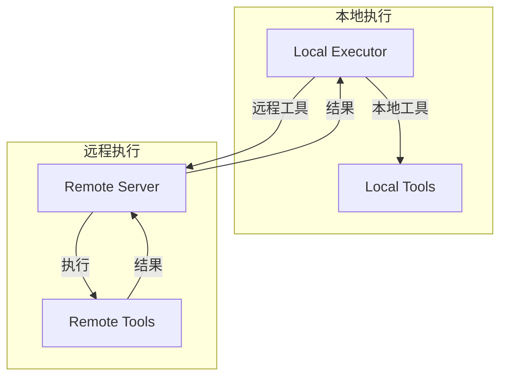

#### 8.3.2 工具版本管理

```rust
// 建议: 支持工具版本
pub struct VersionedToolSpec {
    pub name: ToolName,
    pub version: semver::Version,
    pub spec: Box<dyn ToolSpec>,
    pub deprecation_warning: Option<String>,
}

pub struct ToolRegistry {
    versions: HashMap<ToolName, Vec<VersionedToolSpec>>,
}
```

#### 8.3.3 完整调用追踪

```rust
// 建议: OpenTelemetry 集成
pub struct ToolSpan {
    pub trace_id: TraceId,
    pub span_id: SpanId,
    pub tool_name: ToolName,
    pub input_hash: String,
    pub start_time: Instant,
    pub end_time: Option<Instant>,
    pub outcome: Option<ToolOutcome>,
    pub attributes: Vec<KeyValue>,
}

impl ToolSpan {
    pub async fn record(&self) {
        // 导出到追踪系统
    }
}
```

---

## 附录

### A. 工具类型清单

| 工具类型 | 来源 | Handler | 沙箱支持 |
|---------|------|---------|---------|
| `Bash` | 内置 | `ShellTool` | Linux Namespace |
| `Edit` | 内置 | `EditTool` | Workspace |
| `Read` | 内置 | `ReadTool` | Workspace |
| `Search` | 内置 | `SearchTool` | Workspace |
| `WebFetch` | 内置 | `WebTool` | 网络隔离 |
| `WebSearch` | 内置 | `WebTool` | 网络隔离 |
| `Mcp` | 外部 | `McpHandler` | 取决于 MCP 服务器 |

### B. 钩子事件清单

| 事件 | 触发时机 | Matcher 支持 |
|------|---------|-------------|
| `PreToolUse` | 工具执行前 | tool, command, path |
| `PermissionRequest` | 权限检查时 | tool, command, path |
| `PostToolUse` | 工具执行后 | tool, command, path |
| `SessionStart` | 会话开始时 | - |
| `UserPromptSubmit` | 用户提交时 | - |
| `Stop` | 停止时 | - |

### C. 文件索引

| 文件路径 | 主要内容 |
|----------|----------|
| `codex-rs/tools/src/lib.rs` | 工具 crate 入口、模块导出 |
| `codex-rs/tools/src/tool_spec.rs` | ToolSpec trait 定义 |
| `codex-rs/tools/src/tool_definition.rs` | 工具定义结构 |
| `codex-rs/tools/src/tool_registry_plan.rs` | 工具注册计划 |
| `codex-rs/tools/src/tool_discovery.rs` | 工具发现逻辑 |
| `codex-rs/tools/src/local_tool.rs` | 本地工具实现 |
| `codex-rs/tools/src/mcp_tool.rs` | MCP 工具实现 |
| `codex-rs/tools/src/responses_api.rs` | Responses API |
| `codex-rs/core/src/tools/mod.rs` | 工具运行时核心模块 |
| `codex-rs/core/src/tools/router.rs` | 工具路由器 |
| `codex-rs/core/src/tools/context.rs` | 工具上下文和输出抽象 |
| `codex-rs/core/src/tools/sandboxing.rs` | 沙箱化和审批 |
| `codex-rs/core/src/tools/handlers/shell.rs` | Shell 工具处理器 |
| `codex-rs/hooks/src/lib.rs` | 钩子系统核心 |
| `codex-rs/exec/src/lib.rs` | 执行器入口 |

---

*文档生成时间: 2026-05-06*
*分析工具: Claude Code*
*项目仓库: d:\Project\Hclaw\codex\codex-rs*
