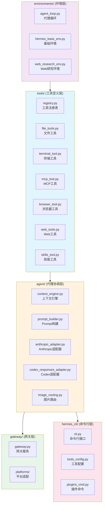
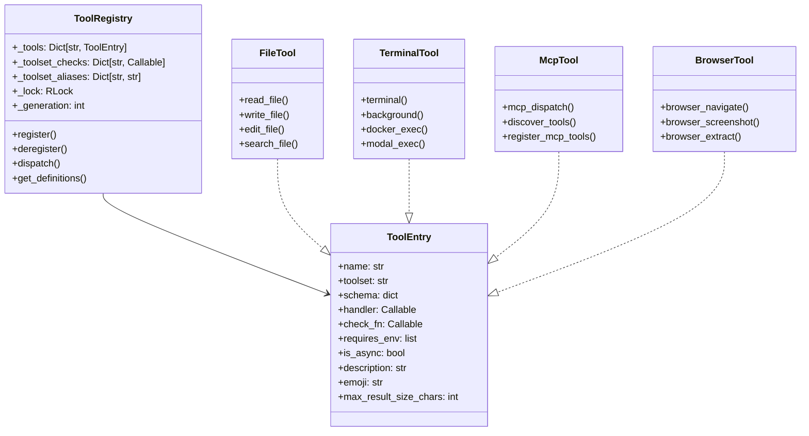
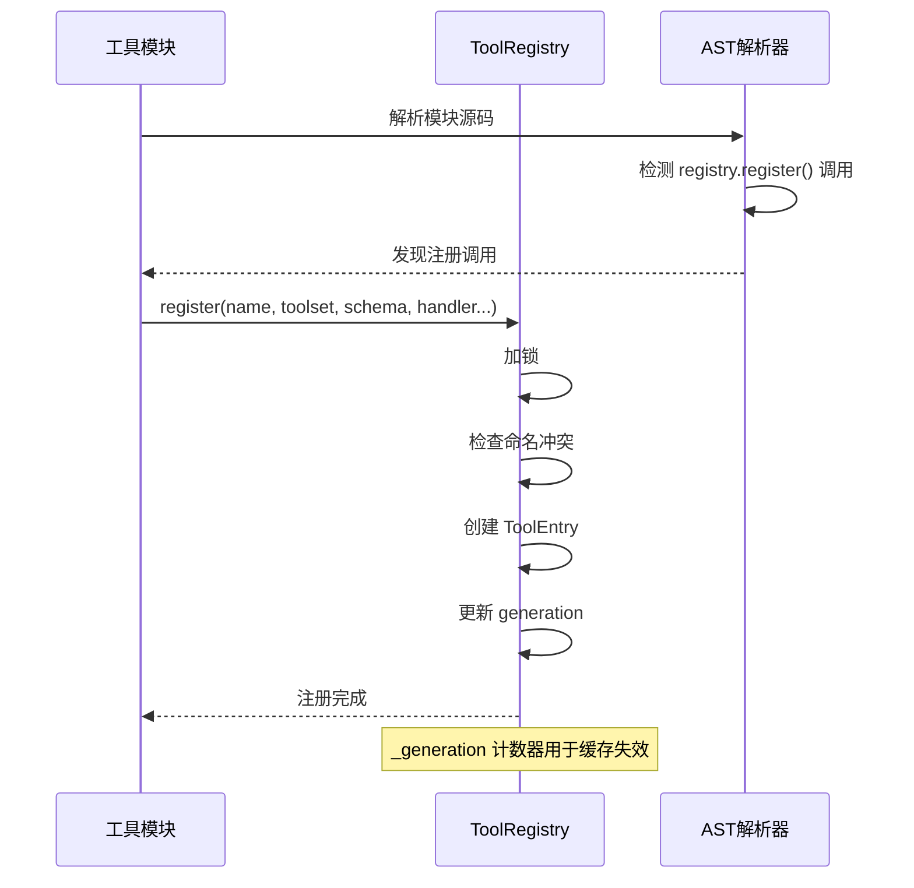
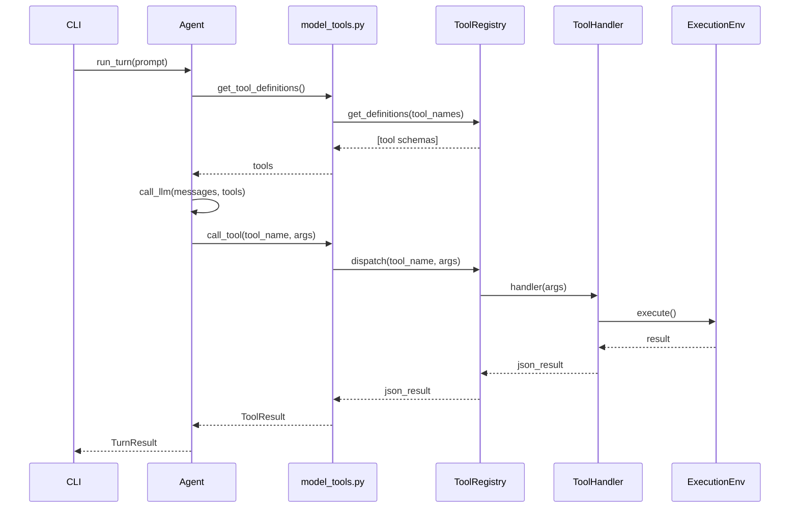
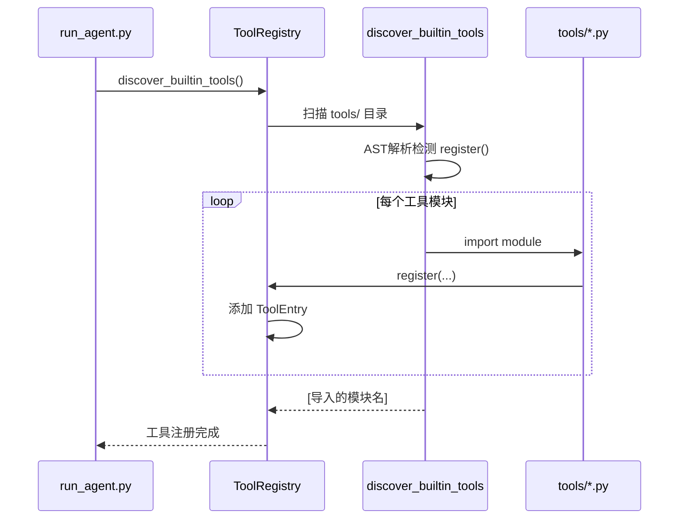
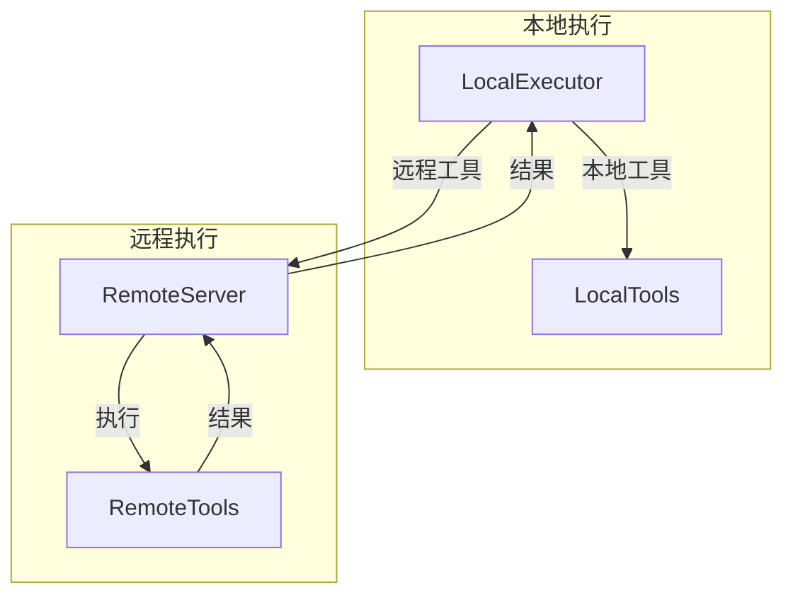

# Hermes-Agent 工具系统深度技术分析

> **分析目标**: `d:\Project\Hclaw\hermes-agent` 项目源码
>
> **分析版本**: 基于最新提交
>
> **文档状态**: 完成

---

## 目录

1. [系统概述与架构设计](#1-系统概述与架构设计)
2. [核心模块详细分析](#2-核心模块详细分析)
3. [数据流转机制](#3-数据流转机制)
4. [状态管理架构](#4-状态管理架构)
5. [组件交互关系](#5-组件交互关系)
6. [关键算法分析](#6-关键算法分析)
7. [技术实现优缺点](#7-技术实现优缺点)
8. [优化方向建议](#8-优化方向建议)

---

## 1. 系统概述与架构设计

### 1.1 系统定位

Hermes-Agent 是一个多功能 AI 代理框架，其工具系统是核心组件之一，负责提供文件操作、终端执行、浏览器自动化、MCP 集成等能力。与 Claw-Code 和 Codex 不同，Hermes-Agent 采用 **Python 单例注册表模式**，具有高度的动态性和扩展性。

### 1.2 整体架构图



### 1.3 工具系统模块划分

```
┌─────────────────────────────────────────────────────────────────────────────┐
│                           tools/ 目录结构                                   │
├─────────────────────────────────────────────────────────────────────────────┤
│  ┌─────────────────┐ ┌─────────────────┐ ┌─────────────────┐               │
│  │   registry.py   │ │  file_tools.py  │ │ terminal_tool.py│               │
│  │  - ToolRegistry │ │  - read_file    │ │  - terminal     │               │
│  │  - ToolEntry    │ │  - write_file   │ │  - background   │               │
│  │  - register()   │ │  - edit_file    │ │  - docker       │               │
│  │  - dispatch()   │ │  - search_file  │ │  - modal        │               │
│  │                 │ │                 │ │  - ssh          │               │
│  └─────────────────┘ └─────────────────┘ └─────────────────┘               │
│  ┌─────────────────┐ ┌─────────────────┐ ┌─────────────────┐               │
│  │    mcp_tool.py  │ │ browser_tool.py │ │   web_tools.py  │               │
│  │  - MCP客户端    │ │  - playwright   │ │  - WebFetch     │               │
│  │  - 工具发现     │ │  - camofox      │ │  - WebSearch    │               │
│  │  - 动态注册     │ │  - cdp          │ │                 │               │
│  │                 │ │                 │ │                 │               │
│  └─────────────────┘ └─────────────────┘ └─────────────────┘               │
│  ┌─────────────────┐ ┌─────────────────┐ ┌─────────────────┐               │
│  │ skills_tool.py  │ │ environments/   │ │   registry.py   │               │
│  │  - 技能管理     │ │  - docker.py    │ │  - 工具发现     │               │
│  │  - 技能搜索     │ │  - modal.py     │ │  - AST解析      │               │
│  │  - 技能同步     │ │  - ssh.py       │ │                 │               │
│  │                 │ │  - local.py     │ │                 │               │
│  └─────────────────┘ └─────────────────┘ └─────────────────┘               │
└─────────────────────────────────────────────────────────────────────────────┘
```

### 1.4 工具类型分类



---

## 2. 核心模块详细分析

### 2.1 registry.py - 工具注册表

#### 2.1.1 ToolEntry 数据结构

**文件位置**: `tools/registry.py:77-99`

```python
class ToolEntry:
    __slots__ = (
        "name", "toolset", "schema", "handler", "check_fn",
        "requires_env", "is_async", "description", "emoji",
        "max_result_size_chars",
    )

    def __init__(self, name, toolset, schema, handler, check_fn,
                 requires_env, is_async, description, emoji,
                 max_result_size_chars=None):
        self.name = name
        self.toolset = toolset
        self.schema = schema
        self.handler = handler
        self.check_fn = check_fn
        self.requires_env = requires_env
        self.is_async = is_async
        self.description = description
        self.emoji = emoji
        self.max_result_size_chars = max_result_size_chars
```

**设计意图**:
- 使用 `__slots__` 优化内存占用
- 完整的元数据描述
- 支持同步/异步处理
- 环境需求声明

#### 2.1.2 ToolRegistry 核心方法

**注册方法**:

```python
def register(
    self,
    name: str,
    toolset: str,
    schema: dict,
    handler: Callable,
    check_fn: Callable = None,
    requires_env: list = None,
    is_async: bool = False,
    description: str = "",
    emoji: str = "",
    max_result_size_chars: int | float | None = None,
):
    with self._lock:
        existing = self._tools.get(name)
        if existing and existing.toolset != toolset:
            both_mcp = (
                existing.toolset.startswith("mcp-")
                and toolset.startswith("mcp-")
            )
            if both_mcp:
                logger.debug("Tool '%s': MCP overwriting MCP", name)
            else:
                logger.error("Tool registration REJECTED: shadowing")
                return
        self._tools[name] = ToolEntry(...)
        self._generation += 1
```

**调度方法**:

```python
def dispatch(self, name: str, args: dict, **kwargs) -> str:
    entry = self.get_entry(name)
    if not entry:
        return json.dumps({"error": f"Unknown tool: {name}"})
    try:
        if entry.is_async:
            from model_tools import _run_async
            return _run_async(entry.handler(args, **kwargs))
        return entry.handler(args, **kwargs)
    except Exception as e:
        logger.exception("Tool %s dispatch error", name)
        return json.dumps({"error": f"Tool execution failed: {e}"})
```

#### 2.1.3 工具发现机制

**文件位置**: `tools/registry.py:29-74`

```python
def _is_registry_register_call(node: ast.AST) -> bool:
    if not isinstance(node, ast.Expr) or not isinstance(node.value, ast.Call):
        return False
    func = node.value.func
    return (
        isinstance(func, ast.Attribute)
        and func.attr == "register"
        and isinstance(func.value, ast.Name)
        and func.value.id == "registry"
    )

def _module_registers_tools(module_path: Path) -> bool:
    try:
        source = module_path.read_text(encoding="utf-8")
        tree = ast.parse(source, filename=str(module_path))
    except (OSError, SyntaxError):
        return False
    return any(_is_registry_register_call(stmt) for stmt in tree.body)

def discover_builtin_tools(tools_dir: Optional[Path] = None) -> List[str]:
    tools_path = Path(tools_dir) if tools_dir else Path(__file__).resolve().parent
    module_names = [
        f"tools.{path.stem}"
        for path in sorted(tools_path.glob("*.py"))
        if path.name not in {"__init__.py", "registry.py", "mcp_tool.py"}
        and _module_registers_tools(path)
    ]
    # ... 导入模块
```

**发现流程**:
1. 遍历 `tools/` 目录下所有 `.py` 文件
2. 使用 AST 解析检测 `registry.register()` 调用
3. 动态导入包含工具注册的模块

#### 2.1.4 TTL 缓存机制

```python
_CHECK_FN_TTL_SECONDS = 30.0
_check_fn_cache: Dict[Callable, tuple[float, bool]] = {}
_check_fn_cache_lock = threading.Lock()

def _check_fn_cached(fn: Callable) -> bool:
    now = time.monotonic()
    with _check_fn_cache_lock:
        cached = _check_fn_cache.get(fn)
        if cached is not None:
            ts, value = cached
            if now - ts < _CHECK_FN_TTL_SECONDS:
                return value
    try:
        value = bool(fn())
    except Exception:
        value = False
    with _check_fn_cache_lock:
        _check_fn_cache[fn] = (now, value)
    return value
```

**设计原理**:
- 30秒 TTL 缓存减少外部状态探测开销
- 支持环境变量动态变化（`hermes tools enable`）
- 线程安全的缓存更新

### 2.2 file_tools.py - 文件操作工具

#### 2.2.1 安全检查机制

**文件位置**: `tools/file_tools.py:69-174`

```python
_BLOCKED_DEVICE_PATHS = frozenset({
    "/dev/zero", "/dev/random", "/dev/urandom", "/dev/full",
    "/dev/stdin", "/dev/tty", "/dev/console",
    "/dev/stdout", "/dev/stderr",
    "/dev/fd/0", "/dev/fd/1", "/dev/fd/2",
})

_SENSITIVE_PATH_PREFIXES = (
    "/etc/", "/boot/", "/usr/lib/systemd/",
    "/private/etc/", "/private/var/",
)

def _is_blocked_device(filepath: str) -> bool:
    normalized = os.path.expanduser(filepath)
    if normalized in _BLOCKED_DEVICE_PATHS:
        return True
    if normalized.startswith("/proc/") and normalized.endswith(("/fd/0", "/fd/1", "/fd/2")):
        return True
    return False

def _check_sensitive_path(filepath: str, task_id: str = "default") -> str | None:
    try:
        resolved = str(_resolve_path_for_task(filepath, task_id))
    except (OSError, ValueError):
        resolved = filepath
    for prefix in _SENSITIVE_PATH_PREFIXES:
        if resolved.startswith(prefix) or normalized.startswith(prefix):
            return f"Refusing to write to sensitive system path: {filepath}"
    return None
```

**安全防护**:
1. **设备路径阻止**: 防止读取 `/dev/zero` 等无限输出设备
2. **敏感路径保护**: 阻止写入系统关键目录
3. **路径规范化**: 处理相对路径和符号链接

#### 2.2.2 文件读取限制

```python
_DEFAULT_MAX_READ_CHARS = 100_000
_max_read_chars_cached: int | None = None

def _get_max_read_chars() -> int:
    global _max_read_chars_cached
    if _max_read_chars_cached is not None:
        return _max_read_chars_cached
    try:
        from hermes_cli.config import load_config
        cfg = load_config()
        val = cfg.get("file_read_max_chars")
        if isinstance(val, (int, float)) and val > 0:
            _max_read_chars_cached = int(val)
            return _max_read_chars_cached
    except Exception:
        pass
    _max_read_chars_cached = _DEFAULT_MAX_READ_CHARS
    return _max_read_chars_cached
```

**设计考虑**:
- 默认 100,000 字符限制（约 25-35K tokens）
- 可通过 `config.yaml` 配置
- 防止上下文窗口溢出

### 2.3 terminal_tool.py - 终端工具

#### 2.3.1 环境选择机制

**文件位置**: `tools/terminal_tool.py`

```python
def resolve_modal_backend_state(
    modal_mode: object | None,
    *,
    has_direct: bool,
    managed_ready: bool,
) -> Dict[str, Any]:
    requested_mode = coerce_modal_mode(modal_mode)
    normalized_mode = normalize_modal_mode(modal_mode)
    
    if normalized_mode == "managed":
        selected_backend = "managed" if managed_nous_tools_enabled() and managed_ready else None
    elif normalized_mode == "direct":
        selected_backend = "direct" if has_direct else None
    else:
        selected_backend = "managed" if managed_nous_tools_enabled() and managed_ready else "direct" if has_direct else None

    return {
        "requested_mode": requested_mode,
        "mode": normalized_mode,
        "has_direct": has_direct,
        "managed_ready": managed_ready,
        "selected_backend": selected_backend,
    }
```

**后端选择策略**:

| 模式 | 优先级 | 说明 |
|------|--------|------|
| `managed` | Nous 订阅用户优先 | 托管网关模式 |
| `direct` | 其次 | 直接 Modal 凭证 |
| `auto` | 默认 | 自动选择 |

#### 2.3.2 后台任务支持

```python
def terminal_tool(args, task_id="default", background=False, **kwargs):
    if background:
        # 启动后台任务
        task = BackgroundTask(
            command=command,
            task_id=task_id,
            **kwargs
        )
        task.start()
        return json.dumps({
            "background": True,
            "task_id": task.id,
            "message": "Command started in background"
        })
    else:
        # 同步执行
        return execute_command_sync(command, **kwargs)
```

### 2.4 mcp_tool.py - MCP 协议支持

#### 2.4.1 架构设计

**文件位置**: `tools/mcp_tool.py:61-70`

```python
"""
Architecture:
    A dedicated background event loop (_mcp_loop) runs in a daemon thread.
    Each MCP server runs as a long-lived asyncio Task on this loop, keeping
    its transport context alive. Tool call coroutines are scheduled onto the
    loop via ``run_coroutine_threadsafe()``.

    On shutdown, each server Task is signalled to exit its ``async with``
    block, ensuring the anyio cancel-scope cleanup happens in the *same*
    Task that opened the connection (required by anyio).
"""
```

**线程安全设计**:
- 专用后台事件循环线程
- `run_coroutine_threadsafe()` 跨线程调度
- `_lock` 保护共享状态

#### 2.4.2 传输层支持

```python
# Stdio transport
from mcp.client.stdio import stdio_client

# HTTP/StreamableHTTP transport
try:
    from mcp.client.streamable_http import streamablehttp_client
    _MCP_HTTP_AVAILABLE = True
except ImportError:
    _MCP_HTTP_AVAILABLE = False
```

**支持的传输方式**:
1. **Stdio**: 启动子进程通信
2. **HTTP**: 远程 MCP 服务器
3. **StreamableHTTP**: 流式 HTTP 传输

### 2.5 tool_backend_helpers.py - 后端选择助手

#### 2.5.1 托管工具网关

```python
def managed_nous_tools_enabled() -> bool:
    try:
        from hermes_cli.auth import get_nous_auth_status
        status = get_nous_auth_status()
        if not status.get("logged_in"):
            return False
        from hermes_cli.models import check_nous_free_tier
        if check_nous_free_tier():
            return False  # free-tier users don't get gateway access
        return True
    except Exception:
        return False
```

**权限检查**:
- 检查 Nous 认证状态
- 排除免费用户
- 异常安全（不阻塞启动）

---

## 3. 数据流转机制

### 3.1 工具调用流程

```mermaid
flowchart LR
    subgraph Agent["Agent 层"]
        LLM[LLM决策]
        MT[model_tools.py]
    end

    subgraph Registry["注册表层"]
        TR[ToolRegistry]
        TE[ToolEntry]
    end

    subgraph Execution["执行层"]
        FH[FileHandler]
        TH[TerminalHandler]
        MH[McpHandler]
    end

    subgraph Environment["环境层"]
        Local[本地执行]
        Docker[Docker容器]
        Modal[Modal云端]
    end

    LLM -->|tool_calls| MT
    MT -->|dispatch(name, args)| TR
    TR -->|查找| TE
    TE -->|handler(args)| FH
    TE -->|handler(args)| TH
    TE -->|handler(args)| MH
    TH -->|选择后端| Local
    TH -->|选择后端| Docker
    TH -->|选择后端| Modal
```

### 3.2 工具注册流程



### 3.3 数据格式定义

#### 3.3.1 工具调用请求

```python
# 工具调用参数（JSON 格式）
{
    "name": "read_file",
    "arguments": {
        "path": "/workspace/src/main.py",
        "offset": 0,
        "limit": 100
    }
}
```

#### 3.3.2 工具返回结果

```python
# 成功响应
{
    "success": true,
    "content": "...文件内容...",
    "file_path": "/workspace/src/main.py",
    "lines_read": 100
}

# 错误响应
{
    "error": "file not found",
    "success": false
}
```

#### 3.3.3 工具定义 Schema

```python
{
    "name": "read_file",
    "description": "Read a file from disk",
    "parameters": {
        "type": "object",
        "properties": {
            "path": {"type": "string"},
            "offset": {"type": "integer", "minimum": 0},
            "limit": {"type": "integer", "minimum": 1}
        },
        "required": ["path"]
    }
}
```

---

## 4. 状态管理架构

### 4.1 注册表状态

**文件位置**: `tools/registry.py:143-159`

```python
class ToolRegistry:
    def __init__(self):
        self._tools: Dict[str, ToolEntry] = {}
        self._toolset_checks: Dict[str, Callable] = {}
        self._toolset_aliases: Dict[str, str] = {}
        self._lock = threading.RLock()
        self._generation: int = 0
```

**状态组成**:
- `_tools`: 工具条目字典
- `_toolset_checks`: 工具集可用性检查
- `_toolset_aliases`: 工具集别名映射
- `_generation`: 版本计数器（用于缓存失效）

### 4.2 检查函数缓存

```python
_CHECK_FN_TTL_SECONDS = 30.0
_check_fn_cache: Dict[Callable, tuple[float, bool]] = {}
_check_fn_cache_lock = threading.Lock()

def invalidate_check_fn_cache() -> None:
    with _check_fn_cache_lock:
        _check_fn_cache.clear()
```

**缓存策略**:
- TTL 30秒，平衡性能与响应性
- 支持显式失效（`hermes tools enable` 后调用）

### 4.3 执行环境状态

**文件位置**: `tools/terminal_tool.py`

```python
_active_environments: Dict[str, Any] = {}
_env_lock = threading.Lock()

def get_environment(task_id: str):
    with _env_lock:
        return _active_environments.get(task_id)
```

**环境管理**:
- 按 task_id 隔离
- 支持 Docker、Modal、SSH 等多种后端
- 自动清理空闲环境

---

## 5. 组件交互关系

### 5.1 核心交互时序图



### 5.2 工具发现时序



### 5.3 MCP 工具注册

```mermaid
flowchart TD
    A[MCP服务器配置] --> B[读取 config.yaml]
    B --> C[初始化 MCP 客户端]
    C --> D[连接服务器]
    D --> E[list_tools()]
    E --> F[获取工具列表]
    F --> G[遍历工具]
    G --> H[registry.register()]
    H --> I[生成 toolset: mcp-{server_name}]
    I --> J[注册完成]
```

---

## 6. 关键算法分析

### 6.1 工具发现算法

**文件位置**: `tools/registry.py:57-74`

```python
def discover_builtin_tools(tools_dir: Optional[Path] = None) -> List[str]:
    tools_path = Path(tools_dir) if tools_dir else Path(__file__).resolve().parent
    
    # 1. 扫描目录获取模块名
    module_names = [
        f"tools.{path.stem}"
        for path in sorted(tools_path.glob("*.py"))
        if path.name not in {"__init__.py", "registry.py", "mcp_tool.py"}
        and _module_registers_tools(path)
    ]

    # 2. 动态导入
    imported: List[str] = []
    for mod_name in module_names:
        try:
            importlib.import_module(mod_name)
            imported.append(mod_name)
        except Exception as e:
            logger.warning("Could not import tool module %s: %s", mod_name, e)
    
    return imported
```

**时间复杂度**:
- 目录扫描: O(n)，n = 文件数量
- AST 解析: O(m)，m = 文件大小
- 总计: O(n * m)

**空间复杂度**: O(k)，k = 注册的工具数量

### 6.2 工具调度算法

```python
def dispatch(self, name: str, args: dict, **kwargs) -> str:
    entry = self.get_entry(name)
    if not entry:
        return json.dumps({"error": f"Unknown tool: {name}"})
    
    try:
        if entry.is_async:
            from model_tools import _run_async
            return _run_async(entry.handler(args, **kwargs))
        return entry.handler(args, **kwargs)
    except Exception as e:
        logger.exception("Tool %s dispatch error", name)
        return json.dumps({"error": f"Tool execution failed: {e}"})
```

**时间复杂度**: O(1) 字典查找 + O(h) 处理器执行时间

### 6.3 TTL 缓存算法

```python
def _check_fn_cached(fn: Callable) -> bool:
    now = time.monotonic()
    
    # 1. 检查缓存
    with _check_fn_cache_lock:
        cached = _check_fn_cache.get(fn)
        if cached is not None:
            ts, value = cached
            if now - ts < _CHECK_FN_TTL_SECONDS:
                return value
    
    # 2. 执行并缓存
    try:
        value = bool(fn())
    except Exception:
        value = False
    
    with _check_fn_cache_lock:
        _check_fn_cache[fn] = (now, value)
    
    return value
```

**时间复杂度**: O(1) 缓存命中，O(c) 缓存未命中（c = 检查函数耗时）

### 6.4 工具定义获取

```python
def get_definitions(self, tool_names: Set[str], quiet: bool = False) -> List[dict]:
    result = []
    check_results: Dict[Callable, bool] = {}
    entries_by_name = {entry.name: entry for entry in self._snapshot_entries()}
    
    for name in sorted(tool_names):
        entry = entries_by_name.get(name)
        if not entry:
            continue
        
        # 检查可用性
        if entry.check_fn:
            if entry.check_fn not in check_results:
                check_results[entry.check_fn] = _check_fn_cached(entry.check_fn)
            if not check_results[entry.check_fn]:
                continue
        
        schema_with_name = {**entry.schema, "name": entry.name}
        result.append({"type": "function", "function": schema_with_name})
    
    return result
```

**时间复杂度**: O(n + m * c)，n = 工具数量，m = 检查函数数量，c = 检查耗时

---

## 7. 技术实现优缺点

### 7.1 优点

#### 7.1.1 动态工具发现

| 特性 | 说明 |
|------|------|
| **AST 解析检测** | 通过源码分析自动发现工具，无需手动维护列表 |
| **模块级注册** | 工具在模块导入时自动注册，简化开发 |
| **热更新支持** | 支持运行时注册/注销工具 |

#### 7.1.2 线程安全设计

```python
# 读写锁保护
self._lock = threading.RLock()

# 快照机制
def _snapshot_entries(self) -> List[ToolEntry]:
    with self._lock:
        return list(self._tools.values())
```

**保护机制**:
- `RLock` 支持递归锁定
- 快照读取避免迭代时修改
- 版本计数器支持外部缓存失效

#### 7.1.3 灵活的后端选择

```python
# 支持多种执行环境
def resolve_modal_backend_state(modal_mode, has_direct, managed_ready):
    # managed > direct > None 的优先级
```

**后端支持**:
- 本地执行
- Docker 容器
- Modal 云端
- SSH 远程
- Daytona 云 IDE

#### 7.1.4 MCP 协议集成

```python
# 支持多种传输方式
try:
    from mcp.client.streamable_http import streamablehttp_client
except ImportError:
    pass  # 可选依赖
```

**特性**:
- Stdio 和 HTTP 传输
- 自动重连和指数退避
- 安全的环境变量过滤

#### 7.1.5 安全防护

```python
# 阻止危险路径
_BLOCKED_DEVICE_PATHS = frozenset({"/dev/zero", "/dev/stdin", ...})

# 保护敏感目录
_SENSITIVE_PATH_PREFIXES = ("/etc/", "/boot/", ...)
```

**安全层**:
- 设备路径黑名单
- 敏感路径保护
- 文件大小限制
- 输出内容截断

### 7.2 缺点与不足

#### 7.2.1 全局状态依赖

| 问题 | 描述 | 影响 |
|------|------|------|
| 单例模式 | `registry = ToolRegistry()` 是模块级单例 | 难以测试和隔离 |
| 全局变量 | `_check_fn_cache` 是模块级变量 | 多进程环境问题 |
| 隐式依赖 | 工具注册依赖模块导入顺序 | 可能导致循环导入 |

#### 7.2.2 错误处理

```python
# 当前实现
def dispatch(self, name: str, args: dict, **kwargs) -> str:
    try:
        return entry.handler(args, **kwargs)
    except Exception as e:
        return json.dumps({"error": f"Tool execution failed: {e}"})
```

**问题**:
- 所有异常统一处理，丢失错误类型信息
- 无法区分用户错误和系统错误
- 缺少错误码体系

#### 7.2.3 性能瓶颈

| 瓶颈 | 位置 | 影响 |
|------|------|------|
| 同步执行 | `dispatch()` 同步调用处理器 | 阻塞主线程 |
| 锁竞争 | 频繁调用 `get_definitions()` | 并发性能 |
| 重复解析 | 每次调用重新解析 JSON | 不必要的开销 |

#### 7.2.4 测试复杂度

```python
# 测试需要 mock 全局注册表
def test_tool_dispatch():
    registry.register("test_tool", ...)
    result = registry.dispatch("test_tool", {})
    # 测试完成后需要清理
    registry.deregister("test_tool")
```

**问题**:
- 全局状态难以隔离
- 测试顺序敏感
- 缺少测试辅助工具

---

## 8. 优化方向建议

### 8.1 短期优化

#### 8.1.1 增强错误处理

```python
# 建议: 使用结构化错误
class ToolError(Exception):
    def __init__(self, code: str, message: str, details: dict = None):
        self.code = code
        self.message = message
        self.details = details or {}
    
    def to_json(self) -> str:
        return json.dumps({
            "error": self.message,
            "code": self.code,
            **self.details
        })

# 在 dispatch 中使用
def dispatch(self, name: str, args: dict, **kwargs) -> str:
    try:
        return entry.handler(args, **kwargs)
    except ValueError as e:
        return ToolError("invalid_input", str(e)).to_json()
    except PermissionError as e:
        return ToolError("permission_denied", str(e)).to_json()
    except Exception as e:
        logger.exception("Tool %s dispatch error", name)
        return ToolError("internal_error", f"Tool execution failed: {e}").to_json()
```

#### 8.1.2 异步调度支持

```python
# 建议: 支持异步调度
async def dispatch_async(self, name: str, args: dict, **kwargs) -> str:
    entry = self.get_entry(name)
    if not entry:
        return json.dumps({"error": f"Unknown tool: {name}"})
    
    try:
        if entry.is_async:
            return await entry.handler(args, **kwargs)
        # 同步处理包装为异步
        loop = asyncio.get_event_loop()
        return await loop.run_in_executor(None, entry.handler, args, kwargs)
    except Exception as e:
        return json.dumps({"error": str(e)})
```

### 8.2 中期优化

#### 8.2.1 依赖注入容器

```python
# 建议: 使用依赖注入
class ToolContainer:
    def __init__(self):
        self._tools = {}
        self._dependencies = {}
    
    def register_tool(self, name: str, handler, **kwargs):
        self._tools[name] = {"handler": handler, **kwargs}
    
    def register_dependency(self, name: str, instance):
        self._dependencies[name] = instance
    
    def dispatch(self, name: str, args: dict):
        tool = self._tools.get(name)
        if not tool:
            raise ValueError(f"Unknown tool: {name}")
        
        # 注入依赖
        handler = tool["handler"]
        return handler(args, **self._dependencies)
```

#### 8.2.2 工具结果缓存

```python
# 建议: 实现工具结果缓存
class ToolResultCache:
    def __init__(self, ttl_seconds: int = 60):
        self._cache = {}
        self._ttl = ttl_seconds
        self._lock = threading.Lock()
    
    def get(self, tool_name: str, args_hash: str) -> Optional[str]:
        with self._lock:
            entry = self._cache.get((tool_name, args_hash))
            if entry and time.time() - entry["timestamp"] < self._ttl:
                return entry["result"]
            return None
    
    def set(self, tool_name: str, args_hash: str, result: str):
        with self._lock:
            self._cache[(tool_name, args_hash)] = {
                "result": result,
                "timestamp": time.time()
            }
```

### 8.3 长期优化

#### 8.3.1 分布式工具执行



#### 8.3.2 工具版本管理

```python
# 建议: 支持工具版本
class VersionedToolEntry:
    def __init__(self, name: str, version: str, handler, **kwargs):
        self.name = name
        self.version = version
        self.handler = handler
        self.kwargs = kwargs

class VersionedToolRegistry:
    def __init__(self):
        self._tools: Dict[str, List[VersionedToolEntry]] = {}
    
    def register(self, name: str, version: str, handler, **kwargs):
        entry = VersionedToolEntry(name, version, handler, **kwargs)
        self._tools.setdefault(name, []).append(entry)
    
    def get_latest(self, name: str) -> Optional[VersionedToolEntry]:
        entries = self._tools.get(name)
        if not entries:
            return None
        # 按版本号排序
        entries.sort(key=lambda e: e.version, reverse=True)
        return entries[0]
```

#### 8.3.3 完整可观测性

```python
# 建议: OpenTelemetry 集成
from opentelemetry import trace

tracer = trace.get_tracer(__name__)

def dispatch(self, name: str, args: dict, **kwargs) -> str:
    with tracer.start_as_current_span(f"tool.{name}") as span:
        span.set_attribute("tool.name", name)
        span.set_attribute("tool.args", json.dumps(args))
        
        try:
            result = entry.handler(args, **kwargs)
            span.set_attribute("tool.success", True)
            return result
        except Exception as e:
            span.set_attribute("tool.success", False)
            span.set_attribute("tool.error", str(e))
            raise
```

---

## 附录

### A. 工具类型清单

| 工具类型 | 文件 | 核心功能 | 环境需求 |
|---------|------|---------|---------|
| 文件工具 | `file_tools.py` | 读写文件、搜索 | 本地文件系统 |
| 终端工具 | `terminal_tool.py` | 命令执行 | 本地/Docker/Modal |
| MCP工具 | `mcp_tool.py` | 外部工具集成 | MCP服务器 |
| 浏览器工具 | `browser_tool.py` | 网页操作 | Playwright |
| Web工具 | `web_tools.py` | 网络搜索、抓取 | 网络连接 |
| 技能工具 | `skills_tool.py` | 技能管理 | 技能目录 |
| 内存工具 | `memory_tool.py` | 记忆管理 | 内存服务 |
| 语音工具 | `voice_mode.py` | 语音交互 | 语音服务 |

### B. 注册表方法速查

| 方法 | 功能 | 参数 | 返回值 |
|------|------|------|--------|
| `register()` | 注册工具 | name, toolset, schema, handler... | None |
| `deregister()` | 注销工具 | name | None |
| `dispatch()` | 执行工具 | name, args, **kwargs | str |
| `get_definitions()` | 获取工具定义 | tool_names, quiet | List[dict] |
| `get_entry()` | 获取工具条目 | name | Optional[ToolEntry] |
| `get_all_tool_names()` | 获取所有工具名 | None | List[str] |
| `get_schema()` | 获取工具 schema | name | Optional[dict] |
| `check_toolset_requirements()` | 检查工具集需求 | None | Dict[str, bool] |

### C. 文件索引

| 文件路径 | 主要内容 |
|----------|----------|
| `tools/__init__.py` | 工具包入口 |
| `tools/registry.py` | 工具注册表核心 |
| `tools/file_tools.py` | 文件操作工具 |
| `tools/terminal_tool.py` | 终端执行工具 |
| `tools/mcp_tool.py` | MCP 协议支持 |
| `tools/browser_tool.py` | 浏览器自动化 |
| `tools/web_tools.py` | Web 工具 |
| `tools/skills_tool.py` | 技能管理 |
| `tools/tool_backend_helpers.py` | 后端选择助手 |
| `tools/environments/*.py` | 执行环境实现 |

---

*文档生成时间: 2026-05-06*
*分析工具: Claude Code*
*项目仓库: d:\Project\Hclaw\hermes-agent*
